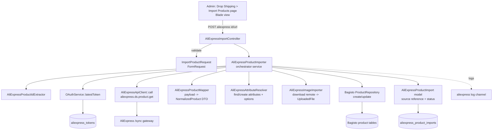
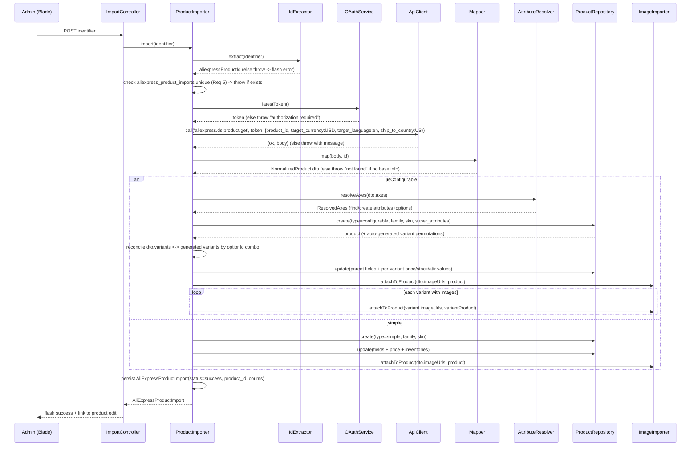

# Design Document

## Overview

This feature adds a "Drop Shipping → Import Products" area to the Bagisto admin panel that imports a single AliExpress product (by id or URL) into the Bagisto catalog, fully synchronously. It reuses the already-built and verified AliExpress OAuth + signed API client, and creates a native Bagisto product (configurable with simple variant children, or a single simple product) that shows up in the standard Admin → Products listing.

All new code lives under the `App\` namespace (PSR-4 `app/`), consistent with the existing AliExpress integration, to avoid touching the Concord/Webkul provider chain. Bagisto package files are not modified; the admin menu is added by merging into the existing `menu.admin` config from `AppServiceProvider`.

The hardest parts — AliExpress payload variability, EAV attribute/option auto-creation, and reconciling AliExpress's specific SKUs against Bagisto's auto-generated configurable permutations — are isolated into dedicated, individually testable components with a single normalization layer.

### Scope guardrails (from requirements)
- One product per request, synchronous, no queues.
- No AI/content rewriting — content stored as-is.
- Default category + default attribute family.
- Store locale `ar`, base currency USD.

## Architecture



Layering:
- **Controller layer** (`App\Http\Controllers\AliExpress\AliExpressImportController`): admin page + import action. Thin; delegates to the importer. Returns session flash result.
- **Orchestration** (`App\Services\AliExpress\AliExpressProductImporter`): the single entry point `import(string $rawInput): AliExpressProductImport`. Coordinates extraction, token, fetch, mapping, attribute resolution, product creation, image import, and source-reference persistence inside a DB transaction.
- **Support services** (each single-responsibility, testable in isolation): `AliExpressProductIdExtractor`, `AliExpressProductMapper`, `AliExpressAttributeResolver`, `AliExpressImageImporter`.
- **Reused, unchanged**: `AliExpressOAuthService`, `AliExpressApiClient`, `aliexpress` log channel, Bagisto `ProductRepository`, `AttributeRepository`, `AttributeOptionRepository`, `ProductImageRepository`, `ProductInventoryRepository`, `ProductAttributeValueRepository`.

## Components and Interfaces

All under `App\`.

### 1. Controller — `App\Http\Controllers\AliExpress\AliExpressImportController`
```php
public function index(): \Illuminate\View\View;          // renders the import page
public function store(ImportProductRequest $request): \Illuminate\Http\RedirectResponse; // runs import, flashes result
```
- Admin route group, `admin` middleware/guard (Requirement 1.4).
- `store()` calls `AliExpressProductImporter::import()` inside try/catch, converts `AliExpressImportException` into a flashed error, success into a flash with a link to the created product edit page.

### 2. Form Request — `App\Http\Requests\AliExpress\ImportProductRequest`
```php
public function rules(): array; // ['identifier' => ['required','string','max:2048']]
public function messages(): array; // arabic-friendly messages via lang keys
```
Deeper "is it a resolvable id" validation is delegated to the extractor (Requirement 2.3/2.4) so we can return the precise reason.

### 3. ID Extractor — `App\Services\AliExpress\AliExpressProductIdExtractor`
```php
public function extract(string $input): string; // returns numeric id or throws AliExpressImportException
```
Rules (Requirement 2):
- Trim input. If empty → throw (2.4).
- If `ctype_digit` → return as-is (2.1).
- Else parse as URL and extract the first numeric id from known patterns: `/item/<id>.html`, `/i/<id>.html`, `product/<id>`, or any `(\d{6,})` segment in the path; also check query params `productId`/`product_id` (2.2).
- If nothing numeric found → throw with the offending input (2.3).

### 4. API Mapper — `App\Services\AliExpress\AliExpressProductMapper`
The single place that knows AliExpress field names. Converts the raw `body` array into a `NormalizedProduct` DTO using tolerant accessors (try multiple known keys, fall back gracefully).
```php
public function map(array $payloadBody, string $aliexpressProductId): NormalizedProduct;
```

### 5. Attribute Resolver — `App\Services\AliExpress\AliExpressAttributeResolver`
```php
/**
 * @param NormalizedVariantAxis[] $axes
 * @return array<string,int[]> super_attributes: [attributeCode => [optionId,...]]
 *         plus a value map for per-variant assignment
 */
public function resolveAxes(array $axes): ResolvedAxes;
```
Finds-or-creates configurable select attributes and their options; returns numeric option ids and a lookup `[axisName][optionLabel] => optionId` (Requirement 8).

### 6. Image Importer — `App\Services\AliExpress\AliExpressImageImporter`
```php
/** @param string[] $urls @return UploadedFile[] (downloaded temp files) */
public function download(array $urls): array;
public function attachToProduct(array $urls, \Webkul\Product\Models\Product $product): void;
```
Downloads each remote URL to a temp file, wraps in `Illuminate\Http\UploadedFile`, and feeds Bagisto's `ProductImageRepository::upload(['images'=>['files'=>[...]]], $product, 'images')`, which re-encodes to webp and stores under `product/{id}/` (Requirement 10). Per-image failures are logged and skipped (10.3).

### 7. Orchestrator — `App\Services\AliExpress\AliExpressProductImporter`
```php
public function import(string $rawInput): AliExpressProductImport;
```
Sequence below. Throws `App\Exceptions\AliExpress\AliExpressImportException` for all handled failure modes.

### 8. Source Reference Model — `App\Models\AliExpressProductImport`
Eloquent model over `aliexpress_product_imports` (schema in Data Models).

### 9. Exception — `App\Exceptions\AliExpress\AliExpressImportException`
Carries a human-readable (Arabic-localized) message and an optional context array for logging.

## Data Models

### New table: `aliexpress_product_imports` (migration)
```php
Schema::create('aliexpress_product_imports', function (Blueprint $table) {
    $table->id();
    $table->string('aliexpress_product_id')->unique();   // duplicate detection (Req 5)
    $table->unsignedInteger('product_id')->nullable();    // Bagisto product id (FK soft)
    $table->string('type')->nullable();                   // 'configurable' | 'simple'
    $table->string('status')->default('pending');         // pending|success|failed
    $table->string('sku')->nullable();
    $table->unsignedSmallInteger('variants_count')->default(0);
    $table->unsignedSmallInteger('images_count')->default(0);
    $table->text('error')->nullable();                    // last failure reason (no secrets)
    $table->json('payload_snapshot')->nullable();         // normalized DTO snapshot for audit
    $table->timestamps();

    $table->index('product_id');
    $table->index('status');
});
```
`product_id` references `products.id` logically; we keep it nullable + soft (no hard FK) so a failed import row can exist before product creation and survive product deletion for audit.

### Normalized DTOs (plain PHP objects under `App\Services\AliExpress\DTO`)
```php
final class NormalizedProduct {
    public string $aliexpressProductId;
    public string $title;
    public string $description;       // html as-is
    public string $shortDescription;  // derived/truncated if absent
    public ?string $metaTitle;
    public ?string $metaKeywords;
    public ?string $metaDescription;
    public array  $imageUrls;         // string[] main gallery
    public array  $axes;              // NormalizedVariantAxis[]
    public array  $variants;          // NormalizedVariant[]
    public bool   $isConfigurable;    // count(variants)>1 && axes not empty
    public string $currency;          // expected USD
}

final class NormalizedVariantAxis {
    public string $name;              // e.g. "Color"  (AliExpress property name)
    public string $code;              // normalized bagisto attribute code, e.g. "ae_color"
    public array  $values;            // distinct labels, string[]
}

final class NormalizedVariant {
    public string $skuId;             // AliExpress sku id
    public float  $price;             // USD
    public int    $stock;
    public array  $optionsByAxis;     // [axisName => optionLabel]
    public array  $imageUrls;         // variant-specific images (may be empty)
}

final class ResolvedAxes {
    public array $superAttributes;    // [attributeCode => int[] optionIds]
    public array $optionIdLookup;     // [attributeCode][optionLabel] => optionId
    public array $attributesByCode;   // [attributeCode => Attribute model]
}
```

### AliExpress payload → DTO mapping (tolerant)
The mapper reads from the `ds.product.get` body. Known/likely locations (with fallbacks; the mapper tries each in order and tolerates absence):
- Base info: `result.ae_item_base_info_dto` (or `aeop_ae_product.*`) → `subject`/`title`, `detail`/`description`.
- Images: `ae_multimedia_info_dto.image_urls` (semicolon/`;`-separated string) and per-sku `ae_sku_property_dtos[].sku_image`.
- SKUs: `ae_item_sku_info_dtos.ae_item_sku_info_d_t_o[]` each with `sku_id`, `offer_sale_price`/`sku_price`, `sku_available_stock`/`ipm_sku_stock`, and `ae_sku_property_dtos.ae_sku_property_d_t_o[]` (each: `sku_property_name`, `sku_property_value`/`property_value_definition_name`).
- Currency: assume `USD` (we request `target_currency=USD`); store as base.

Because shapes vary by account/category, **all access goes through small private helpers** (`firstOf($array, [...paths])`) so adjusting to the real payload touches only the mapper. The first real import will be run against a live id and the mapper tuned once if needed.

### Bagisto create/update arrays produced by the importer
Configurable create:
```php
$product = $productRepository->create([
    'type' => 'configurable',
    'attribute_family_id' => $familyId,         // Default family
    'sku' => $sku,
    'super_attributes' => $resolved->superAttributes, // [code => [optionId,...]]
]);
```
Then a parent update for shared fields:
```php
$productRepository->update([
    'channel' => core()->getDefaultChannelCode(),
    'locale'  => app()->getLocale(),            // 'ar'
    'sku' => $sku,
    'name' => $dto->title,
    'url_key' => $uniqueUrlKey,
    'short_description' => $dto->shortDescription,
    'description' => $dto->description,
    'meta_title' => $dto->metaTitle ?? $dto->title,
    'meta_keywords' => $dto->metaKeywords,
    'meta_description' => $dto->metaDescription,
    'status' => 1,
    'categories' => [$defaultCategoryId],
    'visible_individually' => 1,
    'price' => $minVariantPrice,                // representative
    'weight' => 0,
    'tax_category_id' => '',
    'variants' => $variantUpdatePayload,        // keyed by generated variant id
    'inventories' => [...],                      // for simple
], $product->id);
```
Simple create/update mirrors this without `super_attributes`/`variants`, setting `price`, `inventories` => `[defaultInventorySourceId => qty]`.

## End-to-end import sequence



The whole create/update/image/source-reference block runs inside a `DB::transaction()`; image download happens before/within but per-image failures don't roll back (they're logged and skipped).

## Attribute & option auto-creation algorithm

For each `NormalizedVariantAxis`:
1. Compute a stable Bagisto attribute `code` = `ae_` + `Str::slug(name,'_')` (e.g. `Color` → `ae_color`). Prefix avoids clashing with Bagisto core attributes while staying deterministic for reuse.
2. `AttributeRepository` lookup by `code`.
   - If found → reuse. Ensure it is a select/`is_configurable` type; if an existing attribute with that code is not configurable, fall back to a distinct code (`ae_<slug>_var`) to avoid corrupting core attributes.
   - If not found → `AttributeRepository::create([...])` with:
     - `code`, `type` => `select`, `is_configurable` => 1, `is_required` => 0,
     - `admin_name` => axis name,
     - `options` => one entry per distinct value `{ 'admin_name' => label }`.
3. Load the attribute's options; build `optionIdLookup[code][label] => option.id`. For any label that has no option yet (existing attribute case), create via `AttributeOptionRepository::create(['attribute_id'=>id,'admin_name'=>label])` (Requirement 8.2/8.4).
4. `superAttributes[code] = array_values(distinct optionIds)`.

Option label matching is case-insensitive and trimmed to maximize reuse and avoid duplicates (Requirement 8.4).

## Variant reconciliation algorithm (AliExpress SKUs ↔ Bagisto permutations)

Bagisto's `Configurable::create()` auto-generates the **full cartesian product** of `super_attributes`. AliExpress usually exposes only a subset of real SKUs. Reconciliation:

1. After create, load `$product->variants` (generated children). For each generated variant, read its option ids for each super attribute → build a signature `sortedOptionIds` (e.g. `"12-44"`).
2. For each `NormalizedVariant`, translate its `optionsByAxis` labels → option ids via `optionIdLookup` → build the same signature.
3. Match by signature:
   - **Matched**: set the variant's `price`, `inventories` (qty), and its option attribute values, plus variant images, via the parent `update()` `variants[generatedVariantId]` payload.
   - **Unmatched generated permutation** (no AliExpress SKU): set `status = 0` (disabled) and quantity `0`, so it is not purchasable, rather than deleting (deleting mid-flow risks Bagisto internal state). Logged as info.
4. Parent representative `price` = min matched variant price.

This guarantees only real AliExpress combinations are active, while satisfying Bagisto's permutation model.

## Admin menu integration approach (chosen, non-breaking)

**Decision:** Add the menu by merging into the existing `menu.admin` config key from `App\Providers\AppServiceProvider::register()`, NOT by editing `packages/Webkul/Admin/src/Config/menu.php`.

Justification: `AdminServiceProvider` loads the menu via `mergeConfigFrom(.../Config/menu.php, 'menu.admin')`. `mergeConfigFrom` only fills keys absent from the already-bound config, and app providers boot after package providers, so we cannot rely on it to append. Instead we read the current `menu.admin` array and append our two entries:
```php
// in AppServiceProvider::boot()
$menu = config('menu.admin', []);
$menu[] = ['key'=>'dropshipping','name'=>'Drop Shipping','route'=>'admin.dropshipping.import.index','sort'=>6,'icon'=>'icon-cart'];
$menu[] = ['key'=>'dropshipping.import','name'=>'Import Products','route'=>'admin.dropshipping.import.index','sort'=>1,'icon'=>''];
config(['menu.admin' => $menu]);
```
This is additive, reversible, and touches no package file or provider chain (Requirement 1.1/1.2). Menu labels use translation keys added to an app-level lang namespace (or plain strings initially). ACL entries can be added the same way via the `acl` config key if needed; for this PoC the route sits behind the standard `admin` auth middleware (Requirement 1.4).

Routes are registered in `routes/web.php` (already used for AliExpress) under the admin prefix:
```php
Route::prefix(config('app.admin_url'))->middleware(['web','admin'])->group(function () {
    Route::get('dropshipping/import', [AliExpressImportController::class,'index'])->name('admin.dropshipping.import.index');
    Route::post('dropshipping/import', [AliExpressImportController::class,'store'])->name('admin.dropshipping.import.store');
});
```
The blade view extends the admin layout (`<x-admin::layouts>`).

## Error handling

| Condition | Detection | User feedback | Logged to `aliexpress` |
|-----------|-----------|---------------|------------------------|
| Empty/again invalid input | FormRequest + Extractor (Req 2.3/2.4) | inline validation error | warning (input only) |
| No token stored | `latestToken()===null` (Req 3.2) | "AliExpress authorization required" | warning |
| Token invalid/expired after refresh | `!isAccessTokenValid()` (Req 3.3) | "access token missing or expired" | warning |
| Duplicate product id | unique row exists (Req 5.2) | "already imported as product #N" + link | info |
| API call not ok | `result['ok']===false` (Req 4.3) | message incl. AliExpress reason/code | error (code+message, no secrets) |
| Empty product payload | mapper finds no base info (Req 4.4) | "product not found" | error |
| Per-image download failure | exception per url (Req 10.3) | (import continues) | warning per url |
| Mid-create failure | exception after create begun (Req 12.3) | descriptive failure + transaction rollback | error w/ context |

All failures persist/update an `AliExpressProductImport` row with `status=failed` and the `error` reason. Logging uses `Log::channel('aliexpress')`. **Never logged:** access token, refresh token, app secret (Requirement 12.2) — the API client already enforces this; the importer only logs ids, codes, messages, and counts.

## Testing Strategy

Pest tests under `tests/Feature` and `tests/Unit` (project uses Pest 3).

Unit:
- `AliExpressProductIdExtractorTest`: raw id, several URL shapes, query param, invalid, empty (Req 2).
- `AliExpressProductMapperTest`: feed representative `ds.product.get` JSON fixtures (configurable + simple) → assert NormalizedProduct fields, axes, variants, images, SEO fallback (Req 4,7,9).
- `AliExpressAttributeResolverTest`: missing attribute creates select+options; existing attribute reuses; option label reuse case-insensitive (Req 8).

Feature:
- Bind a fake `AliExpressApiClient` (or `Http::fake()` the `/sync` gateway) returning a fixture payload, and seed an `AliExpressToken`.
- `ImportConfigurableProductTest`: POST id → assert a configurable product + N simple variants exist, super_attributes set, per-variant price/stock/options, images rows created, category + family assigned, `aliexpress_product_imports` row `success`, product visible in listing query (Req 6,9,10,11).
- `ImportSimpleProductTest`: single-SKU payload → simple product with price/stock/images (Req 6.2,9.5).
- `DuplicateImportTest`: second import of same id → rejected with existing product reference (Req 5).
- `MissingTokenTest`: no token → clear error, no product created (Req 3).
- `ApiErrorTest`: client returns `ok=false` → error surfaced, no product, failed import row (Req 4.3,12).
- Image download mocked via `Http::fake()` returning fake binary; assert webp stored on a faked `Storage` disk; one failing url is skipped (Req 10.3).

Mocking note: image importer must allow injecting the HTTP layer / use Laravel `Http` facade so `Http::fake()` covers both the API and image downloads.

## Correctness Properties

These invariants must hold for any successful import and are the basis for property-style assertions in tests:

### Property 1: One source reference per AliExpress product
At most one `aliexpress_product_imports` row with a given `aliexpress_product_id` exists (enforced by the unique index); a successful import has exactly one row with `status=success` and a non-null `product_id`.

**Validates: Requirements 5.1, 5.2, 11.3**

### Property 2: Active variants are real
Every Bagisto variant left enabled (`status=1`, qty>0) corresponds to exactly one AliExpress SKU; every generated permutation with no matching SKU is disabled with zero stock. No active variant lacks a matching SKU.

**Validates: Requirements 6.1, 9.1**

### Property 3: Option-id integrity
Every value assigned to a variant axis attribute references an existing numeric `attribute_options.id` belonging to that attribute; no free-text option values are written.

**Validates: Requirements 8.2, 8.3, 9.4**

### Property 4: Super-attribute consistency
Each code in `super_attributes` resolves to an existing `is_configurable` select attribute, and each option id listed is owned by that attribute.

**Validates: Requirements 8.1, 8.3, 8.4**

### Property 5: Price/stock provenance
Each matched variant's price and inventory quantity equal the values from its corresponding AliExpress SKU (USD); the configurable parent's representative price equals the minimum matched-variant price.

**Validates: Requirements 9.2, 9.3, 9.5, 9.6**

### Property 6: url_key uniqueness
The created product's `url_key` is unique across the catalog; on collision the AliExpress product id is appended.

**Validates: Requirements 7.4, 7.5**

### Property 7: Atomicity
Either the product (with its variants, attribute values, inventories, and source reference) is fully created, or — on a mid-create error — the transaction rolls back and no partial Bagisto product remains. Image rows are best-effort and excluded from this atomicity guarantee.

**Validates: Requirements 12.3, 10.3**

### Property 8: Secret safety
No log entry produced by the import contains an access token, refresh token, or app secret.

**Validates: Requirements 12.1, 12.2**

### Property 9: Type correctness
A payload with >1 SKU and ≥1 axis yields a `configurable` product; a single-SKU, no-axis payload yields a `simple` product. The two outcomes are mutually exclusive.

**Validates: Requirements 6.1, 6.2**

## Requirements Coverage

| Req | Design element |
|-----|----------------|
| 1 | Admin menu merge in AppServiceProvider; routes; controller `index`; blade page; `admin` middleware |
| 2 | `AliExpressProductIdExtractor` + `ImportProductRequest` |
| 3 | Importer calls `OAuthService::latestToken()`; null & invalid handling |
| 4 | Importer → `AliExpressApiClient::call('aliexpress.ds.product.get')`; mapper "not found" |
| 5 | `aliexpress_product_imports.aliexpress_product_id` unique + pre-check |
| 6 | Importer type decision; `ProductRepository::create` configurable/simple; default family+category; listing visibility |
| 7 | Parent `update()` name/description/short/meta/url_key; SEO fallback; unique url_key; no AI |
| 8 | `AliExpressAttributeResolver` find/create attributes + options, numeric ids, reuse |
| 9 | Variant reconciliation; per-variant price/`saveInventories`/`saveValues`; simple price/stock; USD |
| 10 | `AliExpressImageImporter` download → `ProductImageRepository::upload`; per-image tolerance + logging |
| 11 | Synchronous single-product `import()`; success flash with product reference |
| 12 | Exception type + try/catch in controller; failed import row; `aliexpress` channel logging; no secrets |
