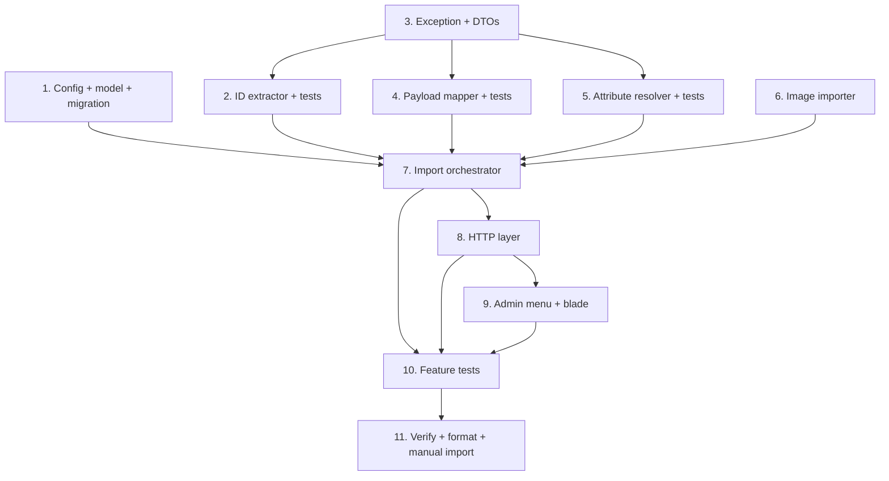

# Implementation Plan

## Overview

This plan implements the single-product AliExpress import feature defined in `design.md`. All code lives under the `App\` namespace and reuses the existing AliExpress OAuth + API client and Bagisto product repositories. Work proceeds bottom-up: config/model/migration first, then leaf services (extractor, mapper, attribute resolver, image importer) each with unit tests, then the orchestrator, then the HTTP/admin layer, then feature tests, and finally verification with a real product.

## Tasks

- [x] 1. Scaffold config, source-reference model, and migration
  - Add AliExpress import config keys to `config/aliexpress.php` (default `ship_to_country`, `target_currency=USD`, `target_language`, attribute code prefix `ae_`).
  - Create migration `database/migrations/xxxx_create_aliexpress_product_imports_table.php` per the design schema (unique `aliexpress_product_id`, nullable `product_id`, `type`, `status`, `sku`, `variants_count`, `images_count`, `error`, `payload_snapshot` json, timestamps, indexes).
  - Create `App\Models\AliExpressProductImport` (fillable, `payload_snapshot` cast to array, scopes `forAliExpressId`, `successful`).
  - Run the migration and confirm the table exists.
  - _Requirements: 5.1, 5.2_

- [x] 2. Build the product id extractor with unit tests
- [x] 2.1 Implement `App\Services\AliExpress\AliExpressProductIdExtractor::extract(string $input): string`
  - Trim; empty → throw `AliExpressImportException`; pure digits → return; parse URL patterns (`/item/<id>.html`, `/i/<id>.html`, `product/<id>`, `(\d{6,})` path segment, `productId`/`product_id` query) → return first numeric; else throw with offending input.
  - _Requirements: 2.1, 2.2, 2.3, 2.4_
- [x] 2.2 Write `tests/Unit/AliExpress/AliExpressProductIdExtractorTest.php` (Pest)
  - Cases: raw numeric id, each URL shape, query-param id, non-numeric garbage (throws), empty (throws).
  - _Requirements: 2.1, 2.2, 2.3, 2.4_

- [x] 3. Create the import exception and normalized DTOs
  - Create `App\Exceptions\AliExpress\AliExpressImportException` (message + optional context array, `context()` getter).
  - Create DTOs under `App\Services\AliExpress\DTO`: `NormalizedProduct`, `NormalizedVariantAxis`, `NormalizedVariant`, `ResolvedAxes` with the public properties defined in the design.
  - _Requirements: 4.4, 6.1, 6.2, 7.1, 8.1, 9.1_

- [x] 4. Implement the AliExpress payload mapper with unit tests
- [x] 4.1 Implement `App\Services\AliExpress\AliExpressProductMapper::map(array $body, string $id): NormalizedProduct`
  - Tolerant `firstOf($array, [...paths])` helper. Extract title, description, short description (truncate from description if absent), SEO (fallback meta_title=title), gallery image urls (split `;`), SKUs (sku_id, price from `offer_sale_price`/`sku_price`, stock from `sku_available_stock`/`ipm_sku_stock`), per-sku property pairs → axes + variants, per-sku image. Compute `isConfigurable`. Throw "product not found" when no base info present.
  - _Requirements: 4.2, 4.4, 6.1, 6.2, 7.1, 7.2, 7.3, 9.2, 9.3, 10.1, 10.2_
- [x] 4.2 Add fixtures + `tests/Unit/AliExpress/AliExpressProductMapperTest.php`
  - Configurable fixture (multi-SKU, color+size) and simple fixture (single SKU). Assert DTO fields, axes, variants, images, SEO fallback, isConfigurable flag, and "not found" on empty body.
  - _Requirements: 4.4, 6.1, 6.2, 7.3, 9.2, 9.3_

- [x] 5. Implement the attribute/option resolver with unit tests
- [x] 5.1 Implement `App\Services\AliExpress\AliExpressAttributeResolver::resolveAxes(array $axes): ResolvedAxes`
  - For each axis: compute code `ae_`+slug; find by code; if missing create `select` + `is_configurable=1` with options; if existing-but-not-configurable use `ae_<slug>_var` fallback; build `optionIdLookup[code][label]=>id` (case-insensitive/trimmed), create missing options; build `superAttributes[code]=optionIds`.
  - _Requirements: 8.1, 8.2, 8.3, 8.4_
- [x] 5.2 Write `tests/Unit/AliExpress/AliExpressAttributeResolverTest.php`
  - Missing attribute → created as configurable select with options; existing attribute reused; option label reuse is case-insensitive; returned option ids are numeric and owned by the attribute.
  - _Requirements: 8.1, 8.2, 8.3, 8.4_

- [x] 6. Implement the image importer
  - Implement `App\Services\AliExpress\AliExpressImageImporter` with `download(array $urls): array` (uses `Http::get`, writes temp file, wraps in `Illuminate\Http\UploadedFile`) and `attachToProduct(array $urls, Product $product): void` (calls `ProductImageRepository::upload(['images'=>['files'=>[...]]], $product, 'images')`).
  - Per-image failure: catch, log warning to `aliexpress` channel (url only), continue.
  - _Requirements: 10.1, 10.2, 10.3_

- [x] 7. Implement the import orchestrator service
- [x] 7.1 Implement `AliExpressProductImporter::import()` pre-create flow
  - Extract id; duplicate pre-check (throw with existing product reference); `OAuthService::latestToken()` (null → "authorization required"; invalid → "missing/expired"); call `aliexpress.ds.product.get` (USD/target language/ship-to from config); on `ok=false` throw with code+message; map body to DTO.
  - _Requirements: 3.1, 3.2, 3.3, 4.1, 4.3, 5.2_
- [x] 7.2 Implement configurable creation + variant reconciliation
  - Resolve axes; `ProductRepository::create(type=configurable, family, sku, super_attributes)`; load generated variants; build option-id signatures; match each AliExpress SKU; matched → set price/stock/option values/images; unmatched generated permutation → status=0, qty=0; parent representative price = min matched price.
  - _Requirements: 6.1, 6.3, 6.4, 9.1, 9.2, 9.3, 9.4, 9.6_
- [x] 7.3 Implement simple creation
  - `ProductRepository::create(type=simple, family, sku)`; update price + inventories from single SKU.
  - _Requirements: 6.2, 6.3, 6.4, 9.5, 9.6_
- [x] 7.4 Apply shared fields, SEO, url_key, category; persist source reference; transaction + logging
  - Parent `update()` name/description/short/meta/url_key (unique; append id on collision)/categories=[default]/status/visible; attach gallery images; wrap create+update+source-reference in `DB::transaction()`; write `AliExpressProductImport` row (success with counts, or failed with error); log steps to `aliexpress` channel without secrets.
  - _Requirements: 5.1, 7.1, 7.2, 7.3, 7.4, 7.5, 7.6, 10.1, 11.1, 11.2, 12.1, 12.2, 12.3_

- [x] 8. Add HTTP layer: FormRequest, controller, routes
- [x] 8.1 Create `App\Http\Requests\AliExpress\ImportProductRequest` (`identifier` required|string|max:2048, localized messages).
  - _Requirements: 2.4_
- [x] 8.2 Create `App\Http\Controllers\AliExpress\AliExpressImportController` (`index` renders page; `store` runs importer in try/catch, flashes success with product-edit link or error message).
  - _Requirements: 1.3, 4.3, 11.3, 12.3, 12.4_
- [x] 8.3 Register admin routes in `routes/web.php` under `config('app.admin_url')` with `['web','admin']` middleware.
  - _Requirements: 1.2, 1.4_

- [x] 9. Add the admin menu and the blade page
- [x] 9.1 Merge the "Drop Shipping" + "Import Products" entries into `config('menu.admin')` from `AppServiceProvider::boot()` (additive, reversible).
  - _Requirements: 1.1, 1.2_
- [x] 9.2 Create blade view `resources/views/aliexpress/import.blade.php` extending `<x-admin::layouts>`: identifier input, Import button, flash success/error display.
  - _Requirements: 1.3, 11.3, 12.4_

- [x] 10. Feature tests for the end-to-end import
- [x] 10.1 `tests/Feature/AliExpress/ImportConfigurableProductTest.php`
  - Seed `AliExpressToken`; `Http::fake()` the `/sync` gateway (fixture) and image urls; POST id; assert configurable + N simple variants, super_attributes, per-variant price/stock/options, image rows, default category+family, success import row, product in listing query.
  - _Requirements: 6.1, 8.1, 9.1, 9.2, 9.3, 9.4, 10.1, 11.1, 11.3_
- [x] 10.2 `tests/Feature/AliExpress/ImportSimpleProductTest.php` — single-SKU payload → simple product with price/stock/images.
  - _Requirements: 6.2, 9.5_
- [x] 10.3 `tests/Feature/AliExpress/ImportErrorsTest.php` — duplicate id rejected with reference; missing token error (no product); API `ok=false` surfaced (no product, failed row); one failing image url skipped.
  - _Requirements: 3.2, 3.3, 4.3, 5.2, 10.3, 12.3_

- [x] 11. Verify, format, and document
  - Run `php artisan migrate` and the new Pest tests (`php artisan test --filter=AliExpress`); fix failures.
  - Run `vendor/bin/pint --dirty` on all new/changed files.
  - Manually import one real AliExpress product id through the admin page; confirm it appears in Admin > Products; tune mapper field paths once against the real payload if needed.
  - _Requirements: 4.2, 6.5, 11.1, 11.3_

## Task Dependency Graph



```json
{
  "waves": [
    { "wave": 1, "tasks": ["1", "2.1", "3"] },
    { "wave": 2, "tasks": ["2.2", "4.1", "5.1", "6"] },
    { "wave": 3, "tasks": ["4.2", "5.2"] },
    { "wave": 4, "tasks": ["7.1", "7.2", "7.3", "7.4"] },
    { "wave": 5, "tasks": ["8.1", "8.2", "8.3"] },
    { "wave": 6, "tasks": ["9.1", "9.2"] },
    { "wave": 7, "tasks": ["10.1", "10.2", "10.3"] },
    { "wave": 8, "tasks": ["11"] }
  ]
}
```

## Notes

- **Bottom-up order**: leaf services (extractor, mapper, resolver, image importer) are built and unit-tested before the orchestrator that composes them.
- **Single source of payload knowledge**: only `AliExpressProductMapper` knows AliExpress field names; task 11 tunes it once against a real payload.
- **No package edits**: the admin menu is added by merging `config('menu.admin')` in `AppServiceProvider`; no Webkul package files are modified.
- **Mocking**: feature tests use `Http::fake()` for both the `/sync` gateway and image downloads; an `AliExpressToken` is seeded directly.
- **Out of scope** (future steps): AI rewriting, bulk import, queues, seller/category-link import.
