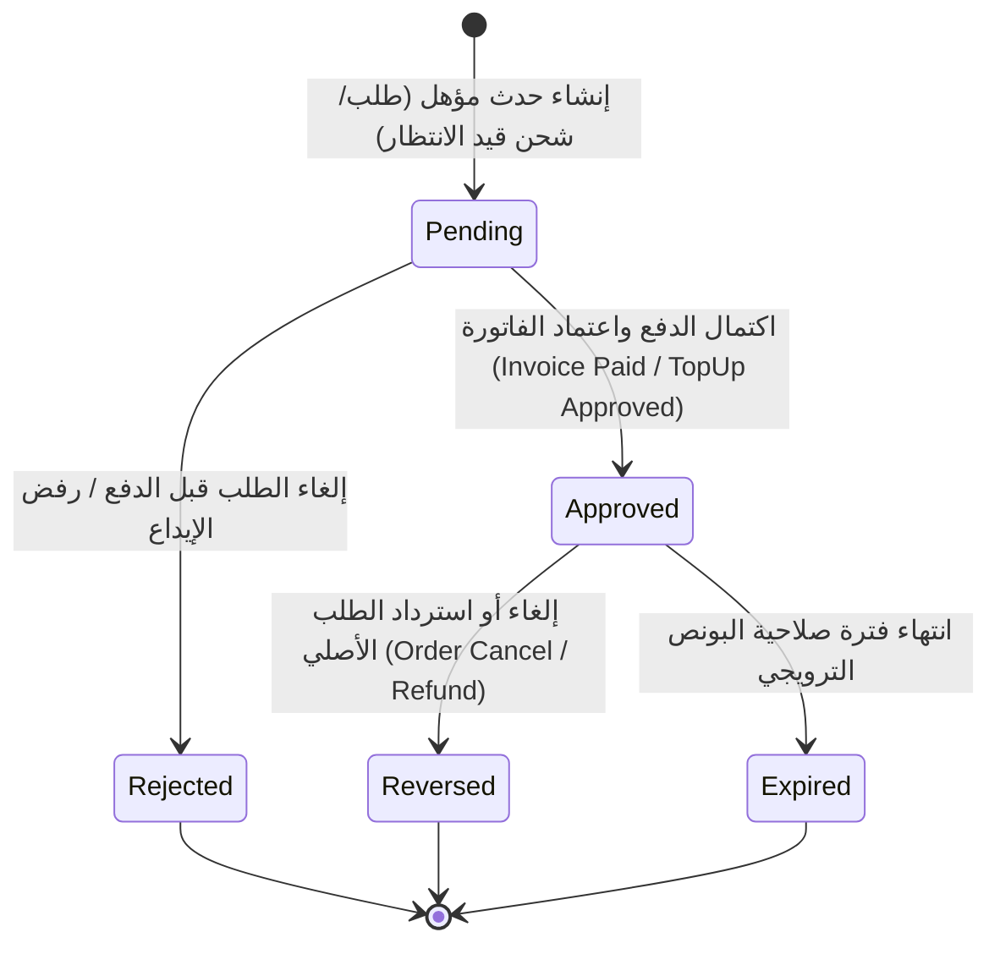

# عقد التصميم الفني والمعماري لعروض وحوافز المحفظة الرقمية
**المشروع:** منصة التجارة والمحفظة الرقمية Bagisto 2.4.x  
**الملف:** `WALLET_PROMOTIONS_DESIGN_CONTRACT.md`  
**الحالة:** مسودة تصميم فني قيد المراجعة والاعتماد (Pre-Implementation Technical Contract)  
**تاريخ الإعداد:** 13 أغسطس 2026  
**المرجع:** مبني بالكامل على الأدلة المثبتة في [WALLET_PROMOTIONS_SYSTEM_AUDIT.md](file:///e:/HIGESTO%20NEW1/higest/higest101/WALLET_PROMOTIONS_SYSTEM_AUDIT.md)

---

## 1. القرارات المعمارية الأساسية والقواعد المالية (Core Financial & Architectural Decisions)

### 1.1. طبيعة الرصيد الترويجي (Withdrawable vs Shopping-Only)
- **القرار:** **كافة مبالغ البونص (Bonus) والكاش باك (Cashback) مخصصة حصراً للشراء من المتجر (Shopping-Only / Non-Withdrawable) وغير قابلة للسحب النقدي نهائياً.**
- **التطبيق الصارم:**
  - يتم فصل الرصيد الترويجي محاسبياً داخل حساب المحفظة.
  - عمليات سحب الأموال عبر التحويلات البنكية (`WalletWithdrawalRequest`) تُمنع منعاً باتاً من المساس بالرصيد الترويجي؛ حيث يُسمح بالسحب فقط من **الرصيد النقدي الحقيقي المودع فعلياً (Real Cash Balance)**.

### 1.2. معادلة فصل الرصيد والـ Balance Invariant
لتجنب خلط الأموال الحقيقية بالبونص ولضمان التوافق مع بنية المحفظة الحالية، يتم تحديث نموذج حساب المحفظة (`wallet_accounts`) ليعتمد المعادلة المحاسبية التالية:

$$\text{total\_balance} = \text{cash\_balance} + \text{promo\_balance}$$
$$\text{available\_balance} = (\text{cash\_balance} - \text{held\_balance}) + \text{promo\_balance}$$
$$\text{withdrawable\_balance} = \max(0, \text{cash\_balance} - \text{held\_balance})$$

* **قواعد السحب (`Withdrawals`):** الحد الأقصى المسموح بطلبه للسحب = $\text{withdrawable\_balance}$.
* **قواعد الشراء والدفع (`Checkout Payment`):** الحد الأقصى المسموح للشراء = $\text{available\_balance}$ (حيث يستهلك النظام الرصيد الترويجي أولاً لتشجيع العميل ثم الرصيد النقدي).

---

## 2. آلة الحالات للمعاملات الترويجية (Promotion Transaction State Machine)



### توصيف الحالات (State Definitions):
1. `pending`: المعاملة الترويجية مسجلة بانتظار التأكيد المالي النهائي (مثل طلب تم إنشاؤه ولم تسدد فاتورته بعد).
2. `approved`: تم التحقق المالي وإيداع الرصيد الترويجي في المحفظة كمعاملة ناجحة.
3. `reversed`: تم عكس الرصيد الترويجي كلياً أو جزئياً بسبب إلغاء الطلب الأصلي أو رد المنتجات.
4. `expired`: انتهت فترة الصلاحية المحددة للبونص الترويجي دون استخدامه.
5. `rejected`: رُفضت المعاملة بسبب عدم تحقق الشروط أو فشل اعتماد العملية المالية.

---

## 3. نقاط المنح وشروط الأهلية للأنواع الأربعة (The 4 Promotion Types Lifecycle)

### 3.1. النوع الأول: بونص ترحيبي عند إنشاء الحساب (Welcome Bonus)
- **الحدث المشغّل:** `customer.create.after` أو `customer.registration.after`.
- **نقطة المنح:** فور اكتمال إنشاء حساب العميل بنجاح.
- **شروط الأهلية:**
  - سريان فترة العرض (`starts_from` <= الآن <= `ends_till`).
  - عدم وجود حساب محفظة سابق مرتبط بنفس رقم الهاتف أو البريد الإلكتروني.
  - تفعيل العرض في القناة (`Channel`).
- **القيمة:** مبلغ ثابت (Fixed Amount) بالعملة الأساسية.
- **حماية التكرار (Idempotency Key):** `welcome_bonus:customer:{customer_id}`.
- **حد الاستخدام:** مرة واحدة فقط لكل عميل (`usage_per_customer = 1`).

### 3.2. النوع الثاني: بونص شحن المحفظة بنسبة مئوية (Top-Up Bonus)
- **الحدث المشغّل:** `wallet.topup.approved` (عند قيام الأدمن باعتماد إيداع الحوالة أو نجاح الدفع الإلكتروني للإيداع).
- **نقطة المنح:** فور انتقال حالة الإيداع إلى `completed` في `WalletTopUpController@approve`.
- **شروط الأهلية:**
  - مبلغ الإيداع >= الحد الأدنى المؤهل للعرض (`min_topup_amount`).
  - طريقة الدفع المستخدمة في الإيداع مشمولة في العرض.
- **القيمة:** نسبة مئوية من مبلغ الشحن (مع حد أقصى للمكافأة `max_reward_amount`).
- **القيد المحاسبي:** قيدان منفصلان في Ledger:
  1. `CREDIT_TOPUP`: مبلغ الشحن النقدي الحقيقي (يزيد `cash_balance`).
  2. `CREDIT_PROMOTION`: مبلغ البونص الترويجي (يزيد `promo_balance`).
- **حماية التكرار:** `topup_bonus:topup:{topup_id}`.

### 3.3. النوع الثالث: كاش باك السلة/الطلب عند تجاوز حد معين (Order Subtotal Cashback)
- **الحدث المشغّل:** `sales.invoice.save.after` (ضمان تحصيل القيمة المالية).
- **نقطة المنح:** فور تأكيد دفع الفاتورة.
- **شروط الأهلية:**
  - صافي مجموع منتجات السلة المؤهلة >= الحد الأدنى للعرض (`min_order_subtotal`).
  - وسيلة الدفع مطابقة لشروط العرض (محفظة، بطاقة، دفع عند الاستلام... إلخ).
- **القيمة:** مبلغ ثابت أو نسبة مئوية مع سقف محدد (`max_cashback_amount`).
- **حماية التكرار:** `order_subtotal_cashback:invoice:{invoice_id}`.

### 3.4. النوع الرابع: كاش باك الطلب المشروط بالمنتجات أو التصنيفات (Conditional Catalog Cashback)
- **الحدث المشغّل:** `sales.invoice.save.after`.
- **نقطة المنح:** فور تأكيد دفع الفاتورة.
- **شروط الأهلية:** يتم تقييمها عبر محرك الشروط المركزي `Webkul\Rule\Helpers\Validator`:
  - احتواء الطلب على تصنيفات معينة (`category_ids`)، علامات تجارية، أو منتجات محددة.
  - مجموعة العميل (`customer_group_id`) مؤهلة.
- **القيمة:** نسبة مئوية من قيمة المنتجات المؤهلة داخل السلة.
- **حماية التكرار:** `order_conditional_cashback:invoice:{invoice_id}:promo:{promo_id}`.

---

## 4. سياسات الإلغاء والاسترداد والتعامل مع الرصيد المستخدم (Cancellation & Refund Policies)

### 4.1. الإلغاء الكامل للطلب (Full Order Cancellation)
- **الحدث:** `sales.order.cancel.after`.
- **السلوك:**
  1. إلغاء أي كاش باك معلق (`pending`) وتحويله إلى `rejected`.
  2. إذا كان الكاش باك قد تم منحه (`approved`)، يتم خصم نفس مبلغ الكاش باك الممنوح بحركة عكسية:
     - نوع المعاملة: `DEBIT_PROMOTION_REVERSAL`.
     - المرجع: رقم الطلب والفاتورة.

### 4.2. الاسترداد الجزئي للمنتجات (Partial Refund)
- **الحدث:** `sales.refund.save.after`.
- **السلوك:**
  - يُعاد احتساب قيمة الكاش باك بناءً على النسبة المئوية للمبلغ المسترد مقارنة بإجمالي الطلب، أو إعادة تقييم شرط الحد الأدنى:
    $$\text{عكس الكاش باك} = \text{الكاش باك الممنوح} \times \left(\frac{\text{المبلغ المسترد}}{\text{إجمالي الطلب الأصلي}}\right)$$
  - خصم الناتج من `promo_balance`.

### 4.3. معالجة حالة: استهلاك العميل للكاش باك ثم طلب إلغاء/استرداد الطلب الأصلي (Spent Bonus Edge Case)
في حال قام العميل باستخدام الكاش باك الممنوح في شراء طلب جديد، ثم طلب استرجاع الطلب الأول:
- **القرار المعتمد:**
  1. يتم خصم قيمة الكاش باك المستحق استرجاعه **مباشرة من مبلغ الاسترداد النقدي للطلب الأصلي (Deduction from Refund Amount)** قبل إرجاع الأموال للعميل.
  2. إذا لم يكن الاسترداد كافياً، يتم خصم الرصيد من `promo_balance` حتى لو أصبح سالباً مؤقتاً كالتزام على العميل، ويتم تسويته تلقائياً من أي كاش باك أو شحن قادم.

---

## 5. مصفوفة الأولوية والتعارض بين العروض (Priority & Conflict Resolution)

| الحالة | قاعدة الحسم والتعارض |
|---|---|
| **اجتماع كاش باك سلة عام مع كاش باك منتجات مخصص** | إذا تم تفعيل خيار `end_other_promotions = 1` على العرض ذي الأولوية الأعلى (`priority`)، يُطبق العرض الأعلى فقط. وإذا كان `0`، يتم تطبيق العرضين مع مراعاة السقف الإجمالي للمكافأة. |
| **اجتماع كود خصم سلة (Cart Rule Coupon) مع كاش باك محفظة** | **مسموح بالجمع:** يتم تطبيق كود الخصم أولاً لتخفيض قيمة الفاتورة، ثم يُحسب الكاش باك على **الصافي المدفوع فعلياً بعد الخصم (Net Paid Amount)** وليس على الإجمالي قبل الخصم. |
| **كاش باك الدفع القديم (Legacy 5%) مقابل النظام الجديد** | **إلغاء وتجاوز تام:** يُعطل كود الكاش باك القديم بالكامل بمجرد تفعيل نظام عروض المحفظة الجديد لمنع ازدواجية منح المكافآت. |

---

## 6. حماية البيانات والتزامن والـ Idempotency (Data Integrity & Concurrency)

### 6.1. منع التكرار على مستوى قاعدة البيانات (Database-Level Idempotency)
- إضافة جدول وسيط لتسجيل استحقاق العروض باسم `wallet_promotion_usages` يحتوي على **قيد فريد مركب (Unique Constraint)**:
  `UNIQUE KEY (promotion_id, event_key)`
- أي محاولة مكررة لإعادة تشغيل الـ Job أو حفظ الفاتورة ستصطدم بالقيد الفريد ويتم تجاهلها بأمان دون تكرار الرصيد.

### 6.2. قفل الصفوف والتزامن (Row Locking & Concurrency)
- كافة عمليات فحص الرصيد، التقييم، وتحديث المجاميع تنفذ إجبارياً داخل:
  ```php
  DB::transaction(function () use ($walletId, $promoId) {
      $wallet = WalletAccount::lockForUpdate()->findOrFail($walletId);
      $promo = WalletPromotion::lockForUpdate()->findOrFail($promoId);
      // تنفيذ المنح المحاسبي وتحديث العدادات
  });
  ```

---

## 7. العملات والتقريب والتوقيت (Currency, Rounding & Timezones)

1. **العملة:** كافة تقييمات العروض والشروط والمكافآت تُحسب وتُسجل بـ **عملة المتجر الأساسية (Base Currency - SAR)**.
2. **التقريب المالي:** يُعتمد التقريب المحاسبي القياسي `round($amount, 2)` لمنع كسور السنتات.
3. **التوقيت والمناطق الزمنية:**
   - تخزن تواريخ بداية ونهاية العروض في قاعدة البيانات بنظام `UTC`.
   - يتم التحقق من سريان العرض بمقارنة `now()->setTimezone('UTC')` مع التواريخ المخزنة.

---

## 8. نموذج البيانات المقترح (Proposed Data Model)

### 8.1. جدول عروض المحفظة `wallet_promotions`
| الحقل | النوع | القيود والوصف |
|---|---|---|
| `id` | `bigint unsigned` | Primary Key |
| `name` | `string(255)` | اسم العرض التعريفي |
| `description` | `text` | وصف العرض وشروطه للعميل |
| `type` | `enum` | `welcome_bonus`, `topup_bonus`, `order_subtotal_cashback`, `order_conditional_cashback` |
| `status` | `boolean` | `1` مفعل / `0` معطل |
| `action_type` | `enum` | `fixed` (مبلغ ثابت) / `percentage` (نسبة مئوية) |
| `reward_value` | `decimal(12,4)` | قيمة المكافأة (المبلغ أو النسبة) |
| `max_reward_amount`| `decimal(12,4) nullable`| سقف المكافأة للعملية الواحدة (في حال النسبة) |
| `min_spend_amount` | `decimal(12,4) nullable`| الحد الأدنى لقيمة الشحن أو السلة المؤهلة |
| `total_budget` | `decimal(12,4) nullable`| الميزانية الإجمالية المخصصة للحملة |
| `total_allocated` | `decimal(12,4)` | إجمالي المبالغ الممنوحة حتى الآن (افتراضي 0) |
| `usage_limit` | `int unsigned nullable` | الحد الأقصى الكلي لعدد مرات الاستخدام |
| `usage_per_customer`|`int unsigned nullable`| الحد الأقصى لمرات الاستخدام لكل عميل |
| `times_used` | `int unsigned` | إجمالي مرات الاستخدام المنفذة |
| `starts_from` | `datetime nullable` | تاريخ ووقت بداية الحملة |
| `ends_till` | `datetime nullable` | تاريخ ووقت نهاية الحملة |
| `conditions` | `json nullable` | شروط محرك القواعد (التصنيفات، المنتجات، القنوات...) |
| `priority` | `int default 0` | أولوية التطبيق عند التزاحم |
| `end_other_promotions`| `boolean default 0` | إيقاف تطبيق العروض الترويجية الأدنى أولوية |
| `created_at` / `updated_at` | `timestamps` | تواريخ الإنشاء والتعديل |

### 8.2. جدول سجل استخدام العروض `wallet_promotion_usages`
| الحقل | النوع | القيود والوصف |
|---|---|---|
| `id` | `bigint unsigned` | Primary Key |
| `promotion_id` | `bigint unsigned` | Foreign Key -> `wallet_promotions.id` |
| `customer_id` | `int unsigned` | Foreign Key -> `customers.id` |
| `wallet_transaction_id`| `bigint unsigned nullable`| Foreign Key -> `wallet_transactions.id` |
| `event_key` | `string(191)` | Unique Idempotency Key (مثل `order:105:invoice:12`) |
| `reward_amount` | `decimal(12,4)` | المبلغ الفعلي الممنوح |
| `status` | `enum` | `approved`, `reversed`, `expired` |
| `created_at` / `updated_at` | `timestamps` | تواريخ التسجيل |
| **Unique Index** | **`UNIQUE(promotion_id, event_key)`** | منع تكرار الاستخدام نهائياً |

### 8.3. تعديل جدول حسابات المحفظة `wallet_accounts`
- إضافة الأعمدة:
  - `promo_balance` (`decimal(12,4) unsigned default 0`): الرصيد الترويجي المتاح للشراء فقط.
  - `cash_balance` (`decimal(12,4) unsigned default 0`): الرصيد النقدي الحقيقي القابل للسحب والشراء.

---

## 9. واجهات الـ Routes والصلاحيات المقترحة (Routes & Permissions Specification)

### 9.1. الـ Routes في لوحة الأدمن (`admin-routes.php`)
تُدرج تحت مسار التسويق والعروض:
- `GET admin/marketing/promotions/wallet-promotions` ⬅️ `index` (قائمة العروض عبر DataGrid).
- `GET admin/marketing/promotions/wallet-promotions/create` ⬅️ `create` (شاشة إنشاء عرض جديد).
- `POST admin/marketing/promotions/wallet-promotions/create` ⬅️ `store` (حفظ العرض).
- `GET admin/marketing/promotions/wallet-promotions/edit/{id}` ⬅️ `edit` (تعديل العرض).
- `PUT admin/marketing/promotions/wallet-promotions/edit/{id}` ⬅️ `update` (تحديث العرض).
- `DELETE admin/marketing/promotions/wallet-promotions/{id}` ⬅️ `destroy` (حذف/تعطيل العرض).

### 9.2. الصلاحيات (ACL Configuration)
في ملف `packages/Webkul/Wallet/src/Config/acl.php`:
```php
[
    'key'   => 'marketing.promotions.wallet_promotions',
    'name'  => 'wallet::app.admin.acl.wallet-promotions',
    'route' => 'admin.marketing.promotions.wallet_promotions.index',
    'sort'  => 4,
]
```

---

## 10. خطة الانتقال وإلغاء الـ Listener القديم (Legacy Migration Plan)

1. **التعطيل الآمن:**
   - إزالة تسجيل `ApplyWalletCashbackListener` من `packages/Webkul/Wallet/src/Providers/EventServiceProvider.php`.
2. **الاستبدال بالمعالج المركزي الجديد:**
   - تسجيل `Webkul\Wallet\Listeners\EvaluateWalletPromotionsListener` على الأحداث الثلاثة:
     * `customer.create.after` (بونص التسجيل).
     * `wallet.topup.approved` (بونص الشحن).
     * `sales.invoice.save.after` (كاش باك الطلبات).
3. **سلامة البيانات السابقة:**
   - المعاملات السابقة المسجلة في `wallet_transactions` بنوع `CREDIT_PROMOTION` تظل كما هي كقيود تاريخية غير قابلة للتعديل للحفاظ على تطابق الـ Ledger.

---

## 11. مصفوفة الاختبارات المعمارية الإلزامية (Comprehensive Test Matrix)

| المعرف | اسم الاختبار | المدخلات والسيناريو | النتيجة المحاسبية المتوقعة | الدليل والتحقق |
|---|---|---|---|---|
| **TEST-01** | عزل سحب الرصيد | محفظة بها 100 كاش و 50 بونص، محاولة سحب 120 | رفض طلب السحب (الرصيد القابل للسحب 100 فقط) | استثناء `InsufficientWithdrawableBalance` |
| **TEST-02** | أولوية استهلاك البونص | محفظة بها 100 كاش و 50 بونص، شراء طلب بقيمة 60 | يخصم 50 من البونص و 10 من الكاش (المتبقي: 90 كاش، 0 بونص) | فحص قيدين في `wallet_transactions` |
| **TEST-03** | منع تكرار بونص التسجيل | استدعاء حدث تسجيل نفس العميل مرتين | منح بونص 10 ريال مرة واحدة وتجاهل المحاولة الثانية | وجود سجل واحد في `wallet_promotion_usages` |
| **TEST-04** | بونص شحن المحفظة وسقف المكافأة | عرض بونص 10% بحد أقصى 50 ريال، شحن 1000 ريال | إيداع 1000 كاش + 50 بونص (تطبيق السقف) | فحص معاميل الإيداع في الـ Ledger |
| **TEST-05** | استرجاع الطلب بعد استهلاك الكاش باك | منح 20 كاش باك تم صرفها، ثم رد الطلب وقيمته 200 | استرداد العميل لـ 180 ريال فقط (خصم 20 كاش باك مستهلك) | فحص صافي مبلغ الفاتورة المستردة |
| **TEST-06** | التحقق من التزامن وقفل الصفوف | إرسال 5 طلبات متزامنة تطبق عرضاً متبقي في ميزانيته 100 فقط | قبول العمليات حتى نفاد الميزانية ورفض الباقي بأمان | عدم تجاوز `total_allocated` لسقف `total_budget` |

---

## 12. بوابة الموافقة قبل بدء البرمجة (Go/No-Go Implementation Gate)

### **القرار النهائي لعقد التصميم:** `READY FOR REVIEW & APPROVAL`

**المحددات الصارمة قبل كتابة الكود:**
1. توقف تام لجميع الأنشطة البرمجية حتى استلام موافقة صريحة من قائد المهمة على بنود هذا العقد.
2. لا يتم فتح أي ملف كود للتعديل إلا بعد الاعتماد النهائي لنموذج البيانات وسياسات الاسترداد الموثقة أعلاه.
