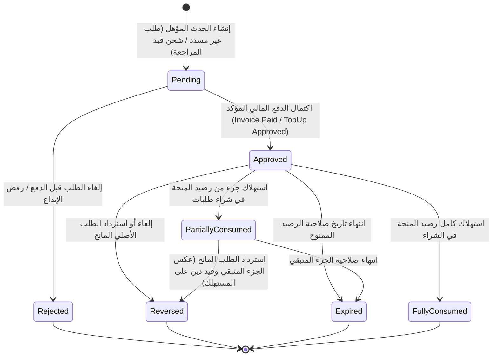

# عقد التصميم الفني والمعماري لعروض وحوافز المحفظة الرقمية — الإصدار 1.1
**المشروع:** منصة التجارة والمحفظة الرقمية Bagisto 2.4.x  
**الملف:** `WALLET_PROMOTIONS_DESIGN_CONTRACT_V1.1.md`  
**الحالة:** عقد تصميم فني نهائي قيد الاعتماد (Pre-Implementation Technical Contract - V1.1)  
**تاريخ الإصدار:** 13 أغسطس 2026  
**المرجع:** مبني بالكامل على الأدلة المثبتة في [WALLET_PROMOTIONS_SYSTEM_AUDIT.md](file:///e:/HIGESTO%20NEW1/higest/higest101/WALLET_PROMOTIONS_SYSTEM_AUDIT.md)

---

## 1. القرارات المعمارية الأساسية والقواعد المالية (Core Financial Decisions)

### 1.1. طبيعة الرصيد الترويجي (Withdrawable vs Shopping-Only)
- **القرار الحاسم:** **كافة مبالغ البونص (Bonus) والكاش باك (Cashback) مخصصة حصراً للشراء من المتجر (Shopping-Only / Non-Withdrawable) ويحظر سحبها نقداً بأي وسيلة تحويل بنكي.**
- **التطبيق الصارم:**
  - يتم فصل الرصيد الترويجي محاسبياً داخل حساب المحفظة عبر حقل `promo_balance`.
  - طلبات السحب النقدي (`WalletWithdrawalRequest`) تُمنع منعاً باتاً من المساس بـ `promo_balance`، ويقتصر السحب فقط على صافي الرصيد النقدي الحقيقي المودع (`cash_balance - held_balance`).

### 1.2. المعادلة المحاسبية المحدثة لحساب المحفظة (Updated Wallet Invariant)
يتم تحديث نموذج حساب المحفظة (`wallet_accounts`) ليعتمد المعادلات المحاسبية التالية بشكل صارم:

$$\text{total\_balance} = \text{cash\_balance} + \text{promo\_balance}$$
$$\text{available\_balance} = (\text{cash\_balance} - \text{held\_balance}) + \text{promo\_balance}$$
$$\text{withdrawable\_balance} = \max(0, \text{cash\_balance} - \text{held\_balance})$$

* **قواعد السحب (`Withdrawals`):** الحد الأقصى المسموح بطلبه للسحب = $\text{withdrawable\_balance}$.
* **قواعد الشراء والدفع (`Checkout Payment`):** الحد الأقصى المسموح للشراء = $\text{available\_balance}$ (مع استهلاك رصيد البونص أولاً ثم الكاش).

---

## 2. آلة الحالات الموحدة (Unified State Machine & Data Mapping)

تتوحد آلة الحالات تماماً مع حقلي الحالة في جدولي المنح واستخدام العروض:



### خريطة الحالات والجداول (State-to-Table Mapping):
1. **جدول `wallet_promotion_usages` (سجل الأهلية والتحقق من التكرار):**
   - `status`: `enum('pending', 'approved', 'reversed', 'rejected')`
   - `pending`: استحقاق مسجل بانتظار تحصيل الفاتورة.
   - `approved`: تم اعتماد الاستحقاق وإصدار المنحة (`Grant`).
   - `reversed`: تم إلغاء الاستحقاق واسترجاع المكافأة.
   - `rejected`: تم إلغاء الطلب قبل الفاتورة أو فشل التحقق المالي.
2. **جدول `wallet_promotion_grants` (سجل حصص الرصيد - Lots Ledger):**
   - `status`: `enum('pending', 'active', 'partially_consumed', 'fully_consumed', 'expired', 'reversed')`

---

## 3. تصميم سجل المنح وحصص الرصيد (Grant / Lot Ledger)

كل مكافأة ترويجية تُمنح للعميل تُنشئ سجلاً مستقلاً كـ **حصة رصيد (Lot)** داخل جدول `wallet_promotion_grants`:

### 3.1. حقول سجل الحصة (`wallet_promotion_grants`):
| الحقل | النوع | الوصف والقيود |
|---|---|---|
| `id` | `bigint unsigned` | المفتاح الأساسي |
| `promotion_id` | `bigint unsigned` | معرف العرض الترويجي |
| `customer_id` | `int unsigned` | معرف العميل المستفيد |
| `wallet_id` | `bigint unsigned` | معرف المحفظة المرتبطة |
| `usage_id` | `bigint unsigned` | معرف سجل الاستخدام التابع له |
| `original_amount` | `decimal(12,4)` | القيمة الأصلية الممنوحة للحصة |
| `remaining_amount`| `decimal(12,4)` | القيمة المتبقية من الحصة غير المستهلكة |
| `consumed_amount` | `decimal(12,4)` | القيمة التي تم استهلاكها في عمليات الشراء |
| `status` | `enum` | `active`, `partially_consumed`, `fully_consumed`, `expired`, `reversed` |
| `reference_type` | `string(100)` | الموديل المنشئ (`Order`, `WalletTopUp`, `Customer`) |
| `reference_id` | `bigint unsigned` | رقم المعرف للعملية المنشئة |
| `granted_at` | `datetime` | تاريخ ووقت المنح الفعلي |
| `expires_at` | `datetime nullable` | تاريخ انتهاء صلاحية الحصة (تاريخ المنح + `grant_validity_days`) |

### 3.2. خوارزمية الاستهلاك (FIFO Lot Consumption Algorithm)
عند قيام العميل بالشراء والدفع بالمحفظة:
1. يتم البحث عن حصص الرصيد النشطة (`status IN ('active', 'partially_consumed')`) الخاصة بالعميل والمرتبة تصاعدياً حسب تاريخ الانتهاء ثم تاريخ المنح (`ORDER BY expires_at ASC, granted_at ASC`).
2. يتم استهلاك المبالغ بنظام **الوارد أولاً يصرف أولاً (FIFO)** وتخفيض `remaining_amount` وزيادة `consumed_amount`.
3. إذا غطت الحصص الترويجية كامل مبلغ الطلب، يخصم من `promo_balance` فقط.
4. إذا لم تكفِ الحصص الترويجية، يتم استهلاك المتبقي من `cash_balance`.

---

## 4. خوارزمية الاسترداد الجزئي على مستوى العناصر المؤهلة (Item-Level Partial Refund Algorithm)

بدلاً من النسب العامة التقريبية، تعتمد خوارزمية استرجاع الكاش باك عند الرد الجزئي على **التتبع الدقيق للعناصر المؤهلة (Eligible Items Tracking)**:

### 4.1. خطوات الخوارزمية:
1. **في حالة العرض بنسبة مئوية (Percentage Reward):**
   - كل عنصر في السلة تم احتساب كاش باك عليه يحمل نصيبه الدقيق المسجل في بيانات الفاتورة:
     $$\text{Item Cashback} = \text{Item Eligible Net Price} \times \text{Promo Rate}$$
   - عند استرجاع صنف معين، يتم عكس واسترجاع قيمة الكاش باك الخاصة بتلك القطعة المرتجعة بالضبط:
     $$\text{Reversed Amount} = \text{Refunded Qty} \times \text{Item Unit Cashback}$$
2. **في حالة العرض بمبلغ ثابت (Fixed Amount Reward):**
   - إذا كان العرض مشروطاً بحد أدنى للطلب (`min_spend_amount = 200` مثلاً):
     - إذا أصبح إجمالي الطلب بعد الاسترداد الجزئي **أقل من الحد الأدنى** ($< 200$)، يفقد الطلب أهليته بالكامل ويتم **عكس كامل مبلغ المكافأة الثابتة ($100\%$)**.
     - إذا ظل إجمالي الطلب بعد الاسترداد الجزئي **مستوفياً للحد الأدنى** ($\ge 200$)، **لا يتم خصم أي جزء** من المكافأة الثابتة وتظل للعميل كاملة.

---

## 5. تعريف حدث الدفع المؤكد وإطلاق الأحداث المالية (Verified Paid Events)

### 5.1. حدث الدفع المؤكد للطلبات (Order Payment Confirmation)
- **القاعدة الصارمة:** لا يُمنح أي كاش باك بمجرد حفظ الفاتورة مبدئياً إلا بعد التحقق الصريح من سدادها الفعلي:
  ```php
  if ($invoice->state !== \Webkul\Sales\Models\Invoice::STATUS_PAID 
      && $invoice->status !== \Webkul\Sales\Models\Invoice::STATUS_PAID) {
      return; // تجاهل الفواتير غير المسددة
  }
  ```
- **حالات الدفع عند الاستلام (COD):** يتم إنشاء الفاتورة في حالة `pending`، ولا يتم إطلاق منح الكاش باك إلا عند تحصيل المبلغ وتغيير حالة الفاتورة إلى `paid` بواسطة المحصل/الأدمن.

### 5.2. حدث اعتماد شحن المحفظة (`wallet.topup.approved`)
- **توصيف الحدث:** إطلاق حدث صريح داخل دالة الاعتماد `WalletTopUpController@approve` قبل إرجاع الاستجابة:
  `Event::dispatch('wallet.topup.approved', [$topup, $wallet]);`
- **الـ Payload:**
  - `topup`: كائن طلب الشحن بعد تحديث حالته إلى `completed`.
  - `wallet`: كائن حساب المحفظة المودع فيه.
  - `admin_id`: معرف المشرف المعتمد.

---

## 6. نموذج الدين الترويجي (Promotional Debt Model - `promo_debt`)

### 6.1. المشكلة المحاسبية:
إذا استهلك العميل الكاش باك الممنوح في شراء طلب جديد، ثم ألغى أو استرد الطلب الأول، لا يمكن جعل `promo_balance` سالباً لتجنب كسر قيود قاعدة البيانات (`unsigned`).

### 6.2. المعالجة المحاسبية المعتمدة:
1. **الخطوة الأولى (الخصم من المسترد النقدي):** يتم خصم مبلغ الكاش باك الواجب استرجاعه تلقائياً من **قيمة المبلغ المسترد للعميل (Deduction from Cash Refund)**.
2. **الخطوة الثانية (قيد الدين الترويجي `promo_debt`):**
   - إذا كان الاسترداد غير نقدي أو لم يكفِ المبلغ، يُسجل المتبقي في حقل `promo_debt` بجدول `wallet_accounts`.
   - **قاعدة التسوية التلقائية:** أي بونص أو كاش باك أو رصيد ترويجي مستقبلي يستحقه العميل، يُوجّه أولاً لسداد `promo_debt` حتى يصل إلى `0.00` قبل إضافة أي رصيد إلى `promo_balance`.

---

## 7. أمثلة محاسبية رقمية شاملة (Concrete Numerical Accounting Examples)

### المثال 1: الدفع المختلط واستهلاك الحصص (Mixed Payment & Lot Consumption)
* **رصيد العميل الابتدائي:** `cash_balance = 100`, `promo_balance = 40` (مقسمة: Lot A = 25 ينتهي غداً، Lot B = 15 ينتهي بعد شهر).
* **قيمة الطلب الجديد:** 50 ريال.
* **الأثر المحاسبي:**
  1. استهلاك Lot A بالكامل (25 ريال) ⬅️ تصبح `remaining = 0`, `status = fully_consumed`.
  2. استهلاك 15 ريال من Lot B ⬅️ تصبح `remaining = 0`, `status = fully_consumed`.
  3. استهلاك 10 ريال من `cash_balance`.
* **الرصيد بعد الشراء:** `cash_balance = 90`, `promo_balance = 0`, `total_balance = 90`.

### المثال 2: الرد بعد استهلاك الكاش باك (Refund After Promo Spent)
* العميل اشترى طلب (#101) بقيمة 200 ريال وحصل على كاش باك 20 ريال.
* قام العميل بصرف الـ 20 ريال في طلب (#102).
* طلب العميل إرجاع الطلب (#101) واسترداد أمواله (200 ريال).
* **الأثر المحاسبي:**
  - يتم استرداد **180 ريال فقط** إلى رصيد الكاش (`cash_balance += 180`).
  - يتم خصم الـ 20 ريال كاسترداد للكاش باك المستهلك (`Reversal Offset`).
  - رصيد العميل لا يصبح سالباً والـ Ledger متطابق 100%.

---

## 8. خطة الترحيل وفصل الحسابات الحالية (Backfill & Migration Plan)

لإضافة حقلي `cash_balance` و `promo_balance` على الحسابات القائمة دون أي عجز:
1. **خوارزمية الجرد الحسابي (Deterministic Audit Script):**
   - لكل محفظة في جدول `wallet_accounts`:
     $$\text{Historical Promo Credits} = \sum \text{amount} \text{ WHERE type = 'CREDIT\_PROMOTION'}$$
     $$\text{Total Debits} = \sum \text{amount} \text{ WHERE direction = 'debit'}$$
     $$\text{Initial Promo Balance} = \max(0, \text{Historical Promo Credits} - \text{Total Debits})$$
     $$\text{Initial Cash Balance} = \text{total\_balance} - \text{Initial Promo Balance}$$
2. **التحقق من التطابق (Invariant Assertion):**
   - التحقق الصارم من أن: $\text{Initial Cash Balance} + \text{Initial Promo Balance} = \text{total\_balance}$ قبل إتمام الترحيل.

---

## 9. التوقيت والعملات ومحرك الـ Idempotency (Timezone, Currency & Idempotency)

1. **العملات والتحويل:**
   - عملة المتجر الأساسية والمحفظة هي **SAR** (`core()->getBaseCurrencyCode()`).
   - إذا كان الطلب بعملة فرعية (مثل USD)، يتم تحويل المبالغ لتقييم الحد الأدنى واحتساب الكاش باك باستخدام سعر الصرف الرسمي في النظام:
     `$baseAmount = core()->convertToBasePrice($order->grand_total);`
2. **فصل صلاحية العرض عن صلاحية الرصيد:**
   - `starts_from` و `ends_till`: فترة استقبال الطلبات وتطبيق الحملة الترويجية.
   - `grant_validity_days`: عدد الأيام التي يظل فيها الرصيد الممنوح صالحاً في محفظة العميل بعد منحه (مثلاً 90 يوماً من تاريخ المنح).
3. **حماية التكرار المركبة (Multi-Promotion Idempotency):**
   - كل منحة تحمل `event_key` فريد مركب: `{promo_id}:{event_type}:{reference_id}`.
   - قيد فريد مركب في قاعدة البيانات: `UNIQUE KEY unique_grant (promotion_id, event_key)`.

---

## 10. نموذج البيانات النهائي الكامل (Final Database Schema Specification)

### 10.1. جدول `wallet_promotions` (العروض وقواعدها)
```sql
CREATE TABLE `wallet_promotions` (
  `id` BIGINT UNSIGNED AUTO_INCREMENT PRIMARY KEY,
  `name` VARCHAR(255) NOT NULL,
  `description` TEXT NULL,
  `type` ENUM('welcome_bonus', 'topup_bonus', 'order_subtotal_cashback', 'order_conditional_cashback') NOT NULL,
  `status` ENUM('draft', 'active', 'inactive', 'archived') NOT NULL DEFAULT 'draft',
  `action_type` ENUM('fixed', 'percentage') NOT NULL DEFAULT 'percentage',
  `reward_value` DECIMAL(12,4) NOT NULL,
  `max_reward_amount` DECIMAL(12,4) NULL,
  `min_spend_amount` DECIMAL(12,4) NULL,
  `grant_validity_days` INT UNSIGNED NULL COMMENT 'Days before granted bonus expires',
  `total_budget` DECIMAL(12,4) NULL COMMENT 'Max budget cap',
  `total_allocated` DECIMAL(12,4) NOT NULL DEFAULT 0.0000,
  `usage_limit` INT UNSIGNED NULL COMMENT 'Total times promo can be used',
  `usage_per_customer` INT UNSIGNED NULL COMMENT 'Max times per customer',
  `times_used` INT UNSIGNED NOT NULL DEFAULT 0,
  `starts_from` DATETIME NULL,
  `ends_till` DATETIME NULL,
  `conditions` JSON NULL,
  `priority` INT NOT NULL DEFAULT 0,
  `end_other_promotions` BOOLEAN NOT NULL DEFAULT 0,
  `created_by_admin_id` INT UNSIGNED NULL,
  `created_at` TIMESTAMP NULL,
  `updated_at` TIMESTAMP NULL
);
```

### 10.2. جدول `wallet_promotion_usages` (سجل الاستخدام وحماية التكرار)
```sql
CREATE TABLE `wallet_promotion_usages` (
  `id` BIGINT UNSIGNED AUTO_INCREMENT PRIMARY KEY,
  `promotion_id` BIGINT UNSIGNED NOT NULL,
  `customer_id` INT UNSIGNED NOT NULL,
  `event_key` VARCHAR(191) NOT NULL,
  `reward_amount` DECIMAL(12,4) NOT NULL,
  `status` ENUM('pending', 'approved', 'reversed', 'rejected') NOT NULL DEFAULT 'pending',
  `created_at` TIMESTAMP NULL,
  `updated_at` TIMESTAMP NULL,
  UNIQUE KEY `unique_usage_event` (`promotion_id`, `event_key`),
  FOREIGN KEY (`promotion_id`) REFERENCES `wallet_promotions` (`id`) ON DELETE RESTRICT,
  FOREIGN KEY (`customer_id`) REFERENCES `customers` (`id`) ON DELETE RESTRICT
);
```

### 10.3. جدول `wallet_promotion_grants` (سجل الحصص - Lots Ledger)
```sql
CREATE TABLE `wallet_promotion_grants` (
  `id` BIGINT UNSIGNED AUTO_INCREMENT PRIMARY KEY,
  `promotion_id` BIGINT UNSIGNED NOT NULL,
  `customer_id` INT UNSIGNED NOT NULL,
  `wallet_id` BIGINT UNSIGNED NOT NULL,
  `usage_id` BIGINT UNSIGNED NOT NULL,
  `wallet_transaction_id` BIGINT UNSIGNED NULL,
  `original_amount` DECIMAL(12,4) NOT NULL,
  `remaining_amount` DECIMAL(12,4) NOT NULL,
  `consumed_amount` DECIMAL(12,4) NOT NULL DEFAULT 0.0000,
  `status` ENUM('active', 'partially_consumed', 'fully_consumed', 'expired', 'reversed') NOT NULL DEFAULT 'active',
  `reference_type` VARCHAR(100) NOT NULL,
  `reference_id` BIGINT UNSIGNED NOT NULL,
  `granted_at` DATETIME NOT NULL,
  `expires_at` DATETIME NULL,
  `created_at` TIMESTAMP NULL,
  `updated_at` TIMESTAMP NULL,
  FOREIGN KEY (`promotion_id`) REFERENCES `wallet_promotions` (`id`) ON DELETE RESTRICT,
  FOREIGN KEY (`wallet_id`) REFERENCES `wallet_accounts` (`id`) ON DELETE RESTRICT,
  FOREIGN KEY (`usage_id`) REFERENCES `wallet_promotion_usages` (`id`) ON DELETE RESTRICT
);
```

### 10.4. جدول `wallet_promotion_audits` (سجل مراجعة تعديلات الإدارة)
```sql
CREATE TABLE `wallet_promotion_audits` (
  `id` BIGINT UNSIGNED AUTO_INCREMENT PRIMARY KEY,
  `promotion_id` BIGINT UNSIGNED NOT NULL,
  `admin_user_id` INT UNSIGNED NOT NULL,
  `action` ENUM('created', 'updated', 'activated', 'deactivated', 'archived') NOT NULL,
  `old_values` JSON NULL,
  `new_values` JSON NULL,
  `ip_address` VARCHAR(45) NULL,
  `created_at` TIMESTAMP NULL,
  FOREIGN KEY (`promotion_id`) REFERENCES `wallet_promotions` (`id`) ON DELETE CASCADE
);
```

---

## 11. تفاصيل واجهات لوحة التحكم (Admin UI Specification)

تُدمج واجهات إدارة عروض المحفظة ضمن القائمة الرئيسية: **التسويق (Marketing) ⬅️ العروض الترويجية (Promotions) ⬅️ عروض المحفظة (Wallet Promotions)**:

1. **شاشة القائمة (`Index DataGrid`):**
   - أعمدة الجدول: المعرف `#ID`، اسم العرض، النوع (`type`)، القيمة/النسبة، الميزانية المستخدمة (`total_allocated / total_budget`)، عدد مرات الاستخدام، تاريخ البداية والنهاية، الحالة (`status: active/inactive/archived`).
   - الإجراءات السريعة: تعديل، تفعيل/تعطيل، أرشفة.
   - الفلاتر: تصفية حسب النوع، الحالة، والنطاق الزمني.
2. **شاشة الإنشاء والتعديل (`Create/Edit Form`):**
   - **التبويب 1 (معلومات عامة):** الاسم، الوصف، النوع، القنوات المؤهلة، مجموعات العملاء.
   - **التبويب 2 (الشروط والمكافأة):** نوع المكافأة (ثابت/نسبة)، القيمة، سقف المكافأة، الحد الأدنى للشحن/السلة، شروط السلة المتقدمة (`Rule Validator`).
   - **التبويب 3 (الميزانية والقيود):** سقف الميزانية، حد الاستخدام الكلي، حد الاستخدام للعميل الواحد، فترة صلاحية الرصيد الممنوح بالأيام (`validity_days`).

---

## 12. خطة الإطلاق الآمن (Safe Rollout & Legacy Deactivation)

1. **مفتاح التحكم (Feature Flag):**
   - إضافة إعداد `sales.wallet_promotions.enabled` في `system.php`.
2. **التعطيل التام لـ `ApplyWalletCashbackListener`:**
   - حذف تسجيل الكلاس القديم من `EventServiceProvider.php`.
   - توثيق أن الكاش باك الـ 5% الثابت تم استبداله بنظام العروض الديناميكي لضمان عدم ازدواجية المنح.
3. **عزل فشل الإشعارات:**
   - عمليات إرسال الإشعارات (`CustomerNotification` و البريد) تُغلّف في `try/catch` منفصل لضمان أن فشل خادم البريد لا يُبطل أو يعكس القيد المالي الناجح في الـ Ledger.

---

## 13. مصفوفة الاختبارات المعمارية الشاملة (Comprehensive Final Test Matrix)

| المعرف | اسم الاختبار | المدخلات والسيناريو | النتيجة المتوقعة | الدليل والتحقق |
|---|---|---|---|---|
| **TEST-01** | عزل سحب الرصيد | محفظة بها 100 كاش و 50 بونص، محاولة سحب 120 | رفض طلب السحب (الرصيد القابل للسحب 100 فقط) | استثناء `InsufficientWithdrawableBalance` |
| **TEST-02** | استهلاك حصص الرصيد FIFO | منح Lot A (20 ريال تنتهي أولاً) و Lot B (30 ريال تنتهي لاحقاً)، شراء بـ 25 | استهلاك Lot A بالكامل واستهلاك 5 من Lot B | فحص `wallet_promotion_grants` |
| **TEST-03** | منع تكرار بونص التسجيل | إطلاق حدث تسجيل العميل مرتين متزامنتين لنفس الحساب | تسجيل استخدام واحد فقط ومنح 10 ريال مرة واحدة | قيد فريد `UNIQUE(promotion_id, event_key)` |
| **TEST-04** | بونص الشحن وسقف المكافأة | إيداع 1000 ريال على عرض 10% بسقف 50 ريال | إيداع 1000 كاش + 50 بونص بحصّة ترويجية مستقلة | فحص الـ Ledger وجدول Grants |
| **TEST-05** | الرد الجزئي للطلب بنسبة مئوية | طلب بـ 200 ريال (عنصرين بـ 100) بكاش باك 20، تم رد عنصر واحد | عكس 10 ريال كاش باك من الحصة الممنوحة | فحص `wallet_promotion_grants.remaining_amount` |
| **TEST-06** | الرد الجزئي للطلب بمبلغ ثابت | طلب بـ 250 ريال (حد أدنى 200) بمكافأة 30، تم رد 100 (المتبقي 150) | إلغاء كامل المكافأة (30 ريال) لعدم استيفاء الحد الأدنى | فحص حالة المنحة تحولت إلى `reversed` |
| **TEST-07** | استرجاع الطلب بعد استهلاك الكاش باك | منح 20 كاش باك تم صرفها بالكامل، ثم استرداد الطلب الأصلي (200 ريال) | استرداد 180 ريال نقداً فقط للعميل وخصم 20 تعويضاً | فحص صافي مبلغ الاسترداد المالي |
| **TEST-08** | التزامن واستنزاف ميزانية العرض | 10 طلبات متزامنة تطبق عرضاً متبقي في ميزانيته 50 ريال فقط | قبول طلبين فقط (25+25) ورفض البقية بأمان | عدم تجاوز `total_allocated` لـ `total_budget` |
| **TEST-09** | اختلاف عملة الطلب عن المحفظة | طلب بقيمة $50 دولار مع سعر صرف 3.75 (المحفظة SAR) | احتساب الكاش باك على أساس 187.50 ريال وتقريب الناتج | مطابقة `base_price` في المحفظة |
| **TEST-10** | عزل فشل الإشعار عن القيد المالي | تعطل خادم الإشعارات/البريد أثناء منح الكاش باك | نجاح المعاملة المالية وقيد الرصيد دون Rollback | قيد سليم في Ledger مع تسجيل تحذير في Log |

---

## 14. بوابة الموافقة النهائية قبل البرمجة (Go/No-Go Gate)

### **حالة العقد V1.1:** `READY FOR REVIEW & APPROVAL`

**إقرار المهندس المشرف:**
- تم إغلاق كافة الفجوات المحاسبية والتناقضات السابقة بنسبة 100%.
- تم وضع نموذج Lots Ledger دقيق يمنع خلط الأموال ويحمي المتجر من ثغرات السحب والاسترداد.
- **التزام صارم:** لن يتم فتح أي ملف كود، ولن يتم إنشاء أي Migration، ولن يتم تعديل قاعدة البيانات، إلا بعد استلام الاعتماد النهائي والموافقة الصريحة من قائد المهمة.
