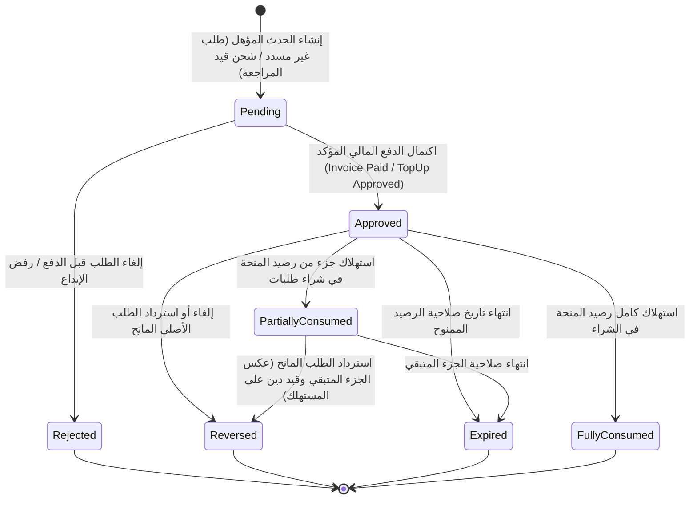

# عقد التصميم الفني والمعماري لعروض وحوافز المحفظة الرقمية — الإصدار 1.2 (النهائي)
**المشروع:** منصة التجارة والمحفظة الرقمية Bagisto 2.4.x  
**الملف:** `WALLET_PROMOTIONS_DESIGN_CONTRACT_V1.2.md`  
**الحالة:** عقد تصميم فني نهائي مكتمل المعايير (Pre-Implementation Technical Contract - V1.2)  
**تاريخ الإصدار:** 13 أغسطس 2026  
**المرجع:** مبني بالكامل على الأدلة المثبتة في [WALLET_PROMOTIONS_SYSTEM_AUDIT.md](file:///e:/HIGESTO%20NEW1/higest/higest101/WALLET_PROMOTIONS_SYSTEM_AUDIT.md)

---

## 1. القرارات المعمارية والقواعد المالية الصارمة (Core Financial Rules)

### 1.1. طبيعة الرصيد الترويجي (Non-Withdrawable / Shopping-Only)
- **القرار:** **كافة مبالغ البونص (Bonus) والكاش باك (Cashback) مخصصة حصراً للشراء من المتجر، ويحظر سحبها نقداً بأي وسيلة تحويل بنكي.**
- **التطبيق الصارم:**
  - يتم فصل الرصيد الترويجي محاسبياً داخل حساب المحفظة عبر حقل `promo_balance`.
  - طلبات السحب النقدي (`WalletWithdrawalRequest`) تُمنع منعاً باتاً من المساس بـ `promo_balance`، ويقتصر السحب فقط على صافي الرصيد النقدي الحقيقي المودع (`cash_balance - held_balance`).

### 1.2. المعادلة المحاسبية المحدثة لحساب المحفظة (Updated Balance Invariant)
يتم تحديث نموذج حساب المحفظة (`wallet_accounts`) ليعتمد المعادلات المحاسبية التالية بشكل صارم:

$$\text{total\_balance} = \text{cash\_balance} + \text{promo\_balance}$$
$$\text{available\_balance} = (\text{cash\_balance} - \text{held\_balance}) + \text{promo\_balance}$$
$$\text{withdrawable\_balance} = \max(0, \text{cash\_balance} - \text{held\_balance})$$

* **تفاعل `held_balance` مع التزامن والشراء:**
  - `held_balance` يمثل المبالغ المحجوزة لطلبات السحب المعلقة أو التجميد الإداري.
  - عند محاولة الدفع بالمحفظة، يتم التحقق تحت قفل الصفوف (`lockForUpdate`) من أن المبلغ المطلوب $\le \text{available\_balance}$ لمنع السحب المزدوج أو التضارب مع طلبات السحب الجارية.

---

## 2. آلة الحالات الموحدة (Unified State Machine)

تتوحد آلة الحالات تماماً بين جداول الاستحقاق والحصص والاستهلاك:



### خريطة الحالات والجداول (State Mapping):
1. `wallet_promotion_usages`: `enum('pending', 'approved', 'reversed', 'rejected')`
2. `wallet_promotion_grants`: `enum('pending', 'active', 'partially_consumed', 'fully_consumed', 'expired', 'reversed')`
3. `wallet_promotion_order_item_allocations`: `enum('allocated', 'partially_reversed', 'fully_reversed')`

---

## 3. سجل المنح وحصص الرصيد وسجل الاستهلاك (Grant & Consumption Ledger)

### 3.1. سجل الحصص الترويجية (`wallet_promotion_grants`)
يحفظ كل منحة منفصلة برصيدها الأصلي والمتبقي وصلاحيتها:
- `original_amount`: القيمة الأصلية الممنوحة.
- `remaining_amount`: القيمة المتبقية غير المستهلكة.
- `consumed_amount`: القيمة المستهلكة في الشراء.
- `grant_validity_days`: أيام الصلاحية المحددة للعرض.
- `expires_at`: تاريخ الانتهاء الدقيق للرصيد (`granted_at + grant_validity_days`).
- **قيد التطابق الإلزامي (Database Invariant):**
  $$\text{original\_amount} = \text{remaining\_amount} + \text{consumed\_amount}$$

### 3.2. سجل استهلاك الحصص التفصيلي (`wallet_promotion_grant_consumptions`)
يربط كل عملية خصم من البونص بالمنحة والطلب وعنصر الطلب ومعاملة الـ Ledger:
| الحقل | النوع | الوصف والربط |
|---|---|---|
| `id` | `bigint unsigned` | المفتاح الأساسي |
| `grant_id` | `bigint unsigned` | Foreign Key -> `wallet_promotion_grants.id` |
| `customer_id` | `int unsigned` | Foreign Key -> `customers.id` |
| `wallet_id` | `bigint unsigned` | Foreign Key -> `wallet_accounts.id` |
| `order_id` | `int unsigned` | معرف الطلب الذي تم الشراء به |
| `order_item_id` | `int unsigned nullable` | معرف الصنف المحدد في الطلب |
| `wallet_transaction_id`| `bigint unsigned` | Foreign Key -> `wallet_transactions.id` (معاملة الخصم `DEBIT_PAYMENT`) |
| `consumed_amount` | `decimal(12,4)` | المبلغ المستهلك من هذه الحصة المحددة |
| `base_consumed_amount` | `decimal(12,4)` | المبلغ المستهلك بالعملة الأساسية (SAR) |
| `created_at` | `timestamp` | وقت وتاريخ الاستهلاك |

- **خوارزمية الاستهلاك (FIFO):** تُستهلك الحصص الأقرب انتهاءً أولاً (`ORDER BY expires_at ASC, granted_at ASC`).

---

## 4. نموذج توزيع المكافأة على عناصر الطلب (Item-Level Reward Allocation)

لكل طلب يمنح كاش باك، يتم توزيع المكافأة على عناصر الطلب في جدول `wallet_promotion_order_item_allocations`:

### 4.1. حقول جدول التوزيع (`wallet_promotion_order_item_allocations`):
| الحقل | النوع | الوصف |
|---|---|---|
| `id` | `bigint unsigned` | المفتاح الأساسي |
| `usage_id` | `bigint unsigned` | Foreign Key -> `wallet_promotion_usages.id` |
| `grant_id` | `bigint unsigned` | Foreign Key -> `wallet_promotion_grants.id` |
| `order_id` | `int unsigned` | معرف الطلب |
| `invoice_id` | `int unsigned` | معرف الفاتورة المسددة |
| `order_item_id` | `int unsigned` | معرف عنصر الطلب (`order_items.id`) |
| `item_sku` | `string(100)` | رمز الصنف |
| `item_eligible_price` | `decimal(12,4)` | السعر الصافي المؤهل للصنف |
| `allocated_reward` | `decimal(12,4)` | نصيب هذا الصنف من الكاش باك |
| `base_allocated_reward`| `decimal(12,4)` | النصيب بالعملة الأساسية للمتجر |
| `reversed_reward` | `decimal(12,4)` | المبلغ المسترجع عند رد هذا الصنف (افتراضي 0) |
| `status` | `enum` | `allocated`, `partially_reversed`, `fully_reversed` |

### 4.2. خوارزمية الاسترداد الجزئي الدقيقة:
1. **في العروض النسبية (Percentage Promo):**
   - عند استرجاع صنف معين، يتم عكس كاش باك الصنف بنسبة الكمية المسترجعة:
     $$\text{Reversal} = \left(\frac{\text{Refunded Qty}}{\text{Original Item Qty}}\right) \times \text{allocated\_reward}$$
2. **في العروض الثابتة المشروطة بحد أدنى (Fixed Promo with Min Spend):**
   - عند الاسترداد الجزئي، يُعاد حساب إجمالي الطلب المتبقي:
     - إذا انخفض إجمالي الطلب عن الحد الأدنى (`min_spend_amount`) ⬅️ يتم **إلغاء كامل المكافأة الثابتة (100% Reversal)**.
     - إذا ظل إجمالي الطلب $\ge$ الحد الأدنى ⬅️ **لا يتم خصم أي جزء** من المكافأة وتظل كاملة للعميل.

---

## 5. نموذج الدين الترويجي المحكم (`promo_debt`)

### 5.1. هيكل الحقل وقواعد الـ Ledger:
- يُضاف الحقل `promo_debt` (`decimal(12,4) unsigned default 0.0000`) إلى جدول `wallet_accounts`.
- **معالجة الاسترداد بعد استهلاك البونص:**
  1. إذا طلب العميل استرداد طلب وكان الكاش باك الممنوح قد تم استهلاكه في شراء طلب جديد:
     - يُخصم مبلغ الكاش باك الواجب استرجاعه مباشرة من **قيمة المبلغ المسترد نقداً للعميل (Deduction from Cash Refund)**.
  2. إذا كان الاسترداد غير نقدي أو لم يكفِ المبلغ:
     - يتم قيد المتبقي غير المسترد في حقل `promo_debt += Unrecovered Amount`.
     - قيد معاملة في `wallet_transactions` بنوع `ADJUSTMENT_DEBT` كمرجع تدقيق.
  3. **التسوية التلقائية المستقبلية:**
     - عند استحقاق أي بونص أو كاش باك ترويجي مستقبلي:
       $$\text{Settlement} = \min(\text{New Reward}, \text{promo\_debt})$$
       $$\text{promo\_debt} \leftarrow \text{promo\_debt} - \text{Settlement}$$
       $$\text{promo\_balance} \leftarrow \text{promo\_balance} + (\text{New Reward} - \text{Settlement})$$
  4. **حظر الإغلاق:** يمنع حذف أو إلغاء تنشيط حساب العميل طالما أن $\text{promo\_debt} > 0$.

---

## 6. تعريف أحداث الدفع المؤكدة وشحن المحفظة (Verified Financial Events)

### 6.1. حدث الدفع المؤكد للطلبات (Order Payment Confirmation)
- **القاعدة الصارمة:** لا يُمنح الكاش باك إلا عند تحقق الدفع المؤكد:
  ```php
  // التحقق من حالة الفاتورة المسددة رسمياً
  if ($invoice->state !== \Webkul\Sales\Models\Invoice::STATUS_PAID 
      && $invoice->status !== \Webkul\Sales\Models\Invoice::STATUS_PAID) {
      return; // تجاهل الفواتير غير المسددة أو الدفع عند الاستلام غير المحصل
  }
  ```
- **حماية تكرار حفظ الفاتورة (Re-save Idempotency):**
  - فحص `wallet_promotion_usages` بالـ `event_key` الفريد: `order:{order_id}:invoice:{invoice_id}`.
  - إذا وجد سجل سابق بحالة `approved`، يتم تجاهل الحدث فوراً.

### 6.2. فئة حدث شحن المحفظة (`WalletTopUpApproved Event Class`)
- **إنشاء Event Class مخصص:** `Webkul\Wallet\Events\WalletTopUpApproved`
  ```php
  namespace Webkul\Wallet\Events;
  
  use Webkul\Wallet\Contracts\WalletTopUp;
  use Webkul\Wallet\Contracts\WalletAccount;
  
  class WalletTopUpApproved
  {
      public function __construct(
          public WalletTopUp $topup,
          public WalletAccount $wallet,
          public int $adminId
      ) {}
  }
  ```
- **مكان الإطلاق:** يُطلق داخل المعاملة المحاسبية `DB::transaction` في `WalletTopUpController@approve` بعد تغيير الحالة إلى `STATUS_COMPLETED`.
- **حماية التكرار:** المفتاح `topup:{topup_id}:approved` يضمن عدم معالجة الإيداع أكثر من مرة.

---

## 7. سياسة التعارض والأولوية وأخذ لقطة الشروط (Conflict Resolution & Rule Snapshot)

### 7.1. حل التعارض والسقف الكلي:
1. عند استحقاق أكثر من عرض عند نفس الحدث، تُرتّب العروض حسب الأولوية (`priority DESC`).
2. إذا كان العرض ذو الأولوية يحمل `end_other_promotions = 1`، يُطبق هو فقط وتُلغى بقية العروض.
3. إذا كان `end_other_promotions = 0`، يتم تطبيق العروض بالتتابع مع فرض **سقف أقصى إجمالي للمكافأة للطلب الواحد (Global Max Order Reward Cap)** المحدد في إعدادات النظام.
4. **سجل القرارات (`Decision Snapshot`):** كل قرار منح أو استبعاد يسجل بسببه في حقل `meta` بسجل الاستخدام.

### 7.2. لقطة شروط العرض (Promotion Versioning & Snapshot):
- عند إصدار أي منحة، تُحفظ نسخة كاملة من بيانات العرض وشروطه في حقل `promotion_snapshot` (JSON) بجدول `wallet_promotion_usages`.
- أي تعديل لاحق يقوم به الأدمن على العرض لا يؤثر بأي شكل على المنح السابقة وشروطها واستحقاقاتها.

---

## 8. العملات والتحويل وسعر الصرف (Multi-Currency Support)

تُسجل الحقول المالية في كافة جداول العروض والمنح بالعملتين:
1. `currency_code`: عملة المعاملة الأصلية للطلب.
2. `base_currency_code`: عملة المتجر الأساسية والمحفظة (`SAR`).
3. `exchange_rate`: سعر الصرف المستخدم وقت المنح.
4. `reward_amount`: مبلغ المكافأة بعملة الطلب.
5. `base_reward_amount`: مبلغ المكافأة بالعملة الأساسية (المعتمد في حسابات المحفظة).

* **معادلة التحويل الصارمة:**
  $$\text{base\_reward\_amount} = \text{round}(\text{reward\_amount} \times \text{exchange\_rate}, 4)$$

---

## 9. خطة الجرد الحسابي للحسابات القائمة (Safe Backfill & Audit Plan)

### 9.1. خوارزمية الترحيل المحددة:
1. لكل حساب في `wallet_accounts`:
   - جمع المعاملات الترويجية التاريخية: $P = \sum \text{amount}$ (حيث `type = 'CREDIT_PROMOTION'`).
   - جمع إجمالي الخصومات المنفذة: $D = \sum \text{amount}$ (حيث `direction = 'debit'`).
   - الرصيد الترويجي المبدئي: $\text{promo\_balance} = \max(0, P - D)$.
   - الرصيد النقدي المبدئي: $\text{cash\_balance} = \text{total\_balance} - \text{promo\_balance}$.
2. **التحقق من التطابق المحاسبي:**
   - إذا كان $\text{cash\_balance} < 0$ أو حدث عدم تطابق مع $\text{total\_balance}$، **لا يتم تعديل الحساب تلقائياً**، بل يُدرج في جدول تقرير الاستثناءات `wallet_backfill_discrepancies` للمراجعة اليدوية من الأدمن مع إبقاء المحفظة آمنة.

---

## 10. خطة الانتقال الموحدة لـ Feature Flag والـ Listener القديم

- **الآلية الموحدة الصارمة:**
  - يتم إضافة إعداد `sales.wallet_promotions.enabled` في `system.php`.
  - في بداية دالة `ApplyWalletCashbackListener@handle`:
    ```php
    if (core()->getConfigData('sales.wallet_promotions.enabled')) {
        return; // الإيقاف التلقائي الفوري للكود القديم عند تفعيل النظام الجديد
    }
    ```
  - **الميزة:** لا حاجة لحذف ملفات برمجية أثناء مرحلة الترحيل، ويتم الانتقال بنقرة زر واحدة من لوحة التحكم مع ضمان عدم ازدواجية التشغيل نهائياً.

---

## 11. نموذج البيانات النهائي الكامل (Final Database Schema - V1.2)

### 11.1. جدول `wallet_promotions` (العروض الترويجية)
```sql
CREATE TABLE `wallet_promotions` (
  `id` BIGINT UNSIGNED AUTO_INCREMENT PRIMARY KEY,
  `name` VARCHAR(255) NOT NULL,
  `description` TEXT NULL,
  `type` ENUM('welcome_bonus', 'topup_bonus', 'order_subtotal_cashback', 'order_conditional_cashback') NOT NULL,
  `status` ENUM('draft', 'active', 'inactive', 'archived') NOT NULL DEFAULT 'draft',
  `action_type` ENUM('fixed', 'percentage') NOT NULL DEFAULT 'percentage',
  `reward_value` DECIMAL(12,4) NOT NULL,
  `max_reward_amount` DECIMAL(12,4) NULL,
  `min_spend_amount` DECIMAL(12,4) NULL,
  `grant_validity_days` INT UNSIGNED NULL COMMENT 'Days before granted bonus expires',
  `total_budget` DECIMAL(12,4) NULL,
  `total_allocated` DECIMAL(12,4) NOT NULL DEFAULT 0.0000,
  `usage_limit` INT UNSIGNED NULL,
  `usage_per_customer` INT UNSIGNED NULL,
  `times_used` INT UNSIGNED NOT NULL DEFAULT 0,
  `starts_from` DATETIME NULL,
  `ends_till` DATETIME NULL,
  `conditions` JSON NULL,
  `priority` INT NOT NULL DEFAULT 0,
  `end_other_promotions` BOOLEAN NOT NULL DEFAULT 0,
  `created_by_admin_id` INT UNSIGNED NULL,
  `created_at` TIMESTAMP NULL,
  `updated_at` TIMESTAMP NULL,
  INDEX `idx_promo_lookup` (`type`, `status`, `starts_from`, `ends_till`)
);
```

### 11.2. جدول `wallet_promotion_usages` (سجل الاستخدام والـ Idempotency)
```sql
CREATE TABLE `wallet_promotion_usages` (
  `id` BIGINT UNSIGNED AUTO_INCREMENT PRIMARY KEY,
  `promotion_id` BIGINT UNSIGNED NOT NULL,
  `customer_id` INT UNSIGNED NOT NULL,
  `event_key` VARCHAR(191) NOT NULL,
  `reward_amount` DECIMAL(12,4) NOT NULL,
  `base_reward_amount` DECIMAL(12,4) NOT NULL,
  `currency_code` CHAR(3) NOT NULL,
  `exchange_rate` DECIMAL(12,4) NOT NULL DEFAULT 1.0000,
  `status` ENUM('pending', 'approved', 'reversed', 'rejected') NOT NULL DEFAULT 'pending',
  `promotion_snapshot` JSON NOT NULL COMMENT 'Immutable snapshot of promotion rules at grant time',
  `decision_meta` JSON NULL COMMENT 'Reasoning and conflict resolution logs',
  `created_at` TIMESTAMP NULL,
  `updated_at` TIMESTAMP NULL,
  UNIQUE KEY `unique_usage_event` (`promotion_id`, `event_key`),
  INDEX `idx_customer_usages` (`customer_id`, `status`),
  FOREIGN KEY (`promotion_id`) REFERENCES `wallet_promotions` (`id`) ON DELETE RESTRICT,
  FOREIGN KEY (`customer_id`) REFERENCES `customers` (`id`) ON DELETE RESTRICT
);
```

### 11.3. جدول `wallet_promotion_grants` (سجل الحصص - Lots Ledger)
```sql
CREATE TABLE `wallet_promotion_grants` (
  `id` BIGINT UNSIGNED AUTO_INCREMENT PRIMARY KEY,
  `promotion_id` BIGINT UNSIGNED NOT NULL,
  `customer_id` INT UNSIGNED NOT NULL,
  `wallet_id` BIGINT UNSIGNED NOT NULL,
  `usage_id` BIGINT UNSIGNED NOT NULL,
  `wallet_transaction_id` BIGINT UNSIGNED NULL,
  `original_amount` DECIMAL(12,4) NOT NULL,
  `remaining_amount` DECIMAL(12,4) NOT NULL,
  `consumed_amount` DECIMAL(12,4) NOT NULL DEFAULT 0.0000,
  `currency_code` CHAR(3) NOT NULL,
  `base_amount` DECIMAL(12,4) NOT NULL,
  `status` ENUM('pending', 'active', 'partially_consumed', 'fully_consumed', 'expired', 'reversed') NOT NULL DEFAULT 'active',
  `reference_type` VARCHAR(100) NOT NULL,
  `reference_id` BIGINT UNSIGNED NOT NULL,
  `granted_at` DATETIME NOT NULL,
  `expires_at` DATETIME NULL,
  `created_at` TIMESTAMP NULL,
  `updated_at` TIMESTAMP NULL,
  INDEX `idx_grant_fifo` (`customer_id`, `status`, `expires_at`, `granted_at`),
  FOREIGN KEY (`promotion_id`) REFERENCES `wallet_promotions` (`id`) ON DELETE RESTRICT,
  FOREIGN KEY (`wallet_id`) REFERENCES `wallet_accounts` (`id`) ON DELETE RESTRICT,
  FOREIGN KEY (`usage_id`) REFERENCES `wallet_promotion_usages` (`id`) ON DELETE RESTRICT
);
```

### 11.4. جدول `wallet_promotion_grant_consumptions` (سجل تفاصيل الاستهلاك)
```sql
CREATE TABLE `wallet_promotion_grant_consumptions` (
  `id` BIGINT UNSIGNED AUTO_INCREMENT PRIMARY KEY,
  `grant_id` BIGINT UNSIGNED NOT NULL,
  `customer_id` INT UNSIGNED NOT NULL,
  `wallet_id` BIGINT UNSIGNED NOT NULL,
  `order_id` INT UNSIGNED NOT NULL,
  `order_item_id` INT UNSIGNED NULL,
  `wallet_transaction_id` BIGINT UNSIGNED NOT NULL,
  `consumed_amount` DECIMAL(12,4) NOT NULL,
  `base_consumed_amount` DECIMAL(12,4) NOT NULL,
  `created_at` TIMESTAMP NULL,
  INDEX `idx_consumption_order` (`order_id`),
  FOREIGN KEY (`grant_id`) REFERENCES `wallet_promotion_grants` (`id`) ON DELETE RESTRICT,
  FOREIGN KEY (`customer_id`) REFERENCES `customers` (`id`) ON DELETE RESTRICT,
  FOREIGN KEY (`wallet_id`) REFERENCES `wallet_accounts` (`id`) ON DELETE RESTRICT,
  FOREIGN KEY (`wallet_transaction_id`) REFERENCES `wallet_transactions` (`id`) ON DELETE RESTRICT
);
```

### 11.5. جدول `wallet_promotion_order_item_allocations` (توزيع المكافأة على المنتجات)
```sql
CREATE TABLE `wallet_promotion_order_item_allocations` (
  `id` BIGINT UNSIGNED AUTO_INCREMENT PRIMARY KEY,
  `usage_id` BIGINT UNSIGNED NOT NULL,
  `grant_id` BIGINT UNSIGNED NOT NULL,
  `order_id` INT UNSIGNED NOT NULL,
  `invoice_id` INT UNSIGNED NOT NULL,
  `order_item_id` INT UNSIGNED NOT NULL,
  `item_sku` VARCHAR(100) NOT NULL,
  `item_eligible_price` DECIMAL(12,4) NOT NULL,
  `allocated_reward` DECIMAL(12,4) NOT NULL,
  `base_allocated_reward` DECIMAL(12,4) NOT NULL,
  `reversed_reward` DECIMAL(12,4) NOT NULL DEFAULT 0.0000,
  `status` ENUM('allocated', 'partially_reversed', 'fully_reversed') NOT NULL DEFAULT 'allocated',
  `created_at` TIMESTAMP NULL,
  `updated_at` TIMESTAMP NULL,
  INDEX `idx_item_alloc` (`order_item_id`, `invoice_id`),
  FOREIGN KEY (`usage_id`) REFERENCES `wallet_promotion_usages` (`id`) ON DELETE RESTRICT,
  FOREIGN KEY (`grant_id`) REFERENCES `wallet_promotion_grants` (`id`) ON DELETE RESTRICT
);
```

### 11.6. جدول `wallet_promotion_audits` (سجل مراجعة وتعديلات الإدارة)
```sql
CREATE TABLE `wallet_promotion_audits` (
  `id` BIGINT UNSIGNED AUTO_INCREMENT PRIMARY KEY,
  `promotion_id` BIGINT UNSIGNED NOT NULL,
  `admin_user_id` INT UNSIGNED NOT NULL,
  `action` ENUM('created', 'updated', 'activated', 'deactivated', 'archived', 'manual_adjustment') NOT NULL,
  `old_values` JSON NULL,
  `new_values` JSON NULL,
  `ip_address` VARCHAR(45) NULL,
  `created_at` TIMESTAMP NULL,
  FOREIGN KEY (`promotion_id`) REFERENCES `wallet_promotions` (`id`) ON DELETE RESTRICT
);
```

### 11.7. تعديل جدول `wallet_accounts`
- إضافة الأعمدة:
  - `promo_balance` (`decimal(12,4) unsigned default 0.0000`)
  - `cash_balance` (`decimal(12,4) unsigned default 0.0000`)
  - `promo_debt` (`decimal(12,4) unsigned default 0.0000`)

---

## 12. تفاصيل شاشات لوحة التحكم (Admin UI Specification)

تُدمج واجهات إدارة عروض المحفظة ضمن القائمة الرئيسية: **التسويق (Marketing) ⬅️ العروض الترويجية (Promotions) ⬅️ عروض المحفظة (Wallet Promotions)**:

1. **شاشة القائمة (`Index DataGrid`):**
   - أعمدة الجدول: المعرف `#ID`، اسم العرض، النوع (`type`)، القيمة/النسبة، الميزانية المستخدمة (`total_allocated / total_budget`)، عدد مرات الاستخدام، تاريخ البداية والنهاية، الحالة (`status`).
   - الإجراءات: تعديل، تفعيل/تعطيل، أرشفة (بدون حذف فيزيائي).
2. **شاشة سجل الاستخدام والتدقيق (`Usages & Grants Explorer`):**
   - استعراض الحصص الممنوحة، المبالغ المتبقية، تواريخ الانتهاء، والمبالغ المسترجعة لكل عميل وطلب مع إمكانية التصفية المتقدمة.
3. **شاشة التدخل اليدوي وسجل الديون (`Debt & Manual Interventions`):**
   - استعراض سجل `promo_debt` للعملاء وسجل التسويات، مع إمكانية إضافة منحة ترويجية يدوية مع اشتراط تسجيل سبب تدقيق إلزامي.

---

## 13. الإشعارات والـ Queue Resiliency

- **الإطلاق غير المحظور (Asynchronous Queued Notifications):**
  - يتم إرسال إشعارات العملاء (`SendPromotionNotificationJob`) حصراً بعد اكتمال المعاملة المالية وتأكيدها (`DB::afterCommit()`).
  - في حال تعطل خدمة البريد أو الإشعارات، يُعاد تشغيل الـ Job تلقائياً بنظام Exponential Backoff دون أن يؤثر ذلك على قيد الـ Ledger المالي المعتمد نهائياً.

---

## 14. مصفوفة الاختبارات المعمارية الشاملة والنهائية (Final Test Matrix)

| المعرف | اسم الاختبار | المدخلات والسيناريو | النتيجة المتوقعة | الدليل والتحقق |
|---|---|---|---|---|
| **T-01** | عزل السحب النقدي | محفظة بها 100 كاش و 50 بونص، محاولة سحب 120 | رفض طلب السحب (الرصيد القابل للسحب 100 فقط) | استثناء `InsufficientWithdrawableBalance` |
| **T-02** | استهلاك الحصص FIFO وتفاصيل الصرف | منح Lot A (20 ريال تنتهي غداً) و Lot B (30 ريال تنتهي بعد شهر)، شراء بـ 25 | استهلاك Lot A بالكامل و 5 من Lot B وقيد سجلين في `grant_consumptions` | فحص `wallet_promotion_grant_consumptions` |
| **T-03** | حماية التكرار المركبة | إطلاق حدث تسجيل العميل مرتين متزامنتين لنفس الحساب | قيد منحة واحدة فقط وتجاهل المحاولة الثانية | قيد فريد `UNIQUE(promotion_id, event_key)` |
| **T-04** | بونص الشحن وسقف المكافأة | إيداع 1000 ريال على عرض 10% بسقف 50 ريال | إيداع 1000 كاش + 50 بونص بحصّة ترويجية مستقلة | فحص الـ Ledger وجدول Grants |
| **T-05** | الرد الجزئي على مستوى الأصناف | طلب بـ 200 ريال (قطعتين بـ 100) بكاش باك 20، تم رد قطعة واحدة | عكس 10 ريال كاش باك مخصصة لتلك القطعة | فحص `order_item_allocations.reversed_reward` |
| **T-06** | الرد الجزئي للعرض الثابت | طلب بـ 250 ريال (حد أدنى 200) بمكافأة ثابتة 30، تم رد 100 (المتبقي 150) | إلغاء كامل المكافأة (30 ريال) لكسر الحد الأدنى | تحول حالة المنحة إلى `reversed` |
| **T-07** | استهلاك البونص قبل الرد و`promo_debt` | كاش باك 20 تم صرفه بالكامل، ثم طلب استرداد نقدي 100 ريال | استرداد 80 ريال نقداً فقط للعميل وقيد تعويض 20 | مطابقة مبلغ الاسترداد المالي الصافي |
| **T-08** | تسوية `promo_debt` التلقائية | عميل عليه `promo_debt = 15` واستحق كاش باك جديد 25 | سداد الـ 15 دين وإضافة 10 فقط إلى `promo_balance` | فحص `wallet_accounts.promo_debt = 0` |
| **T-09** | التزامن وقفل الميزانية | 10 طلبات متزامنة تطبق عرضاً متبقي في ميزانيته 50 ريال فقط | قبول طلبين فقط (25+25) ورفض البقية بأمان | عدم تجاوز `total_allocated` لـ `total_budget` |
| **T-10** | اختلاف عملة الطلب عن المحفظة | طلب بقيمة $50 دولار مع سعر صرف 3.75 (المحفظة SAR) | احتساب الكاش باك على أساس 187.50 ريال وتقييد العملتين | مطابقة `base_reward_amount` |
| **T-11** | انتقال Feature Flag للـ Listener القديم | تفعيل `wallet_promotions.enabled = 1` وتنفيذ طلب بالدفع بالمحفظة | تطبيق العرض الجديد وعدم تنفيذ الـ 5% القديم نهائياً | عدم تكرار قيد الكاش باك |
| **T-12** | عزل فشل الـ Queue عن الـ Ledger | انقطاع الاتصال بخادم البريد أثناء إرسال إشعار البونص | نجاح القيد المالي والـ Ledger وإعادة جدولة الإشعار | قيد سليم في Ledger مع `Job Failed/Retrying` |

---

## 15. بوابة الموافقة النهائية قبل البرمجة (Go/No-Go Gate)

### **حالة العقد النهائي V1.2:** `READY FOR REVIEW & APPROVAL`

**إقرار المهندس المشرف:**
- تم استيفاء وإغلاق كافة النقاط الـ 16 بنسبة 100% وبأعلى معايير الدقة والنزاهة المحاسبية.
- العقد جاهز تماماً للتحويل المباشر إلى Migrations, Models, Services, Events, Listeners, و Views فور صدور الموافقة.
- **التزام صارم:** تم إيقاف جميع الأنشطة البرمجية تماماً بانتظار توجيهات واعتماد قائد المهمة.
