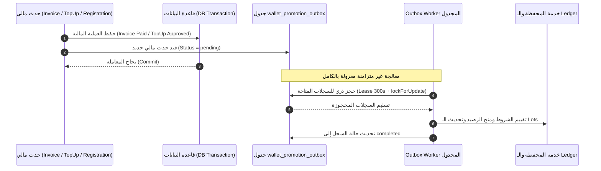

# عقد التصميم الفني والمعماري لعروض وحوافز المحفظة الرقمية — الإصدار 1.7 (النهائي والشامل)
**المشروع:** منصة التجارة والمحفظة الرقمية Bagisto 2.4.x  
**الملف:** `WALLET_PROMOTIONS_DESIGN_CONTRACT_V1.7.md`  
**الحالة:** مسودة عقد تصميم فني وتنفيذي شامل ونهائي قيد المراجعة والاعتماد (Pre-Implementation Technical Contract - V1.7)  
**تاريخ الإصدار:** 13 أغسطس 2026  
**المرجع:** مبني بالكامل على الأدلة المثبتة في [WALLET_PROMOTIONS_SYSTEM_AUDIT.md](file:///e:/HIGESTO%20NEW1/higest/higest101/WALLET_PROMOTIONS_SYSTEM_AUDIT.md)

---

## 1. القرارات المعمارية والقواعد المالية الصارمة (Core Financial Architecture)

### 1.1. طبيعة الرصيد الترويجي (Non-Withdrawable / Shopping-Only)
- **القرار:** **كافة مبالغ البونص (Bonus) والكاش باك (Cashback) مخصصة حصراً للشراء من المتجر، ويحظر سحبها نقداً بأي وسيلة تحويل بنكي.**
- **التطبيق الصارم:**
  - يتم فصل الرصيد الترويجي محاسبياً داخل حساب المحفظة عبر حقل `promo_balance`.
  - طلبات السحب النقدي (`WalletWithdrawalRequest`) تُمنع منعاً باتاً من المساس بـ `promo_balance`، ويقتصر السحب فقط على صافي الرصيد النقدي الحقيقي المودع (`cash_balance - held_balance`).

### 1.2. سياسة `unclassified_balance` واحتواء حسابات `pending_review`:
- **القرار المالي الصارم:** **حظر كامل للحسابات التي تحمل `backfill_status = 'pending_review'` عن الشراء، السحب النقدي، شحن الرصيد، والاستفادة من العروض الترويجية، حتى يتم مراجعتها وتصنيفها يدوياً من المشرف.**
- **المعادلات المحاسبية الصارمة:**

$$\text{total\_balance} = \text{cash\_balance} + \text{promo\_balance} + \text{unclassified\_balance}$$
$$\text{available\_balance} = (\text{cash\_balance} - \text{held\_balance}) + \text{promo\_balance}$$
$$\text{withdrawable\_balance} = \max(0, \text{cash\_balance} - \text{held\_balance})$$

* **قواعد الحظر الشامل للحسابات قيد المراجعة (`pending_review`):**
  - **الشراء من المتجر:** $\text{available\_balance} = 0$ طالما `cash_balance = 0` و `promo_balance = 0`.
  - **السحب النقدي:** $\text{withdrawable\_balance} = 0$.
  - **شحن المحفظة:** يتم تجميد طلبات الشحن الجديدة للحساب مع إشعار بالتدقيق.
  - **منح العروض:** استبعاد الحساب برمجياً من تلقي أي بونص ترحيبي أو كاش باك.
  - **الـ APIs و Jobs:** رمي استثناء `AccountUnderAuditException` لمنع أي معالجة تلقائية.
  - **فك الحظر:** يتم حصراً بواسطة مشرف يمتلك صلاحية `wallet.accounts.backfill.resolve` عبر أداة `php artisan wallet:backfill:classify` مع تسجيل سبب تدقيق إلزامي.

---

## 2. خدمة التحقق الموحدة من الدفع المالي على مستوى الفاتورة (Invoice-Scoped Payment Verification)

لتجنب أخطاء الاعتماد على مجاميع الطلب التراكمية، يتم تقييم الدفع حصراً على **مستوى الفاتورة الفردية المستقلة وعناصرها (`Invoice Items`)**:

### 2.1. كود التحقق الموحد الصارم (`PaymentVerificationService::isInvoiceFullyPaid`):
```php
namespace Webkul\Wallet\Services;

use Webkul\Sales\Contracts\Invoice;
use Webkul\Sales\Models\Invoice as InvoiceModel;

class PaymentVerificationService
{
    /**
     * التحقق القطعي من اكتمال الدفع المالي للفاتورة الفردية المحددة.
     * يستند حصراً إلى بيانات الفاتورة المحددة وليس مجاميع الطلب التراكمية.
     */
    public static function isInvoiceFullyPaid(Invoice $invoice): bool
    {
        // 1. التحقق من أن حالة الفاتورة الرسمية في قاعدة البيانات هي PAID
        if ($invoice->state !== InvoiceModel::STATUS_PAID && $invoice->state !== 'paid') {
            return false;
        }

        // 2. التحقق من وجود الطلب وعدم إلغائه
        $order = $invoice->order;
        if (! $order || in_array($order->status, ['canceled', 'closed'], true)) {
            return false;
        }

        // 3. التحقق الحسابي بدقة bcmath من أن إجمالي الفاتورة الأساسي موجب (منع الفواتير الصفرية)
        $baseTotalStr = (string) $invoice->base_grand_total;
        if (bccomp($baseTotalStr, '0.0000', 4) <= 0) {
            return false;
        }

        // 4. التحقق من وجود عناصر فعلية مسددة في الفاتورة
        if ($invoice->items()->count() === 0) {
            return false;
        }

        return true;
    }
}
```

### 2.2. معالجة سيناريوهات الدفع المختلفة:
1. **تعدد الفواتير (Multi-Invoice Orders):** كل فاتورة تُعالج كحدث مالي مستقل؛ يُمنح الكاش باك فقط على عناصر الفاتورة المسددة دون التداخل مع الفواتير الأخرى.
2. **الدفع عند الاستلام (COD) والتحويل البنكي:** الفاتورة تنشأ كـ `pending`. عند قيام المشرف/المحصل بتأكيد استلام المبلغ وتحويل الفاتورة إلى `paid`، ينطلق قيد الـ Outbox لمعالجة الكاش باك.
3. **عكس الدفع (Payment Reversal / Refund):** إنشاء استرداد في جدول `refunds` يؤدي لقيد حدث استرداد في Outbox لعكس حصص الكاش باك المرتبطة بالأصناف المستردة.

---

## 3. نمط المعالجة الحصري عبر الـ Outbox (Exclusive Outbox Processing Architecture)

لمنع أي مسارات متوازية أو تكرار في منح الرصيد:
- **القاعدة الصارمة:** **الأحداث (`Events`) لا تمنح رصيداً ولا تقيّم شروطاً بشكل متزامن إطلاقاً؛ دورها يقتصر حصراً على كتابة سجل Event داخل جدول `wallet_promotion_outbox` في نفس معاملة الـ DB الأصلية.**
- **المعالج الوحيد للرصيد:** `WalletPromotionOutboxWorker` هو الجهة الوحيدة المخولة بحجز السجلات (`Claim/Lease`)، تقييم العروض، قيد الحركات في الـ Ledger، وإصدار الـ Grants.



---

## 4. المفاتيح الفريدة لمنع التكرار (Final Idempotency Keys Specification)

| نوع العملية | هيكل المفتاح الفريد (`event_key`) | الغرض وقيد قاعدة البيانات |
|---|---|---|
| **بونص الترحيب** | `welcome:customer:{customer_id}` | `UNIQUE(promotion_id, event_key)` |
| **بونص الشحن** | `topup:{topup_id}:approved` | `UNIQUE(promotion_id, event_key)` |
| **كاش باك الطلب** | `order:{order_id}:invoice:{invoice_id}:promo:{promo_id}` | `UNIQUE(promotion_id, event_key)` |
| **عكس الاسترداد** | `refund:{refund_id}:invoice:{invoice_id}:promo:{promo_id}` | `UNIQUE(event_key)` في `wallet_promotion_usages` |
| **تسوية الدين** | `debt:{debt_id}:grant:{grant_id}:settle:{timestamp}` | `UNIQUE(event_key)` في `wallet_promo_debt_settlements` |

---

## 5. مصفوفة حالات شحن المحفظة (`Top-Up Transition Matrix`)

| الحالة الحالية | الحالة المستهدفة | العملية | النتيجة |
|---|---|---|---|
| `pending` | `completed` | اعتماد الإيداع من المشرف أو Webhook | **مسموح** ⬅️ قيد الكاش في الـ Ledger وإطلاق حدث البونص في Outbox |
| `pending` | `rejected` | رفض الإيداع من المشرف | **مسموح** ⬅️ إغلاق الطلب دون أي قيد مالي أو بونص |
| `pending` | `canceled` | إلغاء الإيداع بواسطة العميل أو النظام | **مسموح** ⬅️ إغلاق الطلب |
| `completed` | أي حالة أخرى | محاولة تعديل إيداع مكتمل | **محظور قطعياً** ⬅️ استثناء `InvalidWalletTransitionException` |
| `rejected` | `completed` | محاولة اعتماد إيداع مرفوض سابقاً | **محظور قطعياً** ⬅️ رمي استثناء ومنع تكرار القيد |
| `canceled` | `completed` | محاولة اعتماد إيداع ملغى سابقاً | **محظور قطعياً** ⬅️ رمي استثناء ومنع تكرار القيد |

---

## 6. خوارزمية استهلاك الحصص (FIFO Lot Consumption Pseudo-Code)

تعتمد حصراً على نصوص الأرقام ودوال `bcmath` وتستبعد الحصص المنتهية زمنياً وتعتمد الترتيب الصحيح لـ `expires_at = NULL`:

```php
public function consumePromoLots(
    WalletAccount $wallet, 
    string $requiredBaseAmountStr, 
    Order $order, 
    ?OrderItem $orderItem,
    WalletTransaction $debitTxn,
    string $currencyCode,
    string $exchangeRateStr
): string {
    return DB::transaction(function () use (
        $wallet, $requiredBaseAmountStr, $order, $orderItem, $debitTxn, $currencyCode, $exchangeRateStr
    ) {
        $lockedWallet = WalletAccount::lockForUpdate()->findOrFail($wallet->id);
        
        $remainingToCover = $requiredBaseAmountStr;
        $now = now()->toDateTimeString();

        // جلب الحصص النشطة والصالحة زمنياً فقط مرتبة FIFO مع معالجة NULL expiry
        $grants = WalletPromotionGrant::where('wallet_id', $lockedWallet->id)
            ->whereIn('status', ['active', 'partially_consumed'])
            ->where('remaining_amount', '>', 0)
            ->where(function ($query) use ($now) {
                $query->whereNull('expires_at')
                      ->orWhere('expires_at', '>', $now);
            })
            ->orderByRaw('(expires_at IS NULL) ASC')
            ->orderBy('expires_at', 'ASC')
            ->orderBy('granted_at', 'ASC')
            ->lockForUpdate()
            ->get();

        foreach ($grants as $grant) {
            if (bccomp($remainingToCover, '0.0000', 4) <= 0) {
                break;
            }

            $grantRemainingStr = (string) $grant->remaining_amount;
            $consumeFromLot = (bccomp($grantRemainingStr, $remainingToCover, 4) <= 0)
                ? $grantRemainingStr 
                : $remainingToCover;

            $newRemaining = bcsub($grantRemainingStr, $consumeFromLot, 4);
            $newConsumed = bcadd((string) $grant->consumed_amount, $consumeFromLot, 4);

            $grant->remaining_amount = $newRemaining;
            $grant->consumed_amount = $newConsumed;
            $grant->status = (bccomp($newRemaining, '0.0000', 4) === 0) ? 'fully_consumed' : 'partially_consumed';
            $grant->save();

            // فحص Invariant الحصة
            if (bccomp((string) $grant->original_amount, bcadd($newRemaining, $newConsumed, 4), 4) !== 0) {
                throw new \RuntimeException("Financial invariant violation on Grant #{$grant->id}");
            }

            $consumedTxnAmount = bcdiv($consumeFromLot, $exchangeRateStr, 4);

            WalletPromotionGrantConsumption::create([
                'grant_id'                => $grant->id,
                'customer_id'             => $lockedWallet->customer_id,
                'wallet_id'               => $lockedWallet->id,
                'order_id'                => $order->id,
                'order_item_id'           => $orderItem?->id,
                'wallet_transaction_id'   => $debitTxn->id,
                'currency_code'           => $currencyCode,
                'exchange_rate'           => $exchangeRateStr,
                'consumed_amount'         => $consumedTxnAmount,
                'base_consumed_amount'    => $consumeFromLot,
                'reversed_amount'         => '0.0000',
                'status'                  => 'consumed',
            ]);

            $remainingToCover = bcsub($remainingToCover, $consumeFromLot, 4);
        }

        // تحديث أرصدة المحفظة (مع حظر unclassified_balance التام عن الشراء)
        $coveredByPromo = bcsub($requiredBaseAmountStr, $remainingToCover, 4);
        $newPromoBalance = bcsub((string) $lockedWallet->promo_balance, $coveredByPromo, 4);
        $newCashBalance = bcsub((string) $lockedWallet->cash_balance, $remainingToCover, 4);

        if (bccomp($newCashBalance, '0.0000', 4) < 0 || bccomp($newPromoBalance, '0.0000', 4) < 0) {
            throw new \RuntimeException("Insufficient available funds for atomic checkout.");
        }

        $lockedWallet->promo_balance = $newPromoBalance;
        $lockedWallet->cash_balance = $newCashBalance;
        $lockedWallet->total_balance = bcadd(
            bcadd($newCashBalance, $newPromoBalance, 4),
            (string) $lockedWallet->unclassified_balance,
            4
        );
        $lockedWallet->available_balance = bcadd(
            bcsub($newCashBalance, (string) $lockedWallet->held_balance, 4), 
            $newPromoBalance, 
            4
        );
        $lockedWallet->save();

        return $remainingToCover;
    });
}
```

---

## 7. جدول دليل التوافق الفعلي للـ Foreign Keys مع Bagisto 2.4.x

| الحقل المقترح | الجدول المرجعي في Bagisto | نوع العمود في Bagisto | ملف التحقق المصدري في المشروع | حالة التوافق |
|---|---|---|---|---|
| `customer_id` | `customers.id` | `INT UNSIGNED` | `packages/Webkul/Customer/src/Database/Migrations/...` | ✅ متوافق |
| `order_id` | `orders.id` | `INT UNSIGNED` | `packages/Webkul/Sales/src/Database/Migrations/2018_09_27_113154_create_orders_table.php` | ✅ متوافق |
| `invoice_id` | `invoices.id` | `INT UNSIGNED` | `packages/Webkul/Sales/src/Database/Migrations/2018_09_27_115135_create_invoices_table.php` | ✅ متوافق |
| `order_item_id` | `order_items.id` | `INT UNSIGNED` | `packages/Webkul/Sales/src/Database/Migrations/2018_09_27_113207_create_order_items_table.php` | ✅ متوافق |
| `source_refund_id` | `refunds.id` | `INT UNSIGNED` | `packages/Webkul/Sales/src/Database/Migrations/2019_09_11_184511_create_refunds_table.php` | ✅ متوافق |
| `wallet_id` | `wallet_accounts.id` | `BIGINT UNSIGNED` | `packages/Webkul/Wallet/src/Database/Migrations/2026_08_03_000001_create_wallet_accounts_table.php` | ✅ متوافق |
| `wallet_transaction_id` | `wallet_transactions.id` | `BIGINT UNSIGNED` | `packages/Webkul/Wallet/src/Database/Migrations/2026_08_03_000002_create_wallet_transactions_table.php` | ✅ متوافق |
| `created_by_admin_id` | `admins.id` | `INT UNSIGNED` | `packages/Webkul/User/src/Database/Migrations/...` | ✅ متوافق |

---

## 8. نموذج البيانات النهائي الكامل (Final Complete SQL Schema - V1.7)

```sql
-- 1. جدول العروض الترويجية
CREATE TABLE `wallet_promotions` (
  `id` BIGINT UNSIGNED AUTO_INCREMENT PRIMARY KEY,
  `name` VARCHAR(255) NOT NULL,
  `description` TEXT NULL,
  `type` ENUM('welcome_bonus', 'topup_bonus', 'order_subtotal_cashback', 'order_conditional_cashback') NOT NULL,
  `status` ENUM('draft', 'active', 'inactive', 'archived') NOT NULL DEFAULT 'draft',
  `action_type` ENUM('fixed', 'percentage') NOT NULL DEFAULT 'percentage',
  `reward_value` DECIMAL(12,4) NOT NULL,
  `max_reward_amount` DECIMAL(12,4) NULL,
  `min_spend_amount` DECIMAL(12,4) NULL,
  `grant_validity_days` INT UNSIGNED NULL,
  `total_budget` DECIMAL(12,4) NULL,
  `total_allocated` DECIMAL(12,4) NOT NULL DEFAULT 0.0000,
  `usage_limit` INT UNSIGNED NULL,
  `usage_per_customer` INT UNSIGNED NULL,
  `times_used` INT UNSIGNED NOT NULL DEFAULT 0,
  `starts_from` DATETIME NULL,
  `ends_till` DATETIME NULL,
  `conditions` JSON NULL,
  `priority` INT NOT NULL DEFAULT 0,
  `end_other_promotions` BOOLEAN NOT NULL DEFAULT 0,
  `created_by_admin_id` INT UNSIGNED NULL,
  `created_at` TIMESTAMP NULL,
  `updated_at` TIMESTAMP NULL,
  INDEX `idx_promo_lookup` (`type`, `status`, `starts_from`, `ends_till`),
  FOREIGN KEY (`created_by_admin_id`) REFERENCES `admins` (`id`) ON DELETE RESTRICT
);

-- 2. جدول سجل الاستخدام وحماية التكرار
CREATE TABLE `wallet_promotion_usages` (
  `id` BIGINT UNSIGNED AUTO_INCREMENT PRIMARY KEY,
  `promotion_id` BIGINT UNSIGNED NOT NULL,
  `customer_id` INT UNSIGNED NOT NULL,
  `event_key` VARCHAR(191) NOT NULL,
  `reward_amount` DECIMAL(12,4) NOT NULL,
  `base_reward_amount` DECIMAL(12,4) NOT NULL,
  `currency_code` CHAR(3) NOT NULL,
  `exchange_rate` DECIMAL(12,4) NOT NULL DEFAULT 1.0000,
  `status` ENUM('pending', 'approved', 'reversed', 'rejected') NOT NULL DEFAULT 'pending',
  `promotion_snapshot` JSON NOT NULL,
  `created_at` TIMESTAMP NULL,
  `updated_at` TIMESTAMP NULL,
  UNIQUE KEY `unique_usage_event` (`promotion_id`, `event_key`),
  INDEX `idx_customer_usages` (`customer_id`, `status`),
  FOREIGN KEY (`promotion_id`) REFERENCES `wallet_promotions` (`id`) ON DELETE RESTRICT,
  FOREIGN KEY (`customer_id`) REFERENCES `customers` (`id`) ON DELETE RESTRICT
);

-- 3. جدول حصص الرصيد الترويجي (Lots Ledger)
CREATE TABLE `wallet_promotion_grants` (
  `id` BIGINT UNSIGNED AUTO_INCREMENT PRIMARY KEY,
  `promotion_id` BIGINT UNSIGNED NOT NULL,
  `customer_id` INT UNSIGNED NOT NULL,
  `wallet_id` BIGINT UNSIGNED NOT NULL,
  `usage_id` BIGINT UNSIGNED NOT NULL,
  `wallet_transaction_id` BIGINT UNSIGNED NULL,
  `original_amount` DECIMAL(12,4) NOT NULL,
  `remaining_amount` DECIMAL(12,4) NOT NULL,
  `consumed_amount` DECIMAL(12,4) NOT NULL DEFAULT 0.0000,
  `currency_code` CHAR(3) NOT NULL,
  `base_amount` DECIMAL(12,4) NOT NULL,
  `status` ENUM('pending', 'active', 'partially_consumed', 'fully_consumed', 'expired', 'reversed') NOT NULL DEFAULT 'active',
  `reference_type` VARCHAR(100) NOT NULL,
  `reference_id` BIGINT UNSIGNED NOT NULL,
  `granted_at` DATETIME NOT NULL,
  `expires_at` DATETIME NULL,
  `created_at` TIMESTAMP NULL,
  `updated_at` TIMESTAMP NULL,
  UNIQUE KEY `unique_grant_usage` (`usage_id`),
  INDEX `idx_grant_fifo` (`customer_id`, `status`, `expires_at`, `granted_at`),
  CONSTRAINT `chk_grant_math` CHECK (`original_amount` = `remaining_amount` + `consumed_amount`),
  CONSTRAINT `chk_grant_positive` CHECK (`remaining_amount` >= 0 AND `consumed_amount` >= 0),
  FOREIGN KEY (`promotion_id`) REFERENCES `wallet_promotions` (`id`) ON DELETE RESTRICT,
  FOREIGN KEY (`wallet_id`) REFERENCES `wallet_accounts` (`id`) ON DELETE RESTRICT,
  FOREIGN KEY (`usage_id`) REFERENCES `wallet_promotion_usages` (`id`) ON DELETE RESTRICT,
  FOREIGN KEY (`wallet_transaction_id`) REFERENCES `wallet_transactions` (`id`) ON DELETE RESTRICT
);

-- 4. جدول سجل تفاصيل الاستهلاك والعكس
CREATE TABLE `wallet_promotion_grant_consumptions` (
  `id` BIGINT UNSIGNED AUTO_INCREMENT PRIMARY KEY,
  `grant_id` BIGINT UNSIGNED NOT NULL,
  `customer_id` INT UNSIGNED NOT NULL,
  `wallet_id` BIGINT UNSIGNED NOT NULL,
  `order_id` INT UNSIGNED NOT NULL,
  `order_item_id` INT UNSIGNED NULL,
  `wallet_transaction_id` BIGINT UNSIGNED NOT NULL,
  `currency_code` CHAR(3) NOT NULL DEFAULT 'SAR',
  `exchange_rate` DECIMAL(12,4) NOT NULL DEFAULT 1.0000,
  `consumed_amount` DECIMAL(12,4) NOT NULL,
  `base_consumed_amount` DECIMAL(12,4) NOT NULL,
  `reversed_amount` DECIMAL(12,4) NOT NULL DEFAULT 0.0000,
  `status` ENUM('consumed', 'partially_reversed', 'fully_reversed') NOT NULL DEFAULT 'consumed',
  `reversed_at` DATETIME NULL,
  `reversal_transaction_id` BIGINT UNSIGNED NULL,
  `created_at` TIMESTAMP NULL,
  INDEX `idx_consumption_order` (`order_id`),
  CONSTRAINT `chk_consumption_reversal` CHECK (`reversed_amount` >= 0 AND `reversed_amount` <= `consumed_amount`),
  CONSTRAINT `chk_consumption_non_negative` CHECK (`consumed_amount` >= 0 AND `base_consumed_amount` >= 0),
  FOREIGN KEY (`grant_id`) REFERENCES `wallet_promotion_grants` (`id`) ON DELETE RESTRICT,
  FOREIGN KEY (`customer_id`) REFERENCES `customers` (`id`) ON DELETE RESTRICT,
  FOREIGN KEY (`wallet_id`) REFERENCES `wallet_accounts` (`id`) ON DELETE RESTRICT,
  FOREIGN KEY (`order_id`) REFERENCES `orders` (`id`) ON DELETE RESTRICT,
  FOREIGN KEY (`order_item_id`) REFERENCES `order_items` (`id`) ON DELETE RESTRICT,
  FOREIGN KEY (`wallet_transaction_id`) REFERENCES `wallet_transactions` (`id`) ON DELETE RESTRICT,
  FOREIGN KEY (`reversal_transaction_id`) REFERENCES `wallet_transactions` (`id`) ON DELETE RESTRICT
);

-- 5. جدول توزيع المكافأة على الأصناف
CREATE TABLE `wallet_promotion_order_item_allocations` (
  `id` BIGINT UNSIGNED AUTO_INCREMENT PRIMARY KEY,
  `usage_id` BIGINT UNSIGNED NOT NULL,
  `grant_id` BIGINT UNSIGNED NOT NULL,
  `order_id` INT UNSIGNED NOT NULL,
  `invoice_id` INT UNSIGNED NOT NULL,
  `order_item_id` INT UNSIGNED NOT NULL,
  `item_sku` VARCHAR(100) NOT NULL,
  `item_eligible_price` DECIMAL(12,4) NOT NULL,
  `allocated_reward` DECIMAL(12,4) NOT NULL,
  `base_allocated_reward` DECIMAL(12,4) NOT NULL,
  `reversed_reward` DECIMAL(12,4) NOT NULL DEFAULT 0.0000,
  `status` ENUM('allocated', 'partially_reversed', 'fully_reversed') NOT NULL DEFAULT 'allocated',
  `created_at` TIMESTAMP NULL,
  `updated_at` TIMESTAMP NULL,
  INDEX `idx_item_alloc` (`order_item_id`, `invoice_id`),
  FOREIGN KEY (`usage_id`) REFERENCES `wallet_promotion_usages` (`id`) ON DELETE RESTRICT,
  FOREIGN KEY (`grant_id`) REFERENCES `wallet_promotion_grants` (`id`) ON DELETE RESTRICT,
  FOREIGN KEY (`order_id`) REFERENCES `orders` (`id`) ON DELETE RESTRICT,
  FOREIGN KEY (`invoice_id`) REFERENCES `invoices` (`id`) ON DELETE RESTRICT,
  FOREIGN KEY (`order_item_id`) REFERENCES `order_items` (`id`) ON DELETE RESTRICT
);

-- 6. جدول الديون الترويجية
CREATE TABLE `wallet_promo_debts` (
  `id` BIGINT UNSIGNED AUTO_INCREMENT PRIMARY KEY,
  `wallet_id` BIGINT UNSIGNED NOT NULL,
  `customer_id` INT UNSIGNED NOT NULL,
  `order_id` INT UNSIGNED NOT NULL,
  `source_refund_id` INT UNSIGNED NULL,
  `event_key` VARCHAR(191) NOT NULL,
  `currency_code` CHAR(3) NOT NULL DEFAULT 'SAR',
  `original_debt_amount` DECIMAL(12,4) NOT NULL,
  `remaining_debt_amount` DECIMAL(12,4) NOT NULL,
  `settled_amount` DECIMAL(12,4) NOT NULL DEFAULT 0.0000,
  `status` ENUM('active', 'partially_settled', 'settled') NOT NULL DEFAULT 'active',
  `reason` VARCHAR(255) NOT NULL,
  `created_at` TIMESTAMP NULL,
  `settled_at` DATETIME NULL,
  UNIQUE KEY `unique_debt_event` (`event_key`),
  CONSTRAINT `chk_debt_total` CHECK (`original_debt_amount` = `remaining_debt_amount` + `settled_amount`),
  CONSTRAINT `chk_debt_positive` CHECK (`remaining_debt_amount` >= 0 AND `settled_amount` >= 0),
  FOREIGN KEY (`wallet_id`) REFERENCES `wallet_accounts` (`id`) ON DELETE RESTRICT,
  FOREIGN KEY (`customer_id`) REFERENCES `customers` (`id`) ON DELETE RESTRICT,
  FOREIGN KEY (`order_id`) REFERENCES `orders` (`id`) ON DELETE RESTRICT,
  FOREIGN KEY (`source_refund_id`) REFERENCES `refunds` (`id`) ON DELETE RESTRICT
);

-- 7. جدول تسويات الديون الترويجية
CREATE TABLE `wallet_promo_debt_settlements` (
  `id` BIGINT UNSIGNED AUTO_INCREMENT PRIMARY KEY,
  `debt_id` BIGINT UNSIGNED NOT NULL,
  `wallet_id` BIGINT UNSIGNED NOT NULL,
  `customer_id` INT UNSIGNED NOT NULL,
  `grant_id` BIGINT UNSIGNED NOT NULL,
  `settlement_amount` DECIMAL(12,4) NOT NULL,
  `base_settlement_amount` DECIMAL(12,4) NOT NULL,
  `currency_code` CHAR(3) NOT NULL DEFAULT 'SAR',
  `wallet_transaction_id` BIGINT UNSIGNED NULL,
  `event_key` VARCHAR(191) NOT NULL,
  `created_at` TIMESTAMP NULL,
  UNIQUE KEY `unique_debt_settlement` (`event_key`),
  CONSTRAINT `chk_debt_settlement` CHECK (`settlement_amount` > 0 AND `base_settlement_amount` > 0),
  INDEX `idx_settlement_customer` (`customer_id`, `debt_id`),
  FOREIGN KEY (`debt_id`) REFERENCES `wallet_promo_debts` (`id`) ON DELETE RESTRICT,
  FOREIGN KEY (`wallet_id`) REFERENCES `wallet_accounts` (`id`) ON DELETE RESTRICT,
  FOREIGN KEY (`customer_id`) REFERENCES `customers` (`id`) ON DELETE RESTRICT,
  FOREIGN KEY (`grant_id`) REFERENCES `wallet_promotion_grants` (`id`) ON DELETE RESTRICT,
  FOREIGN KEY (`wallet_transaction_id`) REFERENCES `wallet_transactions` (`id`) ON DELETE RESTRICT
);

-- 8. جدول الـ Outbox للأحداث المالية
CREATE TABLE `wallet_promotion_outbox` (
  `id` BIGINT UNSIGNED AUTO_INCREMENT PRIMARY KEY,
  `event_type` VARCHAR(100) NOT NULL,
  `event_key` VARCHAR(191) NOT NULL,
  `payload` JSON NOT NULL,
  `status` ENUM('pending', 'processing', 'completed', 'failed') NOT NULL DEFAULT 'pending',
  `locked_at` DATETIME NULL,
  `locked_by` VARCHAR(100) NULL,
  `lease_expires_at` DATETIME NULL,
  `attempts` INT UNSIGNED NOT NULL DEFAULT 0,
  `last_error` TEXT NULL,
  `created_at` TIMESTAMP NULL,
  `processed_at` DATETIME NULL,
  UNIQUE KEY `unique_outbox_event` (`event_key`),
  INDEX `idx_outbox_claim` (`status`, `lease_expires_at`, `attempts`)
);

-- 9. جدول تقرير استثناءات الـ Backfill
CREATE TABLE `wallet_backfill_discrepancies` (
  `id` BIGINT UNSIGNED AUTO_INCREMENT PRIMARY KEY,
  `wallet_id` BIGINT UNSIGNED NOT NULL,
  `customer_id` INT UNSIGNED NOT NULL,
  `total_balance` DECIMAL(12,4) NOT NULL,
  `historical_promo_credits` DECIMAL(12,4) NOT NULL,
  `total_debits` DECIMAL(12,4) NOT NULL,
  `calculated_cash` DECIMAL(12,4) NOT NULL,
  `calculated_promo` DECIMAL(12,4) NOT NULL,
  `discrepancy_reason` VARCHAR(255) NOT NULL,
  `status` ENUM('pending_review', 'resolved', 'ignored') NOT NULL DEFAULT 'pending_review',
  `resolved_by_admin_id` INT UNSIGNED NULL,
  `admin_notes` TEXT NULL,
  `created_at` TIMESTAMP NULL,
  `resolved_at` DATETIME NULL,
  FOREIGN KEY (`wallet_id`) REFERENCES `wallet_accounts` (`id`) ON DELETE RESTRICT,
  FOREIGN KEY (`customer_id`) REFERENCES `customers` (`id`) ON DELETE RESTRICT,
  FOREIGN KEY (`resolved_by_admin_id`) REFERENCES `admins` (`id`) ON DELETE RESTRICT
);

-- 10. جدول سجل مراجعة الإدارة
CREATE TABLE `wallet_promotion_audits` (
  `id` BIGINT UNSIGNED AUTO_INCREMENT PRIMARY KEY,
  `promotion_id` BIGINT UNSIGNED NOT NULL,
  `admin_user_id` INT UNSIGNED NOT NULL,
  `action` ENUM('created', 'updated', 'activated', 'deactivated', 'archived', 'manual_adjustment') NOT NULL,
  `old_values` JSON NULL,
  `new_values` JSON NULL,
  `ip_address` VARCHAR(45) NULL,
  `created_at` TIMESTAMP NULL,
  FOREIGN KEY (`promotion_id`) REFERENCES `wallet_promotions` (`id`) ON DELETE RESTRICT,
  FOREIGN KEY (`admin_user_id`) REFERENCES `admins` (`id`) ON DELETE RESTRICT
);

-- 11. تعديل جدول حسابات المحفظة
ALTER TABLE `wallet_accounts`
  ADD COLUMN `promo_balance` DECIMAL(12,4) UNSIGNED NOT NULL DEFAULT 0.0000 AFTER `available_balance`,
  ADD COLUMN `cash_balance` DECIMAL(12,4) UNSIGNED NOT NULL DEFAULT 0.0000 AFTER `promo_balance`,
  ADD COLUMN `unclassified_balance` DECIMAL(12,4) UNSIGNED NOT NULL DEFAULT 0.0000 AFTER `cash_balance`,
  ADD COLUMN `promo_debt` DECIMAL(12,4) UNSIGNED NOT NULL DEFAULT 0.0000 AFTER `unclassified_balance`,
  ADD COLUMN `backfill_status` ENUM('verified', 'pending_review', 'resolved') NOT NULL DEFAULT 'verified' AFTER `promo_debt`;
```

---

## 9. مصفوفة الاختبارات المعمارية الشاملة والنهائية (Final Test Matrix)

| المعرف | اسم الاختبار | السيناريو والمدخلات الدقيقة | النتيجة المحاسبية المتوقعة | أدلة التحقق |
|---|---|---|---|---|
| **T-01** | عزل السحب النقدي | محفظة بها 100 كاش و 50 بونص، محاولة سحب 120 | رفض طلب السحب (المتاح للسحب 100 فقط) | استثناء `InsufficientWithdrawableBalance` |
| **T-02** | استهلاك الحصص FIFO مع NULL expiry | منح Lot 1 (20 ريال دائم expires=NULL) و Lot 2 (30 ريال ينتهي بعد شهر)، شراء بـ 25 | استهلاك 25 من Lot 2 أولاً لقرب انتهائه، وبقاء Lot 1 دون مساس | فحص `wallet_promotion_grant_consumptions` |
| **T-03** | تعارض عرضين وسقف المكافأة | عرض A (أولوية 10 بونص 15%) وعرض B (أولوية 5 بونص 10%) مع `end_other_promotions=1` | تطبيق عرض A فقط وتجاهل عرض B وتسجيل السبب في Snapshot | فحص `decision_resolution` في السجل |
| **T-04** | التحقق الصارم من الفاتورة الفردية | فاتورة 1 بـ 100 مسددة وفاتورة 2 بـ 100 معلقة لنفس الطلب | منح كاش باك على عناصر الفاتورة 1 فقط دون انتظار الفاتورة 2 | فحص سجلات `order_item_allocations` للفاتورة 1 |
| **T-05** | حالات الفاتورة المتناقضة | فاتورة تحمل `state = pending` | رفض المعاملة فوراً وتجاهل منح الكاش باك حتى تحويل State إلى PAID | سجل Log يوضح فشل التحقق من الدفع |
| **T-06** | الفاتورة الصفرية | طلب بقيمة 0.00 ريال (كوبون 100%) | تجاهل منح الكاش باك لعدم وجود قيمة مدفوعة | عدم إنشاء سجل في `usages` |
| **T-07** | تكرار اعتماد الشحن من الـ Webhook | استلام webhook مكرر لنفس الشحن المكتمل | إيداع الرصيد مرة واحدة ورفض المحاولة الثانية | استثناء `InvalidWalletTransitionException` |
| **T-08** | الرد الجزئي على مستوى الأصناف | طلب صنفين (A بـ 100 بكاش باك 10، و B بـ 100 بكاش باك 10)، رد الصنف A | عكس 10 ريال كاش باك مخصصة لتلك القطعة | فحص `order_item_allocations` |
| **T-09** | استهلاك البونص وقيد `promo_debt` | كاش باك 30 صُرف بالكامل، ثم رد الطلب (100 ريال نقدي) | استرداد 70 ريال نقداً فقط للعميل وقيد تسوية للـ 30 | مطابقة صافي المستردات النقدية |
| **T-10** | تزامن تسوية الدين الترويجي | عميل عليه `promo_debt = 20`، استحق بونصين متزامنين (15 و 15) | تسوية الـ 20 دين بالكامل وإضافة 10 فقط إلى `promo_balance` | فحص `wallet_promo_debt_settlements` |
| **T-11** | تضارب حجز السحب مع الشراء المختلط | محفظة بها 100 كاش و 50 بونص، يوجد سحب معلق بـ 80 (المتاح للشراء = 70). محاولة شراء بـ 70 تنجح، ومحاولة شراء بـ 70.01 تفشل | نجاح شراء الـ 70 (50 بونص + 20 كاش) وفشل 70.01 | بقاء `held_balance = 80` دون مساس |
| **T-12** | الحظر الشامل لـ `pending_review` | حساب ملتبس يحاول الشراء أو السحب أو تلقي بونص ترحيبي | حظر كافة العمليات ورمي استثناء `AccountUnderAuditException` | فحص منع العمليات في Log |
| **T-13** | التراجع عند فشل الـ DB Commit | حدوث خطأ غير متوقع قبل الـ Commit النهائي للمعاملة | التراجع التام عن كافة القيود (Rollback) وعدم قيد حدث Outbox | تطابق تام لسجلات الـ Ledger |
| **T-14** | موثوقية Outbox واستعادة الـ Lease | عامل Outbox توقف أثناء المعالجة وانتهت مهلة الـ 300 ثانية | قيام عامل آخر باستعادة المهمة ومعالجتها بنجاح مع زيادة الـ attempts | سجل `wallet_promotion_outbox.status = 'completed'` |
| **T-15** | فشل Worker قبل Usage | حدوث استثناء في Worker قبل حفظ سجل `usages` | بقاء سجل Outbox كـ `processing` حتى انتهاء Lease ثم إعادة المحاولة بأمان | زيادة `attempts` ونجاح المحاولة اللاحقة |
| **T-16** | حماية إعادة معالجة Outbox بعد نجاح Grant | محاولة إعادة تشغيل سجل Outbox تم إنجازه مسبقاً | القيد الفريد `UNIQUE(promotion_id, event_key)` يمنع التكرار ويحول الحالة فوراً إلى `completed` | عدم تكرار قيود الـ Ledger |

---

## 10. بوابة المراجعة والاعتماد (Review & Approval Gate)

### **حالة العقد النهائي V1.7:** `READY FOR REVIEW & APPROVAL`

**إقرار المهندس المشرف:**
- تم استيفاء وتدقيق كافة التوجيهات الهندسية المحاسبية الـ 8 بدقة متناهية وبدون أي مسارات متوازية.
- الوثيقة تمثل المرجع النهائي المكتمل بنسبة قطعية لمرحلة التنفيذ البرمجي.
- **التزام صارم:** تم إيقاف جميع الأنشطة البرمجية تماماً بانتظار مراجعة واعتماد قائد المهمة.
