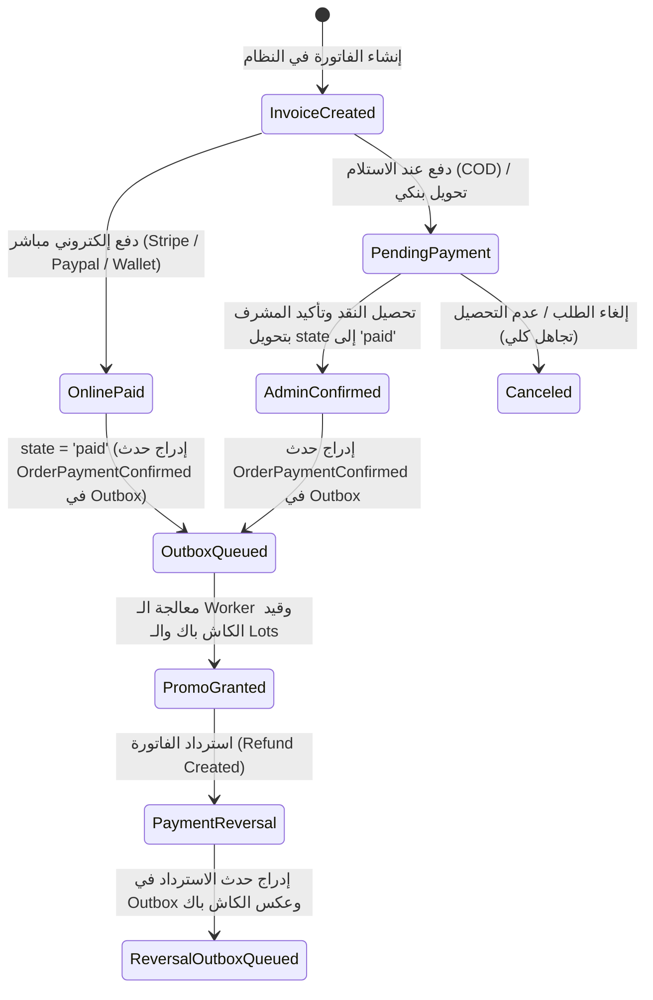

# ملحق عقد التصميم الفني والمعماري — الإصدار 1.7 (Amendment 1)
**المشروع:** منصة التجارة والمحفظة الرقمية Bagisto 2.4.x  
**الملف:** `WALLET_PROMOTIONS_DESIGN_CONTRACT_V1.7_AMENDMENT.md`  
**الوثيقة المرجعية الأصلية:** [WALLET_PROMOTIONS_DESIGN_CONTRACT_V1.7.md](file:///e:/HIGESTO%20NEW1/higest/higest101/WALLET_PROMOTIONS_DESIGN_CONTRACT_V1.7.md)  
**الحالة:** ملحق تعديل وتدقيق تنفيذي نهائي (Pre-Implementation Final Amendment)  
**تاريخ الإصدار:** 13 أغسطس 2026  

---

## 1. التوصيف الرسمي والقطعي لحالة الفاتورة (`state` vs `status`)

### الدليل المصدري المثبت من كود وقاعدة بيانات Bagisto 2.4.x:
- **في قاعدة البيانات:** جدول `invoices` يحتوي حصراً على العمود `state VARCHAR(191)` (راجع ملف `2018_09_27_115135_create_invoices_table.php`). لا يوجد عمود فيزيكال باسم `status` في جدول `invoices`.
- **في النموذج البرمجي (`Invoice.php`):** الثوابت معرفة باسم `STATUS_PAID = 'paid'`، وتُستخدم مع الحقل `state`، ودالة التسمية هي `getStatusLabelAttribute() { return $this->statusLabel[$this->state]; }`.

### دالة التحقق الرسمية المصححة (`PaymentVerificationService::isInvoiceFullyPaid`):
```php
namespace Webkul\Wallet\Services;

use Webkul\Sales\Contracts\Invoice;
use Webkul\Sales\Models\Invoice as InvoiceModel;

class PaymentVerificationService
{
    /**
     * التحقق القطعي من اكتمال الدفع المالي للفاتورة الفردية المحددة.
     * يستند حصراً إلى عمود `state` الرسمي في قاعدة بيانات Bagisto،
     * مع حظر أي كائنات تحمل خاصية `status` متناقضة مع `state`.
     */
    public static function isInvoiceFullyPaid(Invoice $invoice): bool
    {
        // 1. التحقق من أن عمود `state` الرسمي يساوي 'paid'
        if ($invoice->state !== InvoiceModel::STATUS_PAID && $invoice->state !== 'paid') {
            return false;
        }

        // 2. حماية إضافية: إذا كانت الخاصية status معينة في الكائن، يجب ألا تناقض state
        if (isset($invoice->status) && $invoice->status !== InvoiceModel::STATUS_PAID && $invoice->status !== 'paid') {
            return false; // رفض الحالات المتناقضة (مثل state=paid و status=pending)
        }

        // 3. التحقق من وجود الطلب وعدم إلغائه
        $order = $invoice->order;
        if (! $order || in_array($order->status, ['canceled', 'closed'], true)) {
            return false;
        }

        // 4. التحقق الحسابي بدقة bcmath من أن إجمالي الفاتورة الأساسي موجب (منع الفواتير الصفرية)
        $baseTotalStr = (string) $invoice->base_grand_total;
        if (bccomp($baseTotalStr, '0.0000', 4) <= 0) {
            return false;
        }

        // 5. التحقق من وجود عناصر فعلية مسددة في الفاتورة
        if ($invoice->items()->count() === 0) {
            return false;
        }

        return true;
    }
}
```

---

## 2. المفتاح الحتمي لتسوية الديون وقفل المعاملة الذرية (Deterministic Debt Settlement)

### 2.1. استبدال المفتاح الزمني بمفتاح حتمي قطعي:
- **المفتاح السابق (ملغى):** `debt:{debt_id}:grant:{grant_id}:settle:{timestamp}` (غير حتمي).
- **المفتاح الحتمي المعتمد:** 
  $$\text{event\_key} = \text{"debt:\{debt\_id\}:grant:\{grant\_id\}:settle"}$$
  - **القيد الفريد في قاعدة البيانات:** `UNIQUE KEY unique_debt_settlement (event_key)` على جدول `wallet_promo_debt_settlements`.

### 2.2. الكود البرمجي الذري لتسوية الدين مع القفل المزدوج:
```php
public function settleDebtFromGrant(
    WalletPromoDebt $debt, 
    WalletPromotionGrant $grant, 
    WalletAccount $wallet, 
    string $settlementAmountStr
): WalletPromoDebtSettlement {
    return DB::transaction(function () use ($debt, $grant, $wallet, $settlementAmountStr) {
        // قفل الصفوف لمنع التزامن
        $lockedDebt = WalletPromoDebt::lockForUpdate()->findOrFail($debt->id);
        $lockedGrant = WalletPromotionGrant::lockForUpdate()->findOrFail($grant->id);
        $lockedWallet = WalletAccount::lockForUpdate()->findOrFail($wallet->id);

        $eventKey = "debt:{$lockedDebt->id}:grant:{$lockedGrant->id}:settle";

        // التحقق من عدم تنفيذ هذه التسوية مسبقاً (Idempotency)
        $existingSettlement = WalletPromoDebtSettlement::where('event_key', $eventKey)->first();
        if ($existingSettlement) {
            return $existingSettlement;
        }

        // التحقق من ألا تتجاوز التسوية رصيد الدين المتبقي
        $actualSettlement = (bccomp((string) $lockedDebt->remaining_debt_amount, $settlementAmountStr, 4) < 0)
            ? (string) $lockedDebt->remaining_debt_amount
            : $settlementAmountStr;

        // تحديث قيم الدين
        $newRemainingDebt = bcsub((string) $lockedDebt->remaining_debt_amount, $actualSettlement, 4);
        $newSettledDebt = bcadd((string) $lockedDebt->settled_amount, $actualSettlement, 4);

        $lockedDebt->remaining_debt_amount = $newRemainingDebt;
        $lockedDebt->settled_amount = $newSettledDebt;
        $lockedDebt->status = (bccomp($newRemainingDebt, '0.0000', 4) === 0) ? 'settled' : 'partially_settled';
        if ($lockedDebt->status === 'settled') {
            $lockedDebt->settled_at = now();
        }
        $lockedDebt->save();

        // تأكيد Invariant الدين الصارم
        if (bccomp((string) $lockedDebt->original_debt_amount, bcadd($newRemainingDebt, $newSettledDebt, 4), 4) !== 0) {
            throw new \RuntimeException("Debt financial invariant violation on Debt #{$lockedDebt->id}");
        }

        // قيد حركة الـ Ledger للتسوية
        $txn = $this->walletService->credit(
            wallet: $lockedWallet,
            amount: $actualSettlement,
            type: WalletTransaction::TYPE_CREDIT_PROMOTION,
            description: "Automated debt settlement for Debt #{$lockedDebt->id}",
            referenceType: WalletPromoDebt::class,
            referenceId: $lockedDebt->id,
            createdByType: 'system',
            createdById: null
        );

        // إنشاء سجل التسوية الحتمي
        return WalletPromoDebtSettlement::create([
            'debt_id'                => $lockedDebt->id,
            'wallet_id'              => $lockedWallet->id,
            'customer_id'            => $lockedWallet->customer_id,
            'grant_id'               => $lockedGrant->id,
            'settlement_amount'      => $actualSettlement,
            'base_settlement_amount' => $actualSettlement,
            'currency_code'          => 'SAR',
            'wallet_transaction_id'  => $txn->id,
            'event_key'              => $eventKey,
        ]);
    });
}
```

---

## 3. مسار الدفع الفعلي للفواتير الفردية وحالات الانتقال



1. **الدفع الإلكتروني (Online Gateway):** ينشئ الفاتورة فوراً بـ `state = 'paid'` ⬅️ يُسجل حدث الـ Outbox فوراً في نفس المعاملة.
2. **الدفع عند الاستلام (COD) والتحويل البنكي:** تنشأ الفاتورة بـ `state = 'pending'` (لا يُسجل أي حدث ترويجي). عند تحصيل المبلغ وتحويل الفاتورة يدوياً إلى `state = 'paid'` ⬅️ يُسجل حدث الـ Outbox.
3. **إعادة حفظ الفاتورة (Re-save Protection):** المفتاح `order:{id}:invoice:{id}:promo:{id}` يمنع تكرار القيد نهائياً عند أي استدعاء لاحق لـ `$invoice->save()`.

---

## 4. ملحق مصفوفة الاختبارات المعمارية الإضافية (Extended Test Scenarios)

| المعرف | اسم الاختبار | السيناريو والمدخلات الدقيقة | النتيجة المحاسبية والتقنية المتوقعة | أدلة التحقق |
|---|---|---|---|---|
| **T-17** | الفاتورة ذات الحالة المتناقضة | كائن فاتورة يحمل `state = paid` ولكن تم تعيين `status = pending` | رفض المعاملة فوراً وعدم إنشاء أي سجل في Outbox أو Usages أو Grants أو Ledger | استجابة `PaymentVerificationService::isInvoiceFullyPaid = false` |
| **T-18** | ذرية معالجة الـ Worker وعدم انفصال السجلات | تعطل السيرفر أثناء تنفيذ الـ Worker بعد إنشاء `usages` وقبل إتمام `grants` | التراجع التام (Rollback) عن المعاملة المحاسبية، وبقاء سجل Outbox كـ `processing` حتى انتهاء الـ Lease لإعادة المحاولة | عدم وجود سجلات يتيمة في `usages` أو `grants` |
| **T-19** | إعادة تشغيل Worker بعد نجاح القيد | إعادة تشغيل الـ Worker لنفس سجل Outbox المكتمل | المفتاح الفريد `UNIQUE(promotion_id, event_key)` يمنع إعادة القيد فوراً ويحدث Outbox إلى `completed` | عدم تكرار قيد الـ Ledger إطلاقاً |
| **T-20** | تسوية الدين الحتمية المتزامنة | محاولة تسوية نفس الدين من نفس المنحة عبر عمليتين متزامنتين | نجاح العملية الأولى وتسجيل المفتاح `debt:X:grant:Y:settle`، وتخطي العملية الثانية بأمان | قيد تسوية واحد فقط في `wallet_promo_debt_settlements` |

---

### **حالة الملحق والتصميم العام:** `READY FOR REVIEW & APPROVAL`
> **التزام صارم:** تم إيقاف جميع الأنشطة تماماً بانتظار مراجعة واعتماد قائد المهمة.
