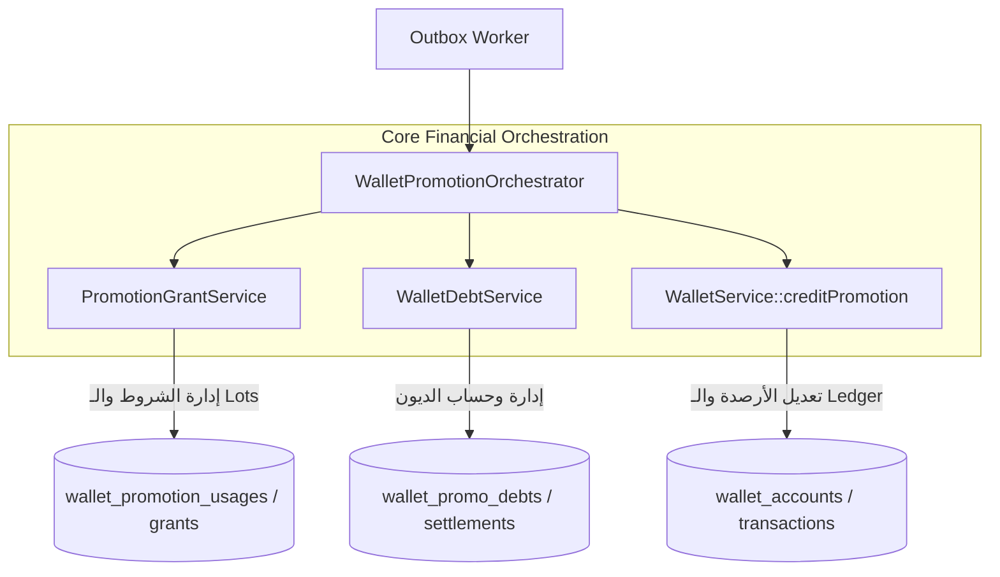

# ملحق عقد التصميم الفني والمعماري — الإصدار 1.7 (Amendment 4 - النهائي)
**المشروع:** منصة التجارة والمحفظة الرقمية Bagisto 2.4.x  
**الملف:** `WALLET_PROMOTIONS_DESIGN_CONTRACT_V1.7_AMENDMENT_4.md`  
**الوثائق المرجعية:** [WALLET_PROMOTIONS_DESIGN_CONTRACT_V1.7.md](file:///e:/HIGESTO%20NEW1/higest/higest101/WALLET_PROMOTIONS_DESIGN_CONTRACT_V1.7.md) و الملاحق 1، 2، 3  
**الحالة:** ملحق هندسي ومحاسبي نهائي لحسم المسؤوليات وحدود الخدمات (Pre-Implementation Final Architectural Specification)  
**تاريخ الإصدار:** 13 أغسطس 2026  

---

## 1. إثبات الكود وتصميم دالة `creditPromotion()` الحصرية

### 1.1. الدليل المصدري من `WalletService.php` القائم:
- بفحص ملف `packages/Webkul/Wallet/src/Services/WalletService.php` بالكامل:
  - دالة `credit()` الحالية (السطور 63-64) تزيد فقط `available_balance` و `total_balance` وليس لديها أي معالجة لحقل `promo_balance` المنفصل.
- **الحل الهندسي المعتمد:** تصميم دالة مخصصة `creditPromotion()` داخل `WalletService` تكون هي **المسؤول الحصري والوحيد** عن قيد حركات الرصيد الترويجي وتحديث الأرصدة.

### 1.2. تصميم وتوصيف دالة `WalletService::creditPromotion()`:
```php
public function creditPromotion(
    WalletAccount $wallet,
    string $amountStr,
    string $description,
    array $meta = [],
    ?string $referenceType = null,
    ?int $referenceId = null,
    ?string $createdByType = 'system',
    ?int $createdById = null
): WalletTransaction {
    $this->guardActive($wallet);

    return DB::transaction(function () use (
        $wallet, $amountStr, $description, $meta,
        $referenceType, $referenceId, $createdByType, $createdById
    ) {
        $lockedWallet = WalletAccount::lockForUpdate()->findOrFail($wallet->id);
        $this->guardActive($lockedWallet);

        if (bccomp($amountStr, '0.0000', 4) <= 0) {
            throw new \InvalidArgumentException("Promotion credit amount must be strictly positive.");
        }

        // 1. حساب الرصيد التراكمي الجديد بدقة bcmath
        $newRunningBalance = bcadd((string) $lockedWallet->available_balance, $amountStr, 4);

        // 2. قيد حركة الـ Ledger غير القابلة للتعديل
        $transaction = WalletTransaction::create([
            'wallet_id'        => $lockedWallet->id,
            'type'             => WalletTransaction::TYPE_CREDIT_PROMOTION,
            'direction'        => 'credit',
            'amount'           => $amountStr,
            'running_balance'  => $newRunningBalance,
            'description'      => $description,
            'reference_type'   => $referenceType,
            'reference_id'     => $referenceId,
            'created_by_type'  => $createdByType,
            'created_by_id'    => $createdById,
            'meta'             => $meta ?: null,
        ]);

        // 3. تحديث الأرصدة حصرياً داخل هذه الدالة فقط (بدون أي float)
        $newPromoBalance = bcadd((string) $lockedWallet->promo_balance, $amountStr, 4);
        $newAvailableBalance = bcadd((string) $lockedWallet->available_balance, $amountStr, 4);
        $newTotalBalance = bcadd((string) $lockedWallet->total_balance, $amountStr, 4);

        $lockedWallet->promo_balance = $newPromoBalance;
        $lockedWallet->available_balance = $newAvailableBalance;
        $lockedWallet->total_balance = $newTotalBalance;
        $lockedWallet->save();

        // 4. فرض Invariant المحفظة الصارم
        $this->assertWalletInvariant($lockedWallet);

        return $transaction;
    });
}
```

---

## 2. حدود ومسؤوليات الخدمات المعمارية (Service Boundaries)

لضمان الفصل التام للمسؤوليات ومنع تداخل الكود:



1. **`PromotionGrantService`:** مسؤول حصراً عن تقييم شروط العرض، التحقق من الميزانية والسقف، أخذ الـ Snapshot، وإنشاء سجل الاستخدام `usages` وحصة الرصيد `grants`.
2. **`WalletDebtService`:** مسؤول حصراً عن قفل ديون العميل، احتساب مبالغ التسوية، تحديث `wallet_promo_debts`، وإنشاء سجلات `wallet_promo_debt_settlements`.
3. **`WalletService`:** مسؤول حصراً عن الأرصدة المالية (`wallet_accounts`) وقيد حركات الـ Ledger (`wallet_transactions`).
4. **`WalletPromotionOrchestrator`:** المنسق العام الذي يدير معاملة الـ DB الموحدة ويستدعي الخدمات الثلاث بالترتيب مع قفل الصفوف.

---

## 3. حماية التزامن المزدوج وإعادة المحاولة الحتمية (Concurrent Idempotency & Net Snapshot)

### 3.1. حقل `net_credited_amount` في جدول `wallet_promotion_usages`:
يُضاف حقل `net_credited_amount DECIMAL(12,4) NOT NULL` إلى جدول `wallet_promotion_usages` لتوثيق الصافي الذي دخل المحفظة في تلك اللحظة تحديداً.

### 3.2. معالجة التصادم التزامني (Race Condition & Duplicate Key Handling):
```php
public function orchestrateGrant(
    WalletAccount $wallet, 
    WalletPromotion $promotion, 
    string $grantAmountStr, 
    string $eventKey
): array {
    try {
        return DB::transaction(function () use ($wallet, $promotion, $grantAmountStr, $eventKey) {
            $lockedWallet = WalletAccount::lockForUpdate()->findOrFail($wallet->id);

            if ($lockedWallet->backfill_status === 'pending_review') {
                throw new \Webkul\Wallet\Exceptions\AccountUnderAuditException(
                    "Account #{$lockedWallet->id} is under audit review."
                );
            }

            // فحص مسبق سريع
            $existingUsage = WalletPromotionUsage::where('promotion_id', $promotion->id)
                ->where('event_key', $eventKey)
                ->first();

            if ($existingUsage) {
                $grant = WalletPromotionGrant::where('usage_id', $existingUsage->id)->firstOrFail();
                return [
                    'grant'               => $grant,
                    'settled_amount'      => bcsub((string) $existingUsage->reward_amount, (string) $existingUsage->net_credited_amount, 4),
                    'net_credited_amount' => (string) $existingUsage->net_credited_amount,
                    'is_idempotent'       => true,
                ];
            }

            // 1. حساب تسوية الديون عبر DebtService
            $debtResult = $this->walletDebtService->calculateAndApplySettlement($lockedWallet, $grantAmountStr);
            $netToCredit = $debtResult['net_to_credit'];
            $totalSettled = $debtResult['total_settled'];

            // 2. إنشاء Usage و Grant عبر GrantService
            $grantResult = $this->promotionGrantService->createUsageAndGrant(
                $lockedWallet, $promotion, $grantAmountStr, $netToCredit, $totalSettled, $eventKey
            );

            // 3. ربط التسويات بالمنحة المنشأة
            $this->walletDebtService->linkSettlementsToGrant($debtResult['settlements'], $grantResult['grant']->id);

            // 4. قيد الصافي المالي فقط عبر WalletService
            if (bccomp($netToCredit, '0.0000', 4) > 0) {
                $this->walletService->creditPromotion(
                    wallet: $lockedWallet,
                    amountStr: $netToCredit,
                    description: "Promotional reward #{$promotion->id}",
                    referenceType: WalletPromotionGrant::class,
                    referenceId: $grantResult['grant']->id
                );
            }

            return [
                'grant'               => $grantResult['grant'],
                'settled_amount'      => $totalSettled,
                'net_credited_amount' => $netToCredit,
                'is_idempotent'       => false,
            ];
        });
    } catch (\Illuminate\Database\QueryException $e) {
        // في حال حدوث تسابق متزامن واصطدام بالقيد الفريد MySQL Error 1062
        if ($e->errorInfo[1] == 1062) {
            $existingUsage = WalletPromotionUsage::where('promotion_id', $promotion->id)
                ->where('event_key', $eventKey)
                ->firstOrFail();

            $grant = WalletPromotionGrant::where('usage_id', $existingUsage->id)->firstOrFail();

            return [
                'grant'               => $grant,
                'settled_amount'      => bcsub((string) $existingUsage->reward_amount, (string) $existingUsage->net_credited_amount, 4),
                'net_credited_amount' => (string) $existingUsage->net_credited_amount,
                'is_idempotent'       => true,
            ];
        }

        throw $e;
    }
}
```

---

## 4. التطابق الرقمي الشامل لاختبار تسوية الدين (T-21 Complete Reconciliation)

### السيناريو المحاسبي الدقيق:
- **الحالة الابتدائية للعميل:**
  - `cash_balance = 100.0000 SAR`
  - `held_balance = 0.0000 SAR`
  - `promo_balance = 0.0000 SAR`
  - `unclassified_balance = 0.0000 SAR`
  - `promo_debt = 20.0000 SAR` (دين ناشئ عن استرداد سابق)
  - $\text{total\_balance} = 100.0000 + 0.0000 + 0.0000 = \mathbf{100.0000\text{ SAR}}$
  - $\text{available\_balance} = (100.0000 - 0.0000) + 0.0000 = \mathbf{100.0000\text{ SAR}}$
  - $\text{withdrawable\_balance} = \mathbf{100.0000\text{ SAR}}$

- **الحدث المالي:** استحقاق منحة كاش باك جديدة بقيمة `Grant = 30.0000 SAR`.

- **العمليات المنفذة ذرياً:**
  1. سداد الدين المستحق بالكامل: $\text{Settlement} = \min(30.0000, 20.0000) = \mathbf{20.0000\text{ SAR}}$.
  2. صافي المكافأة المضافة للرصيد: $\text{Net Credited} = 30.0000 - 20.0000 = \mathbf{10.0000\text{ SAR}}$.
  3. استدعاء `creditPromotion()` للصافي 10.0000 فقط.

- **الحالة النهائية للمحفظة بعد المعاملة:**
  - `cash_balance = 100.0000 SAR` (لم يتغير)
  - `promo_balance = 10.0000 SAR` (زاد بـ 10 فقط)
  - `promo_debt = 0.0000 SAR` (سُدد بالكامل)
  - $\text{total\_balance} = 100.0000 + 10.0000 + 0.0000 = \mathbf{110.0000\text{ SAR}}$
  - $\text{available\_balance} = (100.0000 - 0.0000) + 10.0000 = \mathbf{110.0000\text{ SAR}}$
  - $\text{withdrawable\_balance} = \mathbf{100.0000\text{ SAR}}$ (محمي تماماً من السحب)
  - **سجل الحصة (Grant):** `original = 30.0000`, `remaining = 10.0000`, `consumed = 20.0000`, `status = 'partially_consumed'`.
  - **سجل الدين (Debt):** `original = 20.0000`, `remaining = 0.0000`, `settled = 20.0000`, `status = 'settled'`.
  - **حركات الـ Ledger (`wallet_transactions`):** إضافة **حركة واحدة فقط** بنوع `CREDIT_PROMOTION` وقيمة `10.0000 SAR` و `running_balance = 110.0000 SAR`.
  - **معيار نجاح الاختبار:** يفشل الاختبار فوراً إذا أصبح `promo_balance != 10.0000` أو `total_balance != 110.0000` أو إذا نشأت أكثر من حركة Ledger واحدة.

---

### **حالة التصميم الشامل والملاحق:** `READY FOR REVIEW & APPROVAL`
> **التزام صارم:** تم إيقاف جميع الأنشطة تماماً بانتظار مراجعة واعتماد قائد المهمة.
