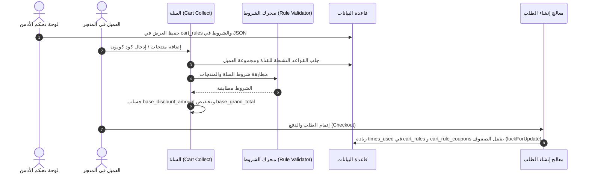

# تقرير التدقيق الشامل لنظام العروض والمحفظة الرقمية
**المشروع:** متجر Bagisto 2.4.x / منصة التجارة والمحفظة الرقمية  
**تاريخ التدقيق:** 13 أغسطس 2026  
**المهمة:** التدقيق والتحليل المعماري الشامل لنظام العروض القائم ومنطق حوافز المحفظة قبل مرحلة التصميم (Pre-Design Architectural Audit).  
**حالة الكود:** لم يتم إجراء أي تعديل على الكود، ولم يتم إنشاء أي Migration، ولم يتم تغيير أي بيانات في قاعدة البيانات.

---

## 1. الملخص التنفيذي (Executive Summary)

أجرينا تدقيقاً برمجياً ومعمارياً شاملاً عبر قراءة واختبار مسارات الكود وقواعد البيانات في متجر Bagisto 2.4.x لتحديد الأساس التقني لبناء ميزة **إدارة عروض وحوافز المحفظة (Wallet Promotions & Incentives)** داخل لوحة تحكم الأدمن (ضمن قسم التسويق والعروض).

### خلاصة النتائج الرئيسية:
1. **نظام العروض والتخفيضات القائم (Promotions/Cart Rules/Catalog Rules):**
   - نظام ناضج ومصمم أصلاً كـ **محرك خصومات زمنية/مباشرة على سلة التسوق وقائمة المنتجات (Price Reduction / Discount Engine)**.
   - يعتمد على تخفيض قيمة الفاتورة أو شحن الطلب لحظياً أثناء حساب الإجمالي (`collectTotals`)، ولا يمتلك أي مفهوم للـ **Ledger المالي** أو **منح رصيد للمحفظة**.
2. **نظام المحفظة والـ Ledger المالي القائم (`Webkul/Wallet`):**
   - يمتلك بنية Ledger محاسبية قوية ومحكمة في المعاملات الأساسية (`wallet_accounts`, `wallet_transactions`) مع قفل السجلات (`lockForUpdate`) ومبدأ الثبات (Immutability).
   - **الواقع الحقيقي لعروض المحفظة:** **لا يوجد نظام متكامل أو لوحة تحكم لعروض المحفظة حالياً**، بل يوجد فقط كود منفرد في Listener يدعى `ApplyWalletCashbackListener` يمنح كاش باك ثابت بنسبة 5% عند الدفع بالمحفظة، بدون واجهة تحكم، وبدون شروط، وبدون حماية من التكرار (Idempotency)، ويخلط الرصيد الترويجي بالرصيد القابل للسحب الحقيقي.
3. **القرار المعماري الاستراتيجي:**
   - **إنشاء نطاق مستقل لعروض المحفظة (`Wallet Promotions Domain`) مع إعادة استخدام محرك تقييم الشروط (`Webkul\Rule\Helpers\Validator`) والتكامل مع خدمة المحفظة المركزية (`WalletService`).**
   - دمج عروض المحفظة قسراً داخل جداول `cart_rules` سيؤدي إلى كسر منطق الخصومات المحاسبية، وتشويه فواتير المبيعات، ومخاطر مالية جسيمة.

---

## 2. نطاق الملفات والمسارات التي تم فحصها (Audit Scope & Inspected Paths)

تم فحص ومطابقة المسارات والملفات التالية بالكامل في مساحة العمل:

### مسارات نظام العروض والتخفيضات (Track 1):
* `packages/Webkul/CartRule/src/` (Models, Helpers, Listeners, Repositories, Database/Migrations)
* `packages/Webkul/CatalogRule/src/` (Models, Helpers, Jobs, Listeners, Database/Migrations)
* `packages/Webkul/Rule/src/` (`Helpers/Validator.php`, Providers)
* `packages/Webkul/FlashDeal/src/` (Models, Controllers, DataGrids, Database/Migrations)
* `packages/Webkul/Admin/src/Http/Controllers/Marketing/Promotions/` (`CartRuleController.php`, `CartRuleCouponController.php`, `CatalogRuleController.php`)
* `packages/Webkul/Admin/src/Resources/views/marketing/promotions/`

### مسارات نظام المحفظة والـ Ledger والحوافز المالية (Track 2):
* `packages/Webkul/Wallet/src/` (Models, Services, Listeners, Providers, Database/Migrations, Payment)
* `packages/Webkul/Wallet/src/Database/Migrations/` (9 ملفات ترحيل من `2026_08_03` إلى `2026_08_06`)
* `packages/Webkul/Wallet/src/Models/` (`WalletAccount.php`, `WalletTransaction.php`, `WalletTopUp.php`, `WalletWithdrawalRequest.php`, `WalletPendingCredit.php`)
* `packages/Webkul/Wallet/src/Services/` (`WalletService.php`)
* `packages/Webkul/Wallet/src/Listeners/` (`ApplyWalletCashbackListener.php`, `CreateWalletOnCustomerRegistered.php`, `CreditWalletOnOrderCanceled.php`, `CreditWalletOnRefundCreated.php`, `DebitWalletOnOrderCreated.php`, `CustomerRegistrationListener.php`, `RefundEventListener.php`)
* `packages/Webkul/Wallet/src/Http/Controllers/` (`Admin/WalletTopUpController.php`, `Admin/WalletAccountController.php`, `Shop/WalletTopUpController.php`, `Shop/WalletController.php`)
* `packages/Webkul/Customer/src/` (تسجيل وحفظ العملاء)
* `packages/Webkul/Sales/src/` (الفواتير، الإلغاء، الردود، الطلبات)

---

## 3. التقنية وبنية المشروع (Tech Stack & Architecture Map)

```
├── packages/Webkul/
│   ├── Rule/                     # محرك التحقق من الشروط والقواعد (Validator Helper)
│   ├── CartRule/                 # قواعد الخصم على السلة وتطبيق الكوبونات
│   ├── CatalogRule/              # قواعد التخفيض على أسعار المنتجات في الكتالوج
│   ├── FlashDeal/                # عروض الفلاش ديل المحددة بوقت
│   ├── Checkout/                 # تجميع مجاميع السلة وتطبيق الخصومات
│   ├── Sales/                    # دورة حياة الطلبات والفواتير والشحنات والمرتجعات
│   ├── Customer/                 # حسابات العملاء والمجموعات
│   └── Wallet/                   # المحفظة والـ Ledger ومعاملات الإيداع والخصم والسحب
└── app/
    ├── Providers/AppServiceProvider.php
    └── Services/AliExpress/
```

---

## 4. التدقيق الكامل لنظام العروض الحالي (Track 1: Existing Promotions System)

### 4.1. المكونات المعمارية لـ Cart Rules
- **جداول قاعدة البيانات:**
  - `cart_rules`: يحفظ العرض الأساسي، نوع الإجراء (`action_type`)، النسبة/المبلغ، التواريخ، الأولوية، وشرط إيقاف القواعد الأخرى (`end_other_rules`).
  - `cart_rule_translations`: الترجمات لاسم ووصف العرض.
  - `cart_rule_channels`: ربط العرض بالقنوات (Channels).
  - `cart_rule_customer_groups`: ربط العرض بمجموعات العملاء.
  - `cart_rule_coupons`: أكواد الكوبونات المرتبطة بالعرض (أساسي أو مولّد تلقائياً)، وحدود الاستخدام الإجمالية ولكل عميل.
  - `cart_rule_coupon_usage`: سجل استخدام الكوبون لكل عميل (`customer_id`, `cart_rule_coupon_id`, `times_used`).
  - `cart_rule_customers`: سجل استخدام القاعدة بدون كوبون لكل عميل (`customer_id`, `cart_rule_id`, `times_used`).

- **أنواع الخصومات المدعومة (`action_type`):**
  1. `by_percent`: خصم نسبة مئوية من سعر كل عنصر مؤهل.
  2. `by_fixed`: خصم مبلغ ثابت عن كل عنصر مؤهل.
  3. `cart_fixed`: خصم مبلغ ثابت من إجمالي السلة موزّعاً على العناصر.
  4. `buy_x_get_y`: اشترِ X واحصل على Y مجاناً أو بخصم.

- **محرك تقييم الشروط (`Webkul\Rule\Helpers\Validator`):**
  - يدعم الشروط المعقدة بنوعين: `All conditions are TRUE` (1) أو `Any condition is TRUE` (2).
  - سمات السلة القابلة للتحقق: `subtotal`, `items_qty`, `total_weight`, `shipping_method`, `payment_method`, `postcode`, `state`, `country`.
  - سمات عناصر السلة والمنتجات: `sku`, `price`, `category_ids`, `attribute_family_id`, وغيرها.

- **الأثر المحاسبي:**
  - الخصم يقلل مباشرة من `cart.base_discount_amount` و `cart_items.base_discount_amount`.
  - يقلل صافي المبلغ المطلوب دفعه (`base_grand_total`).
  - لا ينشئ أي التزام مالي أو قيد في المحفظة.

### 4.2. المكونات المعمارية لـ Catalog Rules
- تطبق مسبقاً عبر Job مجدول/مباشر وتخزن النتائج في جدول `catalog_rule_product_prices` لتعديل سعر البيع المعروض للمنتج في المتجر قبل وصوله للسلة.

### 4.3. المكونات المعمارية لـ Flash Deals
- عروض محددة بوقت للمنتجات تخفض السعر المباشر وترتبط بـ Widgets في واجهة المتجر.

---

## 5. خريطة دورة حياة العرض الحالي (Promotion Lifecycle Map)



---

## 6. التدقيق الكامل لمنطق عروض المحفظة والحوافز المالية القائمة (Track 2: Wallet Promotions Audit)

### 6.1. الواقع الحقيقي لعروض المحفظة في النظام الحالي:
- **هل يوجد نظام عروض محفظة متكامل حالياً؟** **[مؤكد بالدليل: لا]**. لا توجد جداول أو واجهات أو قواعد قابلة للإدارة تخص عروض المحفظة.
- **ما هو المنطق الترويجي الوحيد الموجود حالياً؟**
  - يوجد كلاس مستمع باسم `Webkul\Wallet\Listeners\ApplyWalletCashbackListener`.
  - **الحدث المشغّل:** `sales.invoice.save.after` (عند حفظ فاتورة الطلب).
  - **الشرط:** أن تكون وسيلة الدفع هي المحفظة (`$order->payment?->method === 'wallet'`).
  - **النسبة:** يحاول قراءة `sales.payment_methods.wallet.cashback_percentage`، وحيث أنه غير موجود في `system.php`، يعتمد تلقائياً على القيمة الثابتة برمجياً **`5.0%`**.
  - **المنح:** يقوم باستدعاء `$walletService->credit()` بمبلغ الكاش باك وتصنيفه كـ `TYPE_CREDIT_PROMOTION`.

### 6.2. فحص جميع الأحداث الأخرى:
1. **تسجيل العميل (`customer.create.after` / `customer.registration.after`):**
   - مستمعان: `CreateWalletOnCustomerRegistered` و `CustomerRegistrationListener`.
   - الإجراء: إنشاء حساب المحفظة برصيد **`0.00`** فقط. **لا يوجد بونص ترحيبي**.
2. **شحن المحفظة (`WalletTopUpController@approve`):**
   - الإجراء: إضافة مبلغ الشحن فقط بحركة `CREDIT_TOPUP`. **لا يوجد بونص شحن**.
3. **إلغاء الطلب المردود (`sales.order.cancel.after` / `sales.refund.save.after`):**
   - مستمعان: `CreditWalletOnOrderCanceled` و `CreditWalletOnRefundCreated`.
   - الإجراء: إعادة المبلغ المدفوع من المحفظة إلى العميل.
   - **فجوة حرجة:** **لا يتم عكس أو استرجاع الكاش باك** الذي مُنح للعميل عند الفاتورة إذا تم إلغاء الطلب أو استرداده لاحقاً!

---

## 7. خريطة المحفظة والـ Ledger والمعاملات (Wallet Ledger Map)

### 7.1. هيكل جدول الحسابات `wallet_accounts`:
| الحقل | النوع | الوصف |
|---|---|---|
| `id` | `bigint unsigned` | المفتاح الأساسي |
| `customer_id` | `int unsigned (unique)` | معرف العميل (قيد فريد) |
| `total_balance` | `decimal(12,4)` | إجمالي الرصيد |
| `available_balance` | `decimal(12,4)` | الرصيد المتاح للاستخدام/السحب |
| `held_balance` | `decimal(12,4)` | الرصيد المحجوز (طلبات سحب معلقة) |
| `currency_code` | `char(3)` | العملة (الافتراضية SAR) |
| `status` | `enum('active', 'suspended')` | حالة المحفظة |

* المعادلة الرياضية المحكمة المفروضة في `WalletService`:
  $$\text{total\_balance} = \text{available\_balance} + \text{held\_balance}$$

### 7.2. هيكل جدول المعاملات `wallet_transactions`:
- جدول Ledger غير قابل للتعديل أو الحذف (Immutable عبر Model Boot).
- المعاملات تدعم: `type`, `direction (credit/debit)`, `amount`, `running_balance`, `reference_type`, `reference_id`, `created_by_type`, `created_by_id`, `meta`.
- قفل الصفوف إلزامي: يتم تنفيذ كافة العمليات داخل `DB::transaction` مع `WalletAccount::lockForUpdate()`.

---

## 8. خريطة دورة حياة العمليات الحالية (Registration, Orders, Top-ups)

```
[تسجيل عميل جديد]
   └── customer.create.after ──> إنشاء wallet_account برصيد 0.00 (لا بونص ترحيبي)

[طلب شحن محفظة]
   └── اعتماد الأدمن ──> إضافة مبلغ الشحن فقط (CREDIT_TOPUP) (لا بونص شحن)

[شراء ودفع بالمحفظة]
   ├── checkout.order.save.after ──> خصم قيمة الطلب (DEBIT_PAYMENT)
   └── sales.invoice.save.after ──> منح كاش باك 5% ثابت (CREDIT_PROMOTION)

[إلغاء الطلب أو الرد]
   ├── sales.order.cancel.after ──> إعادة المبلغ المدفوع بالمحفظة (CREDIT_CANCEL)
   └── sales.refund.save.after ──> إعادة المبلغ المسترد للمحفظة (CREDIT_REFUND)
   └── (فجوة: الكاش باك الممنوح لا يتم استرجاعه)
```

---

## 9. الأحداث والمستمعون والـ Jobs (Events & Listeners Map)

| الحدث | المستمع الحالي | الحزمة | الإجراء |
|---|---|---|---|
| `customer.create.after` | `CreateWalletOnCustomerRegistered` | `Webkul\Wallet` | إنشاء محفظة برصيد صفري |
| `checkout.cart.collect.totals.before` | `Cart@applyCartRules` | `Webkul\CartRule` | تطبيق خصومات السلة والكوبونات |
| `checkout.order.save.after` | `DebitWalletOnOrderCreated` | `Webkul\Wallet` | خصم الرصيد عند الدفع بالمحفظة |
| `checkout.order.save.after` | `Order@manageCartRule` | `Webkul\CartRule` | تسجيل عدد مرات استخدام العرض/الكوبون |
| `sales.invoice.save.after` | `ApplyWalletCashbackListener` | `Webkul\Wallet` | منح كاش باك 5% للدفع بالمحفظة |
| `sales.order.cancel.after` | `CreditWalletOnOrderCanceled` | `Webkul\Wallet` | إعادة الرصيد عند الإلغاء |
| `sales.refund.save.after` | `CreditWalletOnRefundCreated` | `Webkul\Wallet` | إعادة الرصيد عند الاسترداد |

---

## 10. جدول المقارنة الشاملة بين النظامين (System Comparison Table)

| المجال | نظام العروض الحالي (Cart Rules) | منطق عروض المحفظة الحالي | الفجوة المكتشفة | القرار المقترح | دليل المطابقة البرمجي |
|---|---|---|---|---|---|
| **نموذج البيانات** | جداول متكاملة (`cart_rules`, `coupons`, `usage`) | لا توجد جداول عروض (Listener ثابت فقط) | انعدام تام لنموذج بيانات عروض المحفظة | إنشاء جداول مخصصة `wallet_promotions` | [CartRule.php](file:///e:/HIGESTO%20NEW1/higest/higest101/packages/Webkul/CartRule/src/Models/CartRule.php) مقابل [ApplyWalletCashbackListener.php](file:///e:/HIGESTO%20NEW1/higest/higest101/packages/Webkul/Wallet/src/Listeners/ApplyWalletCashbackListener.php) |
| **شروط الأهلية** | محرك متقدم (`Validator`) يدعم شروط السلة والمنتج | لا توجد شروط سوى الدفع بالمحفظة | عدم القدرة على تحديد حد أدنى، مستخدمين، أو فترات | إعادة استخدام كلاس `Webkul\Rule\Helpers\Validator` | [Validator.php](file:///e:/HIGESTO%20NEW1/higest/higest101/packages/Webkul/Rule/src/Helpers/Validator.php) |
| **الفترات الزمنية** | مدعومة (`starts_from`, `ends_till`) | غير مدعومة (يعمل دائماً) | غياب تواريخ الصلاحية والانتهاء | إضافة حقول البداية والنهاية في عروض المحفظة | [CartRule.php:L21](file:///e:/HIGESTO%20NEW1/higest/higest101/packages/Webkul/CartRule/src/Models/CartRule.php#L21) |
| **العملة والتقريب** | تحويل أسعار المتجر مع تقريب العملة | عملة المحفظة الأساسية (SAR) مع دقة `12,4` | عدم توحيد العملة بين قنوات المتجر والمحفظة | اعتماد عملة المتجر الأساسية وتقريب `round(amount, 2)` | [WalletAccount.php](file:///e:/HIGESTO%20NEW1/higest/higest101/packages/Webkul/Wallet/src/Models/WalletAccount.php) |
| **نقطة التقييم** | أثناء تجميع مجاميع السلة (`collectTotals`) | بعد دفع الفاتورة (`invoice.save.after`) | تقييم الخصم آني، وتقييم الكاش باك بعدي | تقييم الأهلية عند الأحداث المحددة (تسجيل، إيداع، فاتورة) | [CartRule.php:L55](file:///e:/HIGESTO%20NEW1/higest/higest101/packages/Webkul/CartRule/src/Helpers/CartRule.php#L55) |
| **نقطة منح الرصيد** | خصم من الفاتورة مباشرة (لا يمنح رصيداً) | إيداع فوري في `wallet_accounts` | خلط الرصيد المالي القابل للسحب بالرصيد الترويجي | فصل الرصيد الترويجي أو تسجيله بنوع محدد وقواعد سحب | [WalletService.php:L63](file:///e:/HIGESTO%20NEW1/higest/higest101/packages/Webkul/Wallet/src/Services/WalletService.php#L63) |
| **الحد الأقصى للاستخدام** | مدعوم كلياً ولكل عميل (`usage_limit`) | غير مدعوم | إمكانية استغلال العرض بلا حدود | دعم `usage_limit_per_customer` و `total_usage_limit` | [Order.php:L87](file:///e:/HIGESTO%20NEW1/higest/higest101/packages/Webkul/CartRule/src/Listeners/Order.php#L87) |
| **التكرار والتزامن** | محمي بقفل الصفوف `lockForUpdate` | لا يوجد Idempotency Key أو تحقق من التكرار | تكرار منح الكاش باك لو أُعيد حفظ الفاتورة | فرض التحقق من `event_key` أو `reference_id` مسبقاً | [ApplyWalletCashbackListener.php:L56](file:///e:/HIGESTO%20NEW1/higest/higest101/packages/Webkul/Wallet/src/Listeners/ApplyWalletCashbackListener.php#L56) |
| **الإلغاء والعكس** | لا يتم استرجاع مرات استخدام الكوبون | لا يتم عكس الكاش باك الممنوح | خسارة مالية عند إلغاء طلبات منح كاش باك | برمجة Listener لعكس الرصيد الترويجي عند الإلغاء/الرد | [EventServiceProvider.php](file:///e:/HIGESTO%20NEW1/higest/higest101/packages/Webkul/Wallet/src/Providers/EventServiceProvider.php) |
| **واجهة الأدمن** | متكاملة تحت `Marketing > Promotions > Cart Rules` | لا توجد واجهة | عدم القدرة على إدارة العروض برمجياً من الإدارة | إنشاء واجهة إدارة تحت `Marketing > Wallet Promotions` | [routes/admin-routes.php](file:///e:/HIGESTO%20NEW1/higest/higest101/packages/Webkul/Admin/src/Routes/admin-routes.php) |
| **الإشعارات** | لا توجد إشعارات مخصصة | لا يوجد إشعار عند منح الكاش باك | العميل لا يعلم بإضافة الكاش باك لمحفظته | إطلاق `CustomerNotification` عند إضافة أي بونص/كاش باك | [ApplyWalletCashbackListener.php](file:///e:/HIGESTO%20NEW1/higest/higest101/packages/Webkul/Wallet/src/Listeners/ApplyWalletCashbackListener.php) |

---

## 11. مصفوفة الأنواع الأربعة المطلوبة مقابل النظام القائم (Target Types Matrix)

| نوع العرض المطلوب | الحدث المشغّل | هل يوجد مثيل قائم؟ | أقرب منطق قائم في الكود | ما الذي يمكن إعادة استخدامه؟ | ما الذي ينقص لبنائه؟ | المخاطر عند الدمج المباشر |
|---|---|---|---|---|---|---|
| **1. بونص ترحيبي عند إنشاء الحساب** | `customer.create.after` | **لا** [مؤكد بالدليل] | `CreateWalletOnCustomerRegistered` | حدث التسجيل واستدعاء `$walletService->credit()` | جدول العروض، التحقق من فترة العرض وحالة التفعيل | إنشاء حسابات وهمية متكررة لاستنزاف البونص الترحيبي |
| **2. كاش باك عند تجاوز السلة حداً معيناً** | `sales.invoice.save.after` / `checkout.order.save.after` | **جزئياً** (كاش باك 5% عام) | `ApplyWalletCashbackListener` | آلية احتساب الفاتورة والإيداع الترويجي | التحقق من حد السلة، النسبة الديناميكية، دعم وسائل دفع أخرى | تضارب الكاش باك التلقائي الحالي مع العرض الجديد |
| **3. بونص شحن المحفظة بنسبة مئوية** | `wallet.topup.approved` (اعتماد الإيداع) | **لا** [مؤكد بالدليل] | `WalletTopUpController@approve` | خدمة الإيداع `$walletService->credit()` | حساب نسبة البونص الإضافية، قيدها بحركة منفصلة | احتساب بونص على إيداعات غير مكتملة أو ملغاة |
| **4. كاش باك الطلب المرتبط بشروط معينة** | `sales.invoice.save.after` | **جزئياً** (ثابت للدفع بالمحفظة فقط) | `ApplyWalletCashbackListener` | استدعاء `WalletService` | ربط محرك الشروط `Rule\Validator` لتقييم التصنيفات والمنتجات | تكرار منح الكاش باك عند تعدد الفواتير لنفس الطلب |

---

## 12. قرار إعادة الاستخدام أو التوسعة أو الفصل (Architectural Decision)

### الأسئلة العشرة الحاسمة:
1. **هل يوجد نظام عروض عام يمكن توسيعه؟** نعم، `CartRule` و `Rule`، لكنهما مخصصان لتخفيض أسعار الفواتير فقط وليس لتوليد قيود Ledger مالية.
2. **هل توجد خدمة مركزية لتقييم الشروط؟** نعم، `Webkul\Rule\Helpers\Validator` جاهزة وتدعم الشروط المعقدة.
3. **هل توجد خدمة مركزية لمنح الرصيد؟** نعم، `Webkul\Wallet\Services\WalletService` ممتازة ومبنية بقفل الصفوف (`lockForUpdate`).
4. **هل توجد آلية موحدة للـ event_key أو Idempotency؟** غير مطبقة حالياً في كاش باك المحفظة (فجوة حرجة).
5. **هل توجد بنية موحدة لتسجيل أسباب المعاملات؟** نعم، حقول `description`, `reference_type`, `reference_id`, `meta` في `wallet_transactions`.
6. **هل توجد صلاحيات جاهزة لإدارة العروض؟** نعم، نظام Bouncer ACL في Bagisto.
7. **هل توجد واجهة Admin قابلة لإضافة نوع عرض جديد؟** نعم، قسم التسويق (`Marketing > Promotions`) يتيح دمج فروع جديدة بسهولة.
8. **هل توجد إشعارات جاهزة للمعاملات المالية؟** نعم، `CustomerNotificationService` ونظام `Notification` في المتجر.
9. **هل توجد تقارير أو Audit Logs قابلة لإعادة الاستخدام؟** نعم، سجل المعاملات `wallet_transactions`.
10. **هل التوسعة المباشرة لـ Cart Rules ستكسر عروض الطلب؟** **نعم بكل تأكيد**؛ لأن إدخال منطق زيادة رصيد المحفظة داخل معادلات خصم السلة سيفسد مجاميع الضريبة والشحن وصافي الفاتورة.

### القرار المعماري النهائي:
> **القرار: بناء نطاق مستقل متكامل (`Independent Wallet Promotions Sub-Domain`) داخل قسم التسويق مع إعادة استخدام الخدمات المركزية المشتركة:**
> 1. **إعادة استخدام** محرك الشروط `Webkul\Rule\Helpers\Validator` لتقييم شروط السلة والمنتجات والعملاء.
> 2. **إعادة استخدام** خدمة المحفظة المركزية `Webkul\Wallet\Services\WalletService` لتنفيذ كافة قيود الإيداع والعكس.
> 3. **إنشاء جداول مخصصة** لعروض المحفظة (`wallet_promotions`, `wallet_promotion_usages`) حتى لا تتداخل مع خصومات السلة المباشرة.
> 4. **إعادة هيكلة وحذف** الـ Listener القديم المكتوب بشكل ثابت (`ApplyWalletCashbackListener`) واستبداله بالمعالج الديناميكي الجديد.

---

## 13. الفجوات والمخاطر والتناقضات المكتشفة (Gaps, Risks & Inconsistencies)

1. **فجوة الـ Enum في قاعدة البيانات:**
   - في الموديل `WalletTransaction.php` تم تعريف الثابت `TYPE_CREDIT_PROMOTION`، بينما في الـ Migration الأساسي `2026_08_03_000002_create_wallet_transactions_table.php` حقل `type` هو `enum` لا يحتوي صراحة على هذه القيمة. يجب التحقق من تعديل الحقل ليدعم كافة أنواع البونص.
2. **فجوة خلط الرصيد الحقيقي بالرصيد الترويجي (Withdrawable Funds Risk):**
   - حالياً الرصيد الممنوح ككاش باك يضاف مباشرة إلى `available_balance`، مما يسمح للعميل بطلب سحبه كأموال نقدية حقيقية عبر صفحة طلبات السحب (`Withdrawals`)!
3. **غياب حماية التكرار (Lack of Idempotency):**
   - `ApplyWalletCashbackListener` لا يتحقق هل تم منح كاش باك لهذا الطلب مسبقاً أم لا، مما قد يؤدي لمضاعفة الرصيد عند إعادة معالجة الفاتورة.
4. **عدم عكس الكاش باك عند الإلغاء (No Reversal on Refund/Cancel):**
   - عند إلغاء الطلب أو استرداده، يتم رد المبلغ الأصلي دون استرجاع الكاش باك الذي دخل المحفظة.

---

## 14. الصلاحيات وسجل المراجعة (Permissions & Audit Logging)

- **الصلاحيات (ACL):**
  - استخدام نظام Bouncer المعتمد في `packages/Webkul/Wallet/src/Config/acl.php` و `packages/Webkul/Admin/src/Config/acl.php`.
  - إضافة مفتاح صلاحيات مستقل: `marketing.promotions.wallet_promotions` (عرض، إنشاء، تعديل، حذف).
- **سجل المراجعة (Audit Log):**
  - كل معاملة ترويجية تسجل في `wallet_transactions` مع إرفاق:
    - `reference_type`: معرف الموديل المرتبط (`Order`, `Customer`, `WalletTopUp`).
    - `reference_id`: رقم المعاملة الأصلية.
    - `meta`: بيانات JSON تتضمن اسم العرض، رقم القاعدة، وتفاصيل النسبة.

---

## 15. التقارير والمراقبة (Reporting & Observability)

- يجب أن تتكامل عروض المحفظة مع:
  - لوحة تحكم المحفظة (`WalletDashboardController`).
  - تقارير المحفظة (`WalletReportController`) لحساب إجمالي الالتزامات المالية الترويجية (Promotional Liabilities).
  - سجلات Log مخصصة لكل عملية منح/عكس كاش باك وبونص لتتبع أي استثناءات.

---

## 16. مصفوفة الاختبارات المقترحة (Proposed Test Matrix)

| الاختبار المقترح | الهدف | المدخلات | النتيجة المتوقعة | الدليل المطلوب |
|---|---|---|---|---|
| **T-01: عزل الخصم عن المحفظة** | التأكد من أن خصومات السلة الحالية لا تؤثر على رصيد المحفظة | تطبيق كوبون سلة 10% | خصم 10% من الفاتورة مع بقاء رصيد المحفظة دون تغيير | فحص `cart.base_discount_amount` و `wallet.available_balance` |
| **T-02: البونص الترحيبي ضمن الفترة** | التحقق من منح البونص عند إنشاء حساب جديد خلال العرض | تسجيل عميل جديد أثناء سريان العرض | إضافة المبلغ المحدد فوراً للمحفظة بحركة `CREDIT_PROMOTION` | فحص جدول `wallet_transactions` وحساب العميل |
| **T-03: منع تكرار البونص الترحيبي** | منع استغلال إعادة التسجيل أو إعادة إطلاق الحدث | استدعاء معالج التسجيل مرتين لنفس العميل | منح البونص مرة واحدة فقط وتجاهل المحاولة الثانية | قيد فريد أو فحص `wallet_promotion_usages` |
| **T-04: بونص شحن المحفظة** | التحقق من احتساب نسبة البونص الإضافية عند اعتماد الشحن | شحن 100 ريال مع بونص 10% | إيداع 100 (شحن) + 10 (بونص ترويجي) في المحفظة | وجود معاملتين منفصلتين في `wallet_transactions` |
| **T-05: كاش باك الطلب مع الشروط** | التحقق من تقييم شروط السلة ومنح الكاش باك بعد الفاتورة | طلب قيمته 200 ريال ينطبق عليه شرط الحد الأدنى | منح الكاش باك المحدد بعد حفظ الفاتورة | وجود قيد كاش باك مرتبط بـ `Order #ID` |
| **T-06: عكس الكاش باك عند الإلغاء** | التحقق من استرجاع الكاش باك عند إلغاء أو رد الطلب | إلغاء طلب تم منحه كاش باك سابقاً | خصم مبلغ الكاش باك من المحفظة بحركة عكسية | قيد خصم بنوع عكس ترويجي في `wallet_transactions` |
| **T-07: التزامن والقفل (Concurrency)** | التحقق من سلامة الرصيد عند تزامن عدة عمليات | إرسال عمليتي دفع/منح متزامنتين | معالجة العمليات بالتتابع دون حدوث Race Condition أو رصيد خاطئ | ثبات المعادلة `total = available + held` |

---

## 17. القرارات التي يجب أن يعتمدها صاحب المشروع (Required Stakeholder Decisions)

قبل الانتقال إلى وثيقة التصميم الفني (`WALLET_PROMOTIONS_DESIGN_CONTRACT.md`)، نطلب من صاحب المشروع اعتماد النقاط التالية:

1. **سياسة سحب الرصيد الترويجي (Withdrawal Policy):**
   - هل يُسمح للعميل بسحب رصيد البونص والكاش باك كنقد حقيقي عبر الحوالات البنكية، أم يجب أن يكون مخصصاً للشراء من المتجر فقط (Non-withdrawable / Shopping-only)؟
2. **سياسة عكس الكاش باك عند الإلغاء/الاسترداد (Reversal Policy):**
   - إذا استخدم العميل رصيد الكاش باك في طلب جديد ثم طلب استرداد الطلب الأول، هل يصبح رصيده سالباً، أم يتم خصم المتبقي فقط؟
3. **مكان واجهة إدارة العروض في لوحة الأدمن:**
   - المقترح الموصى به: إدراج قسم `عروض المحفظة (Wallet Promotions)` داخل القائمة الرئيسية `التسويق (Marketing) > العروض الترويجية (Promotions)` بجانب `Cart Rules` و `Catalog Rules` و `Flash Deals`.
4. **مصير كود الكاش باك القديم (5% Hardcoded):**
   - اعتماد إيقافه بالكامل واستبداله بنظام العروض الديناميكي الجديد.

---

## 18. قائمة الملفات التي قد تحتاج تعديلاً لاحقاً (Impacted Files List - No edits made)

> **تنبيه:** لم يتم تعديل أي من هذه الملفات في هذه المرحلة، وهي مدرجة فقط لحصر النطاق المستقبلي:

* `packages/Webkul/Wallet/src/Providers/EventServiceProvider.php` (تحديث مسارات المستمعين).
* `packages/Webkul/Wallet/src/Listeners/ApplyWalletCashbackListener.php` (استبداله بالمعالج الجديد).
* `packages/Webkul/Wallet/src/Listeners/CreateWalletOnCustomerRegistered.php` (ربطه بمعالج البونص الترحيبي).
* `packages/Webkul/Wallet/src/Http/Controllers/Admin/WalletTopUpController.php` (ربطه ببونص الإيداع).
* `packages/Webkul/Wallet/src/Config/acl.php` و `admin-menu.php` (إضافة قوائم وصلاحيات عروض المحفظة).
* `packages/Webkul/Wallet/src/Database/Migrations/` (إنشاء جداول عروض المحفظة وسجل استخدامها).

---

## 19. بوابة الموافقة المعمارية (Go/No-Go Gate Verdict)

### **القرار النهائي:** `READY FOR DESIGN`

**المبررات:**
- تم فحص وتدقيق كل من نظام العروض الحالي ونظام المحفظة والـ Ledger المالي بدقة متناهية وبالأدلة البرمجية الكاملة.
- تم تحديد الفجوات الحرجة والمخاطر المالية بوضوح وتحديد حلولها المعمارية.
- لا توجد أي عوائق برمجية أو قيود غير معروفة تمنع الانتقال إلى كتابة **عقد التصميم الفني المفصل (`WALLET_PROMOTIONS_DESIGN_CONTRACT.md`)** فور استلام موافقة قائد المهمة على القرارات المطلوبة.
