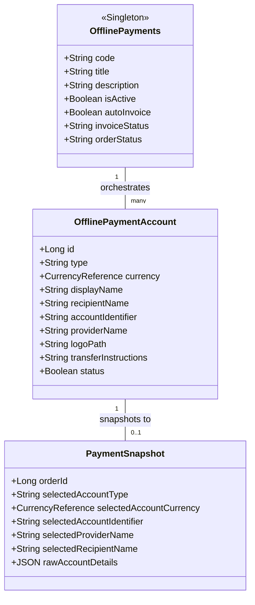

# Offline Payments Architecture Specification
### Version 2.0 (Approved Reference)  
**Status:** Frozen  

---

> ## ❝ One Method, Many Accounts ❞

---

## 1. Executive Summary
The Offline Payments module represents a paradigm shift from dynamic bank transfers to a generalized, structured **Offline Payments** ecosystem. It decouples payment orchestration behavior (invoices, status changes, order workflow) from payment destination accounts (bank routing details, digital wallets, local cash points). 

Bagisto registers **exactly one** static payment method (`offline_payments`), while merchant-controlled accounts are queried at runtime, filtered by active channel, status, and transaction currency, and presented as payment options to checkout customers.

---

## 2. Business Context
* **Merchant Profile:** HIGEST is a single-merchant dropshipping platform. The store owner imports goods from AliExpress and sells them.
* **No Marketplace Overheads:** No vendor splits, no commissions, no complex seller ledger logic.
* **No Real-time Gateways:** Completely offline payment workflow; no integrations with PSP APIs (e.g. Stripe, PayPal) or crypto processors.
* **Payment Types:** Limited to local Bank Accounts, Mobile Wallets (e.g., Kuraimi Pocket, Yalla, OneCash), and cash remittance Payment Points (e.g., Al-Najm, Dada).

---

## 3. Design Philosophy
The system follows Domain-Driven Design (DDD) principles with a strict Separation of Concerns (SoC):
* **One Method, Many Accounts:** Orchestration logic is static. Selection logic is dynamic.
* **Immutable History:** Financial records are snapshotted instantly on order creation. Subsequent modifications to accounts do not alter order logs.
* **No Container Pollution:** Zero runtime modification of Laravel's IoC container bindings or virtual class registration based on database contents. This prevents system bootstrap failure in the event of database outages.

---

## 4. Domain Model



---

## 5. Architectural Boundaries

To ensure clean system maintenance and prevent responsibility leakage, the boundaries of each subsystem are strictly defined:

### 5.1. Payment Method (OfflinePayments)
* **Responsibility:** Control execution behavior, general workflow, and global checkout visibility.
* **Parameters owned:** Global Active Status, Title, Description, Default Logo, Auto Invoice Generation, Invoice Status mapping, Order Status mapping, and Sort Order.

### 5.2. Payment Account (OfflinePaymentAccount)
* **Responsibility:** Store destination data for manual customer payments.
* **Parameters owned:** Account Type, Currency Reference, Display Name, Recipient Identity, Account Identifiers, Provider Identity, Custom Logo, and specific Transfer Instructions.

### 5.3. Snapshot (PaymentSnapshot)
* **Responsibility:** Guarantee the historical integrity of placed orders.
* **Parameters owned:** Frozen attributes of the selected payment destination (Type, Currency Reference, Provider, Recipient, Identifier) saved in an immutable JSON structure at order creation.

### 5.4. Checkout Subsystem
* **Responsibility:** Filter accounts dynamically and capture the customer's selection.
* **Parameters owned:** Current Cart Currency matching, Active Status matching, current Channel matching, and capturing the selected account ID to forward to the Snapshot builder.

---

## 6. Core Concepts
* **OfflinePayments:** Represents the Bagisto payment configuration instance. It owns execution settings and controls checkout visibility.
* **OfflinePaymentAccount:** Represents the physical destination of customer funds. It is currency-bound and does not participate in order workflows.
* **PaymentSnapshot:** Represents the immutable historical record of the specific payment destination chosen by the customer for an order.

---

## 7. Payment Method Responsibilities
The registered Bagisto Payment Method Class (`Webkul\OfflinePayments\Payment\OfflinePayments`) encapsulates payment behavior:
* **Visibility:** Controlled via `active` status in System Configuration.
* **Metadata:** Standard localized `title`, `description`, and `logo` defined at the package level.
* **Workflow:** Settings for automatic invoicing (`generate_invoice`), default invoice status, and default order status (e.g., `pending_payment` / `processing`).
* **Positioning:** Sorting order in checkout lists.

---

## 8. Payment Account Responsibilities
Payment Accounts only represent where the customer sends money.
* **Unified Data Model:** All accounts share a single, unified database schema. No separate tables or models exist per account type.
* **Dynamic Validation Rule:** 
  > تختلف قواعد التحقق والحقول الظاهرة حسب نوع الحساب، بينما يبقى نموذج البيانات الأساسي واحدًا.
* **Data Fields:**
  * `type`: enum/string (`BANK`, `WALLET`, `PAYMENT_POINT`).
  * `currency`: Currency Reference to the platform's configured currencies.
  * `displayName`: Custom label (e.g., "Al Kuraimi Bank - YER Account").
  * `recipientName`: Full beneficiary name.
  * `accountIdentifier`: Account number, wallet telephone, or ID code.
  * `providerName`: Bank name, Wallet company, or Exchange network name.
  * `logoPath` (Optional): Bank/Provider icon path.
  * `transferInstructions` (Optional): Specific payment rules.
  * `status`: Active / Inactive toggle.

---

## 9. Currency Model
* **Referential Integrity:** Each payment account belongs to exactly one enabled store currency via a Currency Reference pointing directly to the platform's configured currencies.
* **Zero Conversions:** The checkout system presents payment accounts whose associated Currency Reference matches the cart currency's reference. No currency converter or multiplier calculation is done on the fly, avoiding manual rounding errors.

---

## 10. Checkout UX Flow
The customer checkout journey follows a structured, sequential pipeline to minimize cognitive load:

```
[Offline Payments Selected]
            ↓
    [Select Account]      ← Filtered dynamically by currency, channel & status
            ↓
    [Display Details]     ← Shows provider details, identifier, and logo
            ↓
[Upload Receipt (Future)] ← Placeholder step for receipt image/PDF upload
            ↓
     [Place Order]        ← Snapshots selected account and creates order
```

---

## 11. Checkout Architecture
1. **Method Check:** System checks if `offline_payments` is enabled.
2. **Account Query:** Retrieve active `OfflinePaymentAccount` records where:
   * `status = true`
   * `currency = Cart::getCart()->currency` (or currency reference mapping)
   * `channel_ids` contains the current channel ID.
3. **Sub-Selection:** If accounts exist, the checkout displays them under the "Offline Payments" tab as a nested select list or selector grid.
4. **Checkout Submission:** The ID of the selected account is processed. The system generates an immutable snapshot of that account and stores it inside `order_payment.additional`.

---

## 12. Admin Architecture
The admin panel UI splits management into two areas:
* **General Settings:** Handled in the default System Configuration panel under `sales -> payment_methods`. Used to enable the module, toggle auto-invoice, default statuses, and method title.
* **Offline Payment Accounts:** Handled in `Sales -> Offline Accounts`. A clean list/DataGrid containing CRUD operations.
* **Account Form:** The account creation form uses a Reactive Admin UI / Reactive Form to show fields based on `type`:
  * *Bank:* Shows Bank Name, SWIFT, IBAN.
  * *Wallet:* Hides SWIFT/IBAN. Shows Wallet Provider Name.
  * *Payment Point:* Hides SWIFT/IBAN/Account. Shows Recipient Full Name and Remittance Network Name.

---

## 13. Snapshot Strategy
* **Immutability:** When a customer places an order, the system captures the account parameters in JSON format.
* **Field Scope:** Captured details include: `type`, `currency`, `provider_name`, `recipient_name`, `account_identifier`, and the specific instructions.
* **Zero Modification Policy:** Once saved in the order payment details column, changes to the original account (e.g., modifying the IBAN or renaming the wallet) will have no effect on this historical snapshot.

---

## 14. Future Extensibility
The design leaves strict interfaces/reserved fields to support:
* **Receipt Verification:** A future file upload module can associate uploaded payment receipts (images, PDFs) with the order.
* **Payment Policies:** Custom terms of service (e.g., "Must complete transfer within 24 hours" or "Minimum payment of 50% required") belong under the **Payment Policies** layer linked at the payment method level, not at the individual account level.
* **Approval Workflow:** Changing the order state from `pending` to `paid` upon merchant verification of receipt.
* **Payment Matching:** Algorithmic verification of recipient data or transactional references.

---

## 15. Non-Goals
* No vendors or multi-seller splits.
* No automatic transaction reconciliation via API.
* No credit card processing or tokenization.
* No crypto addresses or blockchain validation.

---

## 16. Guiding Principles
Any future development or refactoring must prioritize and validate its designs against these five core pillars:

1. **Single Payment Method:** The front-facing storefront exposes exactly one gateway option.
2. **Many Payment Accounts:** Dynamic routing endpoints exist only as data entities, not code extensions.
3. **Immutable Financial History:** Payment snapshots are locked on order creation and cannot be changed retrospectively.
4. **Configuration over Duplication:** Rely on unified database structures and custom form validation behaviors over creating split models.
5. **Business First, Framework Second:** Define architectural bounds based on operations, maintaining framework neutrality where possible.

---

## 17. Architectural Decisions (ADR Style)

### ADR-002: Static Container Boot Registration
* **Context:** Version 1 registered dynamic payment method classes in the container based on database records. This created runtime dependencies on database connection availability during boot.
* **Decision:** Register exactly one payment method class `offline_payments` inside `PaymentServiceProvider`. All account data is loaded dynamically only when rendering checkout or admin forms.
* **Consequences:** Faster boot times, zero risk of bootstrap crash due to database outages, and clean code separation.

### ADR-003: Type-Based Dynamic Validation
* **Context:** Strict IBAN checks blocked non-bank payment accounts.
* **Decision:** The Form Request class determines rules dynamically based on the selected `type` field (BANK, WALLET, PAYMENT_POINT).
* **Consequences:** Allows wallets and cash points to bypass IBAN/SWIFT constraints.
