# Dynamic Money Transfer Sequence Diagrams v1.0

**Project:** HIGEST (Bagisto 2.4.x / Laravel)  
**Document Type:** Enterprise Technical Sequence Specification  
**Classification:** Internal — Engineering Reference  
**Status:** Approved Sequence Diagram Blueprint v1.0 (Includes Failure Sequences, Authority Precedence & Transaction Boundaries)  
**Author Role:** Principal Software Architect & Lead Software Engineer  
**Reference Specification:** Dynamic Money Transfer Architecture Specification v1.1  
**Date:** 2026-07-30  

---

## Table of Contents

1. [Executive Summary, Authority Precedence & Transaction Boundaries](#1-executive-summary-authority-precedence--transaction-boundaries)
2. [Sequence Notation & Actor Definitions](#2-sequence-notation--actor-definitions)
3. [Flow 1: Create Bank Transfer Payment Method (Admin)](#3-flow-1-create-bank-transfer-payment-method-admin)
4. [Flow 2: Load Checkout Payment Methods (Storefront Customer)](#4-flow-2-load-checkout-payment-methods-storefront-customer)
5. [Flow 3: Select Payment Method & Save Cart Payment (Storefront Customer)](#5-flow-3-select-payment-method--save-cart-payment-storefront-customer)
6. [Flow 4: Create Order & Inject Complete Immutable Snapshot (Order Pipeline)](#6-flow-4-create-order--inject-complete-immutable-snapshot-order-pipeline)
7. [Flow 5: Auto-Generate Invoice & Update Order Status (Event Listener)](#7-flow-5-auto-generate-invoice--update-order-status-event-listener)
8. [Flow 6: Soft-Delete Bank Transfer Payment Method (Admin)](#8-flow-6-soft-delete-bank-transfer-payment-method-admin)
9. [Flow 7: Deactivate / Toggle Status of Bank Transfer Payment Method (Admin)](#9-flow-7-deactivate--toggle-status-of-bank-transfer-payment-method-admin)
10. [Flow 8: Multi-Tier Cache Refresh & Invalidation Lifecycle](#10-flow-8-multi-tier-cache-refresh--invalidation-lifecycle)
11. [Flow 9: Tier-2 Lazy Guard Registration Fallback Execution](#11-flow-9-tier-2-lazy-guard-registration-fallback-execution)
12. [Flow 10: [Failure Path] Snapshot Creation Exception Handling](#12-flow-10-failure-path-snapshot-creation-exception-handling)
13. [Flow 11: [Failure Path] Auto-Invoice Creation Exception & Resilience](#13-flow-11-failure-path-auto-invoice-creation-exception--resilience)
14. [Flow 12: [Failure Path] Cache Miss & Database Connection Outage](#14-flow-12-failure-path-cache-miss--database-connection-outage)
15. [Flow 13: [Failure Path] Active Cart Conflict on Method Deletion](#15-flow-13-failure-path-active-cart-conflict-on-method-deletion)
16. [Flow 14: [Failure Path] Logo File Upload Exception & Rollback](#16-flow-14-failure-path-logo-file-upload-exception--rollback)
17. [Flow 15: [Failure Path] Registry Configuration Injection Exception](#17-flow-15-failure-path-registry-configuration-injection-exception)

---

## 1. Executive Summary, Authority Precedence & Transaction Boundaries

### 1.1 Executive Summary

This document provides **formal, visually verifiable sequence diagrams** using standard Mermaid syntax for both successful (happy path) and failure (resilience path) execution flows of the `DynamicBankTransfer` system.

### 1.2 Document Authority & Precedence Hierarchy

These sequence diagrams provide **illustrative behavioral representations** of component interactions during runtime. To prevent this document from becoming a competing source of truth, the following **Strict Authority Precedence Hierarchy** is enforced across the HIGEST project:

```
┌───────────────────────────────────────────────────────────────────────────┐
│     1. Dynamic Money Transfer Architecture Specification v1.1            │
│        (HIGHEST AUTHORITY — Defines architectural boundaries & models)   │
└─────────────────────────────────────┬─────────────────────────────────────┘
                                      │ Overrides if conflict exists
                                      ▼
┌───────────────────────────────────────────────────────────────────────────┐
│     2. Dynamic Money Transfer Implementation Specification v1.0           │
│        (SECOND AUTHORITY — Defines component structure & execution order) │
└─────────────────────────────────────┬─────────────────────────────────────┘
                                      │ Overrides if conflict exists
                                      ▼
┌───────────────────────────────────────────────────────────────────────────┐
│     3. Dynamic Money Transfer Interface Contracts v1.0                     │
│        (THIRD AUTHORITY — Defines method signatures, types & exceptions) │
└─────────────────────────────────────┬─────────────────────────────────────┘
                                      │ Overrides if conflict exists
                                      ▼
┌───────────────────────────────────────────────────────────────────────────┐
│     4. Dynamic Money Transfer Sequence Diagrams v1.0                      │
│        (BEHAVIORAL VIEW — Illustrative runtime flow diagrams)              │
└───────────────────────────────────────────────────────────────────────────┘
```

In the event of any contradiction or ambiguity between documents, engineering teams shall defer strictly to the document with the higher precedence rank.

---

### 1.3 Database Transaction Boundaries & Concurrency Policy

To prevent database deadlocks, uncommitted dirty reads, or unintended transaction rollbacks, all system interactions strictly adhere to the following **Transaction Boundary Rules**:

#### 1. Inside Database Transactions (`DB::beginTransaction()` to `DB::commit()`):
* **Order Creation Pipeline (Flow 4):** Insertion of `orders`, `order_payment` (with Complete Snapshot v1.1 JSON), `order_items`, `order_addresses`, and inventory updates **MUST** occur inside a single atomic DB transaction. If any step fails, `DB::rollBack()` reverts the entire order.
* **Bank Method Creation / Update (Flow 1 & 7):** Insertion or modification of `dynamic_bank_transfers` row and system code assignment MUST occur within an atomic DB transaction.

#### 2. Outside Database Transactions (Post-Commit / Asynchronous Operations):
* **Auto-Invoice Generation (Flow 5 & 11):** Executes **after** order transaction commits (`checkout.order.save.after`). Auto-invoicing runs in its own separate transaction (`InvoiceRepository::create()`). A failure in auto-invoicing **MUST NOT** roll back the completed order.
* **Application Cache Invalidation (Flow 1, 6, 7, 8):** Redis/Cache operations (`Cache::forget()`, `Cache::rememberForever()`) run strictly **outside** DB transactions to avoid cache/DB state desynchronization if a DB transaction rolls back.
* **Storage File Uploads (Flow 1 & 14):** Disk file writes (`Storage::putFile()`) run **before** DB transaction start. If DB insertion fails, file cleanup is handled via exception catch blocks.
* **Dynamic Payment Registry Injection (Flow 9):** In-memory config array mutation (`config('payment_methods')`) runs outside DB transactions.

---

## 2. Sequence Notation & Actor Definitions

* **Admin User:** Store Administrator interacting with Admin Panel.
* **Customer User:** Storefront Customer navigating Checkout.
* **AdminController:** `Webkul\DynamicBankTransfer\Http\Controllers\Admin\DynamicBankTransferController`
* **OnepageController:** `Webkul\Shop\Http\Controllers\API\OnepageController`
* **DynamicBankTransferService:** Domain Service layer handling caching and business rules.
* **DynamicPaymentRegistry:** Dynamic config injection engine.
* **DynamicBankTransferRepository:** Eloquent Repository accessing DB.
* **PaymentManager:** Bagisto core Facade (`Webkul\Payment\Payment`).
* **OrderRepository:** Bagisto core Sales Order Repository (`Webkul\Sales\Repositories\OrderRepository`).
* **Cache System:** Redis / Application Cache (`dynamic_bank_transfers.active`).
* **Database:** MySQL relational DB.

---

## 3. Flow 1: Create Bank Transfer Payment Method (Admin)

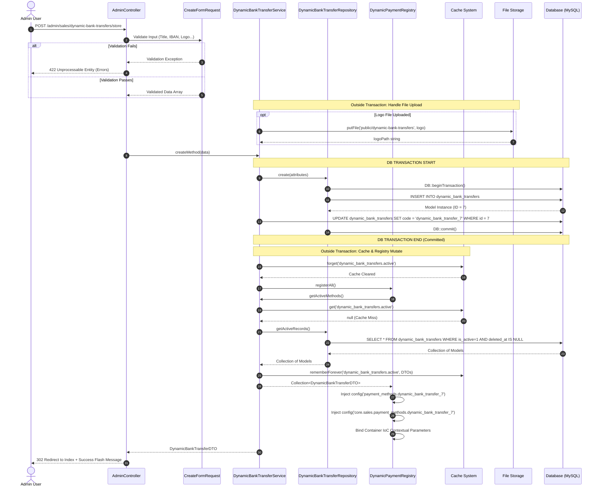

---

## 4. Flow 2: Load Checkout Payment Methods (Storefront Customer)

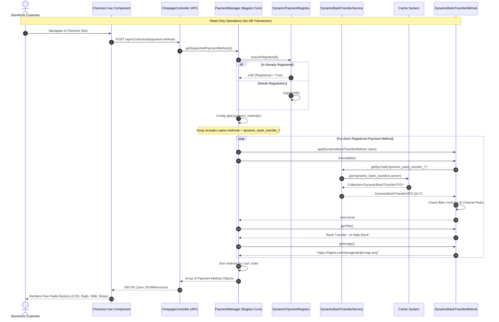

---

## 5. Flow 3: Select Payment Method & Save Cart Payment (Storefront Customer)

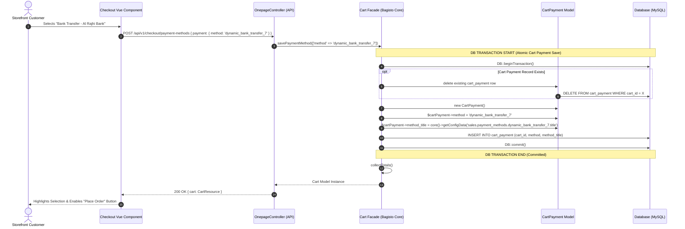

---

## 6. Flow 4: Create Order & Inject Complete Immutable Snapshot (Order Pipeline)

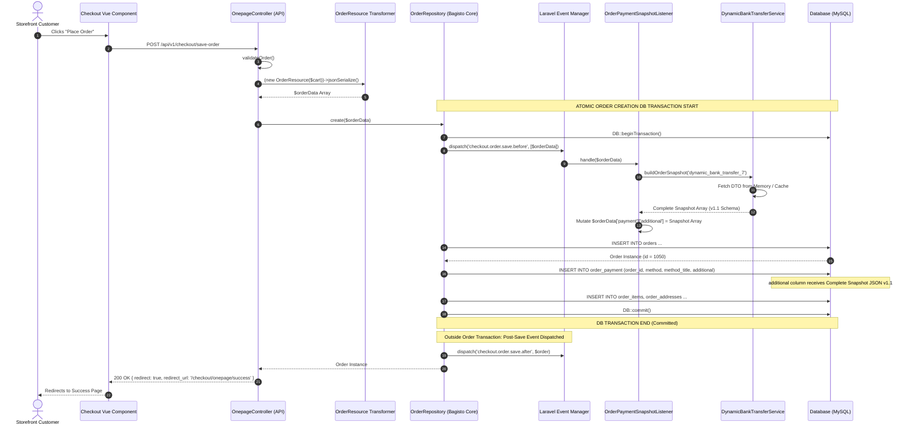

---

## 7. Flow 5: Auto-Generate Invoice & Update Order Status (Event Listener)

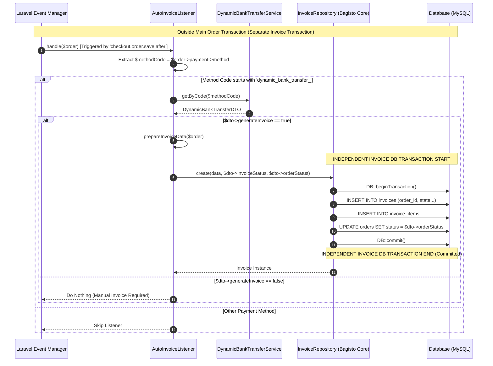

---

## 8. Flow 6: Soft-Delete Bank Transfer Payment Method (Admin)

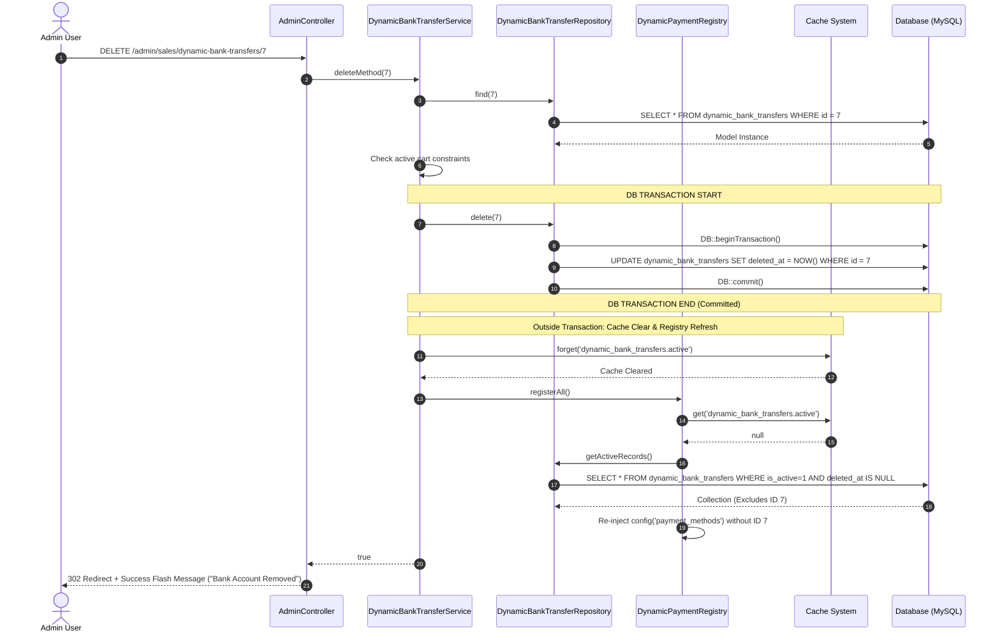

---

## 9. Flow 7: Deactivate / Toggle Status of Bank Transfer Payment Method (Admin)

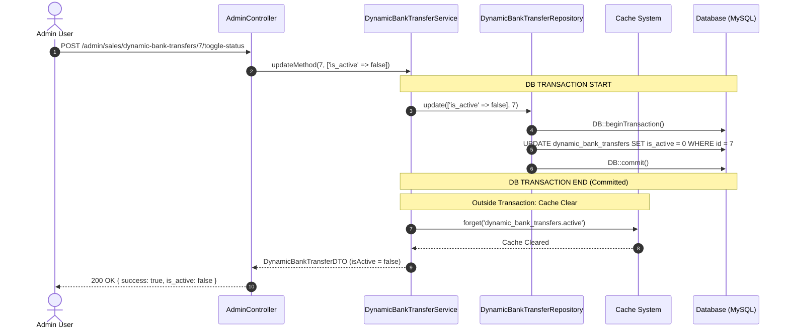

---

## 10. Flow 8: Multi-Tier Cache Refresh & Invalidation Lifecycle

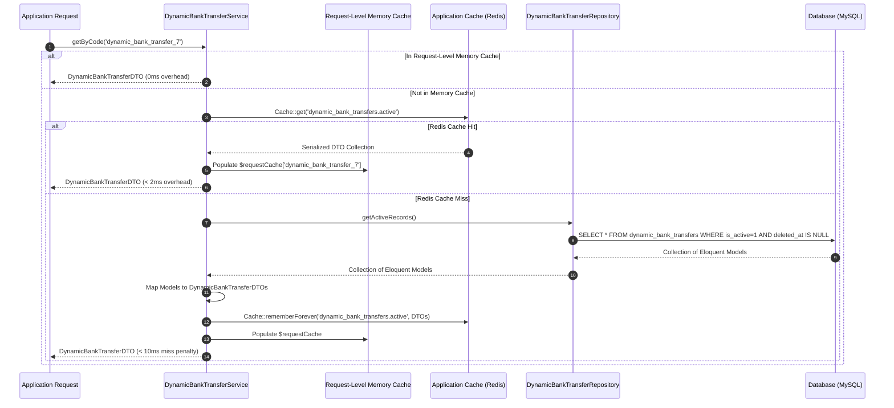

---

## 11. Flow 9: Tier-2 Lazy Guard Registration Fallback Execution

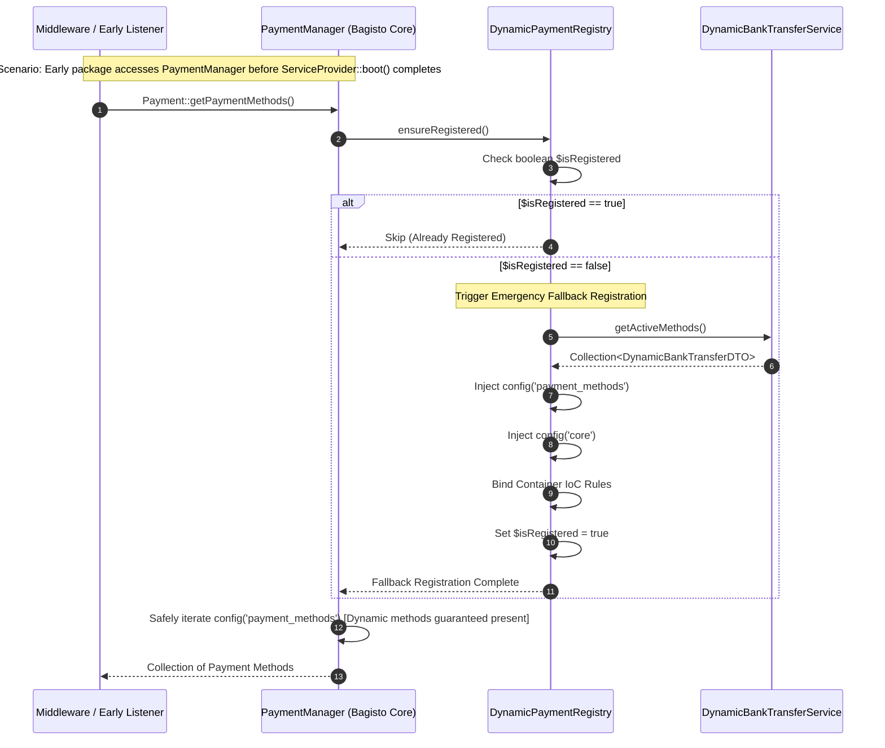

---

## 12. Flow 10: [Failure Path] Snapshot Creation Exception Handling

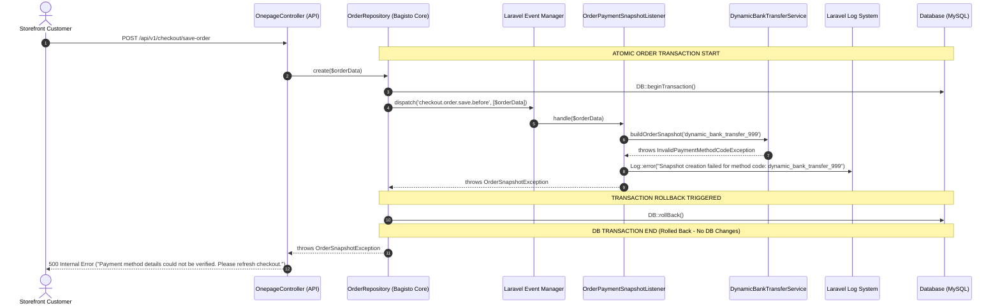

---

## 13. Flow 11: [Failure Path] Auto-Invoice Creation Exception & Resilience

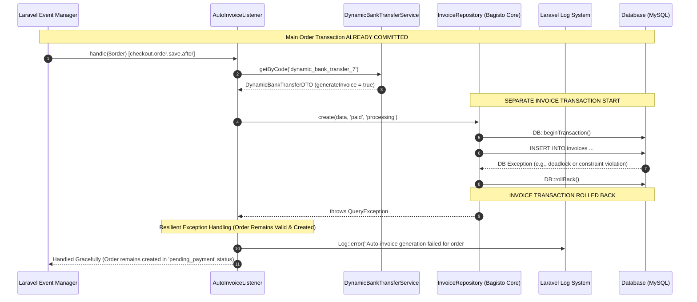

---

## 14. Flow 12: [Failure Path] Cache Miss & Database Connection Outage

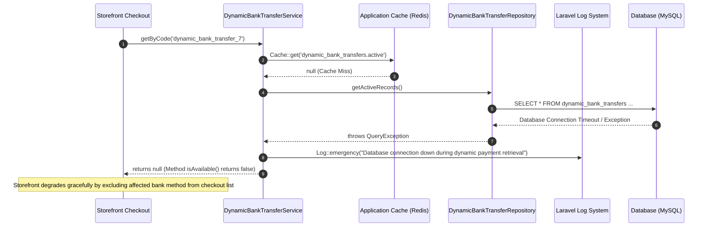

---

## 15. Flow 13: [Failure Path] Active Cart Conflict on Method Deletion

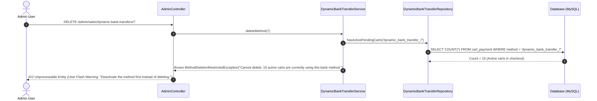

---

## 16. Flow 14: [Failure Path] Logo File Upload Exception & Rollback

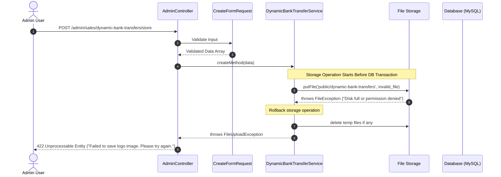

---

## 17. Flow 15: [Failure Path] Registry Configuration Injection Exception

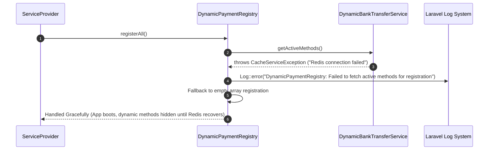

---

**End of Sequence Diagrams Specification v1.0**  
*This document constitutes the official sequence diagram specification. Implementation shall strictly follow the message ordering, authority precedence hierarchy, database transaction boundaries, cache invalidation cycles, and failure handling pathways defined herein.*
