# مواصفات تصميم المجاميع (01 - Aggregate Design Specification)
## منصة HIGEST — نظام إدارة الطلبات طويل العمر (OMS)

> **الإصدار:** 2.1  
> **الحالة:** معتمد للتجميد (Architecture Freeze Ready)  
> **المجال:** التصميم الموجه بالمجال (DDD) — هيكلة الكيانات وقواعد المعاملات وقرارات التصميم للطبقات البرمجية.

---

## 1. تعريف الـ Aggregate Roots

تتكون منصة HIGEST من سبعة مجاميع (Aggregates) رئيسية. يمثل كل مجموع كتلة متسقة من البيانات يتم التحكم بقوانينها وثوابتها البرمجية عبر جذر المجموع (Aggregate Root) حصراً. يمنع منعاً باتاً الوصول للكيانات الداخلية أو تعديلها من خارج حدود المجموع إلا عبر الجذر.

```mermaid
graph TD
    subgraph Sales Domain
        Order[Order Root] --> OrderItem(OrderItem Entity)
        Order --> OrderAddress(OrderAddress Value Object)
        Order --> OrderPayment(OrderPayment Entity)
    end
    
    subgraph Allocation Domain
        OrderAllocation[OrderAllocation Root] --> AllocationLog(AllocationLog Entity)
    end
    
    subgraph Procurement Domain
        PurchaseOrder[PurchaseOrder Root] --> PurchaseOrderItem(PurchaseOrderItem Entity)
        PurchaseOrder --> POAttempt(POAttempt Entity)
    end
    
    subgraph Warehouse Domain
        WarehouseReceipt[WarehouseReceipt Root] --> ReceiptItem(ReceiptItem Entity)
    end
    
    subgraph Financial Domain
        Ledger[Ledger Root] --> LedgerEntry(LedgerEntry Entity)
        FinancialTimeline[FinancialTimeline Root] --> TimelineEvent(TimelineEvent Entity)
    end
    
    subgraph Logistics Domain
        Shipment[Shipment Root] --> ShipmentItem(ShipmentItem Entity)
    end

    subgraph Customer Care Domain
        RMA[RMA Root] --> RMAItem(RMAItem Entity)
    end
```

---

## 2. تفاصيل وتفكيك المجاميع (Aggregate Structure & Boundaries)

### 1) مجموع الطلب (Order Aggregate)
* **Aggregate Root:** `Webkul\Sales\Models\Order`
* **الكيانات التابعة (Entities):**
  * `OrderItem`: يمثل بند الطلب المشتري من قبل العميل.
  * `OrderPayment`: يمثل بوابة الدفع والمعلومات الأساسية لعملية التفويض.
* **الكائنات القيمية (Value Objects):**
  * `OrderAddress`: عنوان الشحن والتحصيل للعميل.
  * `OrderStatus`: الحالة التجارية للطلب (Computed Projection من نطاق العمليات).
  * `Money`: السعر والعملة لكل بند ولإجمالي الطلب.
* **القوانين الثابتة المحمية (Invariants):**
  * إجمالي الطلب يجب أن يساوي مجموع أسعار البنود مخصوماً منها الخصومات ومضافاً إليها الضرائب وتكلفة الشحن.
  * لا يمكن إلغاء الطلب إذا كان قد تم شحنه أو تحصيل قيمته بالكامل (إلا عبر ساقا لوجستية عكسية).

### 2) مجموع التخصيص (OrderAllocation Aggregate)
* **Aggregate Root:** `Webkul\Fulfillment\Models\OrderAllocation`
* **الكيانات التابعة (Entities):**
  * `AllocationLog`: سجل تاريخ حركات التخصيص وتغيير الكميات للمراجعة والتدقيق.
* **الكائنات القيمية (Value Objects):**
  * `AllocationSource`: مصدر التخصيص (Warehouse_ID للمخازن المحلية، أو Supplier_ID للموردين الخارجيين).
  * `AllocationState`: حالة التخصيص الحالية (`reserved`, `fulfilled`, `cancelled`).
* **القوانين الثابتة المحمية (Invariants):**
  * الكمية المحجوزة (`reserved_qty`) + الكمية المنفذة (`fulfilled_qty`) + الكمية الملغاة (`cancelled_qty`) لبند تخصيص معين يجب أن تساوي دائماً كمية بند طلب العميل الأصلي.
  * لا يمكن حجز كمية تتجاوز الكمية المطلوبة في بند الطلب الأصلي.

### 3) مجموع أمر الشراء الخارجي (Purchase Order Aggregate)
* **Aggregate Root:** `Webkul\Fulfillment\Models\PurchaseOrder`
* **الكيانات التابعة (Entities):**
  * `PurchaseOrderItem`: بنود أمر الشراء الموجهة للمورد الخارجي.
  * `POAttempt`: محاولات الاتصال الفني بـ API المورد.
* **الكائنات القيمية (Value Objects):**
  * `SupplierSignature`: معرف فريد للمورد داخل نظام dropshipping.
  * `POState`: حالة المعاملة مع المورد.
  * `TrackingInfo`: رقم الشحن وشركة النقل وتاريخ المزامنة.
* **القوانين الثابتة المحمية (Invariants):**
  * لا يمكن تعديل كميات بنود أمر الشراء بعد إرساله بنجاح للمورد وقبول الدفع (`submitted` أو `awaiting_payment_to_supplier`) إلا من خلال تقديم طلب موافقة رسمي يمر بمصفوفة الموافقات (Approval Matrix).
  * مفتاح منع التكرار (`idempotency_key`) يجب أن يكون فريداً على مستوى قاعدة البيانات لمنع ازدواجية الإرسال.

### 4) مجموع شحنات العملاء (Shipment Aggregate)
* **Aggregate Root:** `Webkul\Sales\Models\Shipment`
* **الكيانات التابعة (Entities):**
  * `ShipmentItem`: يمثل البند الذي تم تغليفه وتجهيزه للشحن الفعلي.
* **الكائنات القيمية (Value Objects):**
  * `TrackingNumber`: رقم تتبع الشحنة الممنوح من شركة النقل.
  * `Carrier`: شركة الشحن الموكلة بالتسليم.
* **القوانين الثابتة المحمية (Invariants):**
  * لا يمكن شحن كميات تتجاوز الكميات التي تمت تصفيتها وتخصيصها في نطاق التخصيص كـ `fulfilled`.

### 5) مجموع دفتر الحسابات المالي (Ledger Aggregate)
* **Aggregate Root:** `Webkul\Financial\Models\Ledger`
* **الكيانات التابعة (Entities):**
  * `LedgerEntry`: قيود دفتر الحسابات المزدوجة (كل عملية تتكون من حساب مدين وحساب دائن).
* **الكائنات القيمية (Value Objects):**
  * `AccountCode`: رمز الحساب المالي (مثل: `1010-Cash`, `2020-AliExpress-Payable`, `4010-Sales-Revenue`).
  * `FinancialAmount`: القيمة المالية والعملة وتاريخ تسجيل القيد.
* **القوانين الثابتة المحمية (Invariants):**
  * مجموع القيم المدينة (Debit) يجب أن يساوي دائماً مجموع القيم الدائنة (Credit) لكل معاملة مالية مسجلة.
  * لا يسمح بمسح أو تعديل أي قيد مالي تم ترحيله نهائياً. يتم التعديل فقط بقيد عكسي تسووي.

### 6) مجموع السجل المالي الزمني (Financial Timeline Aggregate)
* **Aggregate Root:** `Webkul\Financial\Models\FinancialTimeline`
* **الكيانات التابعة (Entities):**
  * `TimelineEvent`: أحداث التدفق المالي المسجلة بنمط Event Sourcing.
* **القوانين الثابتة المحمية (Invariants):**
  * الأحداث تسجل بترتيب زمني متسلسل وتاريخ ختم زمني (Timestamp) صارم ولا تقبل التعديل التراجعي.

### 7) مجموع المرتجعات (RMA Aggregate)
* **Aggregate Root:** `Webkul\RMA\Models\RMA`
* **الكيانات التابعة (Entities):**
  * `RMAItem`: البنود المسترجعة فعلياً.
* **الكائنات القيمية (Value Objects):**
  * `RMAState`: حالة الارتجاع والتحقق.
  * `ReturnReason`: سبب الارتجاع الموثق من الزبون.
* **القوانين الثابتة المحمية (Invariants):**
  * لا يمكن إنشاء طلب مرتجع لبنود لم يتم تأكيد شحنها وتوصيلها بالكامل.
  * القيمة المسترجعة لا تتجاوز القيمة المدفوعة من العميل بأي حال.

---

## 3. دورة الـ Transaction (Transaction Ownership)

لمنع مشاكل قفل الجداول (Table Locking) والسباق البرمجي (Race Conditions)، يتم التحكم بدورة المعاملات بقواعد صارمة:

1. **معاملة قاعدة بيانات واحدة لكل مجموع:**
   * يجب أن تقتصر معاملة قاعدة البيانات (SQL Transaction) الواحدة على تعديل مجموع واحد فقط.
   * *مثال:* عند تغيير حالة التخصيص، لا تفتح معاملة SQL تعدل جدول `orders` وجدول `order_allocations` وجدول `purchase_orders` معاً. التعديل يتم في `order_allocations` وتغلق المعاملة، ثم يرسل حدث يتم من خلاله معالجة الجداول الأخرى في معاملات منفصلة.
2. **الرجوع بالمعرف فقط (Reference by ID):**
   * تمنع العلاقات المباشرة لـ ORM (مثل `hasMany` أو `belongsTo`) عابرة المجاميع الكبرى.
   * يتم الرجوع للمجاميع الأخرى عبر معرفاتها الفريدة المخزنة كـ حقول نصية أو رقمية فقط (مثل: `order_id` داخل `PurchaseOrder` بدلاً من علاقة الـ Eloquent `order()`).
3. **الملكية البرمجية للتحديث:**
   * الحزمة البرمجية المالكة للمجموع هي الكيان الوحيد المخول بإنشاء الـ Repository والـ Service الخاصين به والتحكم بتعديل حقوله.
   * يمنع منعاً باتاً كتابة استعلامات SQL تحديثية (`UPDATE`) عابرة للحزم والطبقات.

---

## 4. العمليات المسموح بتعديلها داخل كل Aggregate (Public API)

لا يسمح بتعديل خصائص وحقول المجاميع بشكل عشوائي، بل يتم توفير دوال رسمية ومحمية (State Changers) داخل جذور المجاميع:

### 1) مجموع `OrderAllocation`
* **دوال التعديل المسموحة:**
  * `reserve(OrderItemId $itemId, AllocationSource $source, Quantity $qty)`: لإنشاء حجز للمخزون.
  * `fulfill(Quantity $qty)`: عند إتمام الشراء الفعلي من المورد الخارجي أو سحب المنتج من الرف.
  * `cancel(Quantity $qty, Reason $reason)`: لإلغاء التخصيص وإطلاق الحجز للمخزون العام.

### 2) مجموع `PurchaseOrder`
* **دوال التعديل المسموحة:**
  * `initialize(OrderId $orderId, SupplierSignature $supplier)`: لإنشاء المسودة الأولية لأمر الشراء.
  * `submit(ExternalOrderId $externalId)`: لتأكيد إرسال الطلب بنجاح للـ API الخارجي.
  * `markAwaitingPayment()`: في حال تطلب المورد دفعاً يدوياً أو تحويلاً بنكياً.
  * `updateTracking(TrackingNumber $number, Carrier $carrier)`: لمزامنة أرقام الشحن.
  * `fail(FulfillmentErrorType $error, string $message)`: لتسجيل الفشل والدخول في وضع المراجعة اليدوية.
  * `cancel(Reason $reason)`: لإلغاء الأمر بالتزامن مع المورد الخارجي.

### 3) مجموع `Ledger`
* **دوال التعديل المسموحة:**
  * `recordDoubleEntry(AccountCode $debitAccount, AccountCode $creditAccount, FinancialAmount $amount, string $reference)`: لإدراج قيد محاسبي مزدوج جديد. لا توجد دوال للحذف أو التعديل نهائياً.

### 4) مجموع `FinancialTimeline`
* **دوال التعديل المسموحة:**
  * `recordEvent(FinancialEventType $type, Money $amount, array $metadata)`: لتسجيل حدث مالي جديد في السجل.
