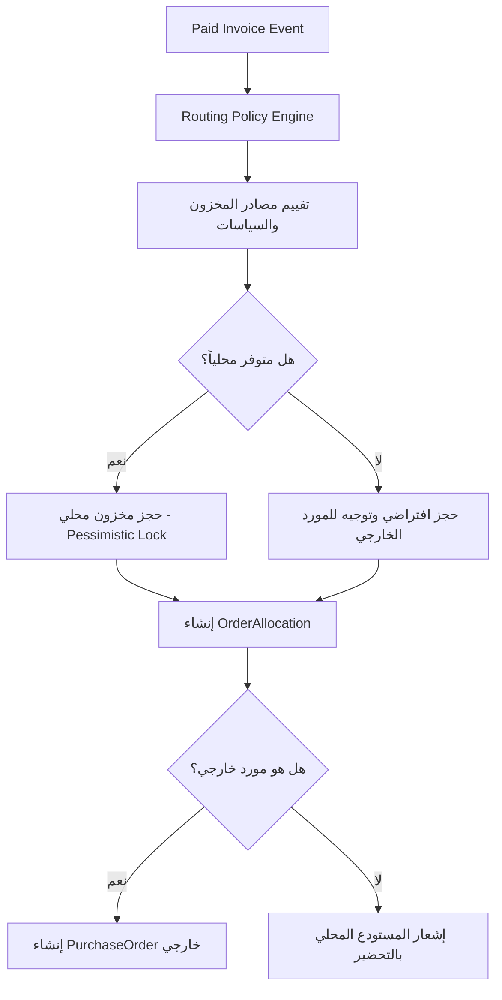

# مواصفات التخصيص والمخزون (04 - Allocation & Inventory Specification)
## منصة HIGEST — نظام إدارة الطلبات طويل العمر (OMS)

> **الإصدار:** 2.1  
> **الحالة:** معتمد للتجميد (Architecture Freeze Ready)  
> **المجال:** إدارة المخزون المحلي، حجز المنتجات الافتراضي، والتوجيه الذكي للتخصيص لمنع البيع المزدوج ودعم الطلبات الهجينة.

---

## 1. آلية حجز وتخصيص البنود (Allocation & Reservation Mechanism)

عند تأكيد الدفع لطلب العميل، يتم تشغيل نطاق التخصيص والمخزون بشكل متتابع للتأكد من ربط كل بند بمصدر حقيقي وتجنب ضياع البضاعة أو تأخر الطلب:



### هيكلية كيان `OrderAllocation`:
يمثل كيان التخصيص المستقل `OrderAllocation` الرابط المباشر لكل قطعة مطلوبة مع مصدر توريدها الفعلي. يحتوي السجل على:
* `allocation_type`: هل التخصيص للمستودع (`warehouse`) أو للمورد (`supplier`).
* `source_code`: رمز المصدر الفعلي (مثل: `warehouse_riyadh` أو `aliexpress`).
* `supplier_signature`: توقيع متجر المورد في حال التخصيص لمورد خارجي.
* `reserved_qty`: الكمية المحجوزة للطلب.
* `fulfilled_qty`: الكمية التي تم شراؤها أو شحنها فعلياً.
* `cancelled_qty`: الكمية الملغاة والتي أعيدت للمخزون العام.

---

## 2. منع التخصيص المزدوج وحالات السباق (Double Booking Prevention)

لحماية المخزون من الحجز المكرر من قبل طلبات متزامنة في نفس اللحظة (Race Conditions):

### 1) الحجز القفل التشاؤمي (Pessimistic Locking `SELECT FOR UPDATE`):
عندما تحاول عملية حجز المنتجات في المستودع المحلي فحص كمية المخزون المتاحة وتعديلها، يمنع النظام الاستعلامات العادية. بدلاً من ذلك، يتم قفل الصفوف المستهدفة في قاعدة البيانات:

```php
DB::transaction(function () use ($sku, $qty) {
    // 1. قفل صف المخزون لهذا المنتج بشكل تشاؤمي لمنع أي قراءة أو تعديل متزامن
    $inventory = WarehouseInventory::where('sku', $sku)
        ->where('warehouse_id', $riyadhWarehouseId)
        ->lockForUpdate()
        ->first();

    if (!$inventory || $inventory->qty_available < $qty) {
        throw new InsufficientStockException("Stock unavailable for SKU: {$sku}");
    }

    // 2. تحديث الكمية المحجوزة والكمية المتاحة
    $inventory->qty_available -= $qty;
    $inventory->qty_reserved += $qty;
    $inventory->save();
});
```
* **تأثير القفل:** أي معاملة SQL متزامنة تحاول قراءة نفس صف المنتج لإجراء حجز آخر ستنتظر تلقائياً حتى تنتهي المعاملة الحالية وتطلق القفل، مما يمنع تماماً التخصيص المزدوج.

### 2) الأقفال الموزعة عبر Redis (Distributed Lock Engine):
للموردين الخارجيين حيث لا تتوفر قاعدة بيانات موحدة لقفل الصفوف، يستخدم النظام أقفال Redis الموزعة قبل إرسال طلب الشراء للتأكد من عدم معالجة الطلب نفسه من طابورين منفصلين:

```php
$lock = Cache::lock("fulfillment-allocation-{$orderId}", 10); // قفل لمدة 10 ثوانٍ

if ($lock->get()) {
    try {
        // إجراء التخصيص والمشتريات الخارجية
    } finally {
        $lock->release();
    }
} else {
    // تعليق العملية وإعادتها للطابور لإعادة المحاولة لاحقاً
    throw new ConcurrentExecutionException("Allocation already processing for this order");
}
```

---

## 3. معالجة سلال التسوق الهجينة (Hybrid Inventory Routing)

تسمح المنصة للزبون بإنشاء سلة تسوق تحتوي على منتجات متنوعة المصادر (جزء متوفر في المستودع المحلي الرياض، وجزء آخر يتطلب الاستيراد والطلب من AliExpress).

### سياسة إدارة الطلبات الهجينة (Hybrid Order Policy):
1. **تقسيم التخصيص (Allocation Split):**
   * عند معالجة الطلب، يقوم `Routing Engine` بفرز البنود.
   * ينشأ `OrderAllocation` الأول للبنود المتوفرة محلياً ويوجه للمستودع المحلي الرياض.
   * ينشأ `OrderAllocation` الثاني للبنود الخارجية ويوجه لـ `PurchaseOrder` خاص بالمورد الخارجي.
2. **عزل الشحنات (Split Shipments):**
   * يتم توليد شحنتين منفصلتين (`Shipments`) داخل نظام مبيعات Bagisto.
   * الشحنة الأولى: تحتوي على المنتجات المحلية وتصدر لها بوليصة شحن وتخرج من المستودع فوراً.
   * الشحنة الثانية: تنتظر وصول رقم التتبع من المورد الخارجي ليتم ربط بوليصتها به وتوصيلها بشكل منفصل.
3. **السياسة المالية للطلب الهجين:**
   * يتم تقسيم تكلفة الشحن المحصلة من الزبون نسبياً على الشحنتين لضمان دقة احتساب الأرباح لكل تخصيص في دفتر الأستاذ.
   * لا يتم إغلاق وتحديث حالة الطلب الأساسي في Bagisto إلى `completed` إلا بعد إتمام تسليم جميع الشحنات المشتقة وتأكيد وصول التخصيصين بنجاح (Totality Mapping Rule).
4. **حالة الفشل الجزئي:**
   * إذا فشل توفير الجزء الموجه للمورد الخارجي (AliExpress)، لا يتم إلغاء الشحنة المحلية المتوفرة؛ بل يتم الغاء التخصيص الخارجي فقط، وبدء إجراءات تعويض مالي جزئي للزبون عن القطعة الناقصة دون كسر الطلب بأكمله.
