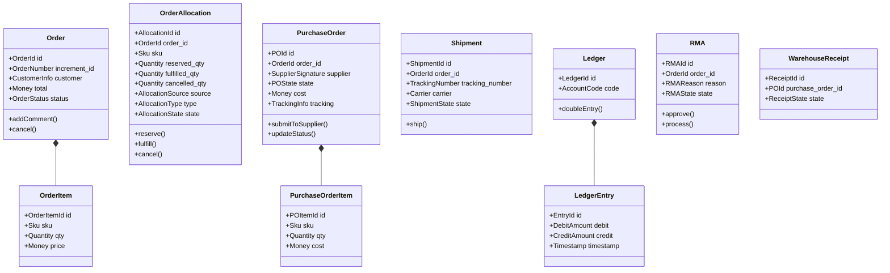
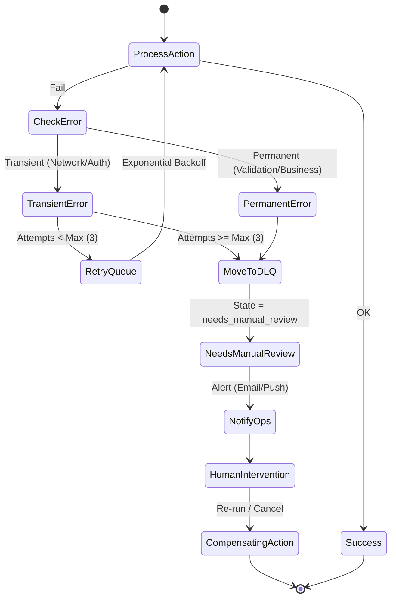
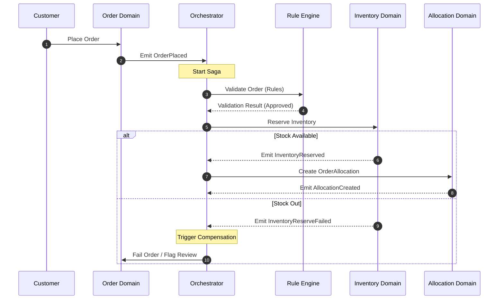

# وثيقة معمارية النظام (Architecture v2.1)
## منصة HIGEST — نظام إدارة الطلبات طويل العمر (OMS)

> **حالة الوثيقة:** مراجعة معمارية (Draft for Approval)  
> **الإصدار:** 2.1  
> **تاريخ الإصدار:** 9 يوليو 2026  
> **الهدف:** الانتقال بالمنصة من نموذج مبسط إلى نظام متكامل قائم على التصميم الموجه بالمجال (DDD)، وفصل واضح للمسؤوليات، وتغطية الفجوات الهيكلية قبل البدء في التنفيذ الفعلي للكود.

---

## مقدمة وتوضيح التعديلات الهيكلية الكبرى (v2.1 vs v2.0)

بناءً على التقييم المعماري المتقدم والمراجعة الهيكلية الشاملة، تم إجراء التغييرات الهيكلية الكبرى التالية لضمان صلابة واستمرارية المنصة لسنوات قادمة:

1. **فصل المعالج التشغيلي عن محركات القواعد وسير العمل:** تم تفكيك الـ *Operations Orchestrator* (الذي كان يتجه ليصبح God Service) وتوزيع مسؤولياته على ثلاثة مكونات منفصلة:
   - **Operations Orchestrator (المنسق التشغيلي):** ينسق تدفق البيانات والأحداث بين المجالات المختلفة فقط دون اتخاذ قرارات منطقية.
   - **Workflow Engine (محرك سير العمل):** يعرف تسلسل الخطوات التشغيلية والانتقال بين حالات النظام (State Transitions).
   - **Rule Engine (محرك القواعد):** المسؤول عن تقييم شروط القبول والتحقق التشغيلي والتحقق من القوانين والسياسات.
2. **إدخال محرك السياسات (Policy-Based Routing Engine):** ترقية نظام التوجيه من مجرد شروط `if/else` إلى محرك مرن يعتمد على السياسات الديناميكية المتعددة (Priority, Inventory, Cost, Delivery, Supplier, Customer Policies).
3. **تأسيس نطاق التخصيص المستقل (Allocation Domain):** إدخال كيان `OrderAllocation` كعنصر أساسي مستقل لإدارة الربط بين الطلب ومصادر المخزون أو التوريد.
4. **تضمين حجز المخزون (Inventory Reservation):** توفير آلية واضحة لحجز المخزون قبل المشتريات (Reserve Inventory) لحل مشاكل السباق والتنافس على القطع الأخيرة.
5. **الفصل التام لحالات الطلبات (Bagisto Status vs Operations Ground Truth):** بقاء حالة الطلب الأصلية في Bagisto كمجرد إسقاط محسوب (Computed Projection) للواجهة، بينما الحقيقة التشغيلية تدار بالكامل داخل مجالات العمليات المعزولة.
6. **بناء السجل الزمني العام (Generic Timelineable):** توحيد السجل الزمني ليصبح عاماً وقابلاً لإعادة الاستخدام عبر مختلف الكيانات (Orders, POs, Shipments, RMAs, Financial Accounts).
7. **إدخال مصفوفة الموافقات الصارمة (Approval Matrix):** تعريف هيكلية الموافقات وتحديد الصلاحيات للعمليات التشغيلية والمالية ذات الخطورة العالية.
8. **عزل مركز الإشعارات (Notification Center Domain):** عزل نظام التنبيهات بالكامل ليصبح حزمة مستقلة تدير قنوات الاتصال المختلفة.
9. **تعريف واضح وكامل للمجاميع (Aggregate Roots):** رسم حدود المجاميع السبعة الأساسية وتحديد ملكيتها وحدود معاملاتها.

---

## 1. Aggregate Design (تصميم المجاميع)

تلتزم المنصة بتعريف حدود صارمة للمجاميع (Aggregates) لحماية اتساق البيانات. يمثل كل مجموع وحدة متكاملة يتم التعامل معها عبر جذره (Aggregate Root) فقط:



### تفاصيل هيكلية المجاميع الأساسية:
1. **Order Aggregate**:
   - **Root**: `Order` (مستورد من حزمة المبيعات الأساسية في Bagisto ولكن يتم التعامل معه ككيان قراءة/كتابة محدود).
   - **Entities**: `OrderItem` (بند الطلب)، `OrderAddress` (عنوان الشحن)، `OrderPayment` (بيانات الدفع).
   - **Value Objects**: `Money` (السعر والعملة)، `OrderStatus` (حالة الطلب).
2. **OrderAllocation Aggregate**:
   - **Root**: `OrderAllocation` (الكيان الجديد المنشأ لإدارة التخصيص والمخزون المحجوز).
   - **Entities**: لا يوجد (كيان موحد).
   - **Value Objects**: `AllocationSource` (مستودع محلي أو مورد خارجي)، `AllocationType` (Supplier, Warehouse)، `AllocationState` (Reserved, Fulfilled, Cancelled).
3. **PurchaseOrder (PO) Aggregate**:
   - **Root**: `PurchaseOrder` (أمر الشراء الموجه للمورد).
   - **Entities**: `PurchaseOrderItem` (بند أمر الشراء).
   - **Value Objects**: `SupplierSignature` (توقيع المورد الخارجي)، `TrackingInfo` (رقم وتفاصيل التتبع)، `POState` (الحالة التشغيلية للأمر).
4. **Shipment Aggregate**:
   - **Root**: `Shipment` (الشحنة الفعلية).
   - **Entities**: `ShipmentItem` (البنود المشحونة).
   - **Value Objects**: `TrackingNumber` (رقم التتبع)، `Carrier` (الناقل).
5. **WarehouseReceipt Aggregate**:
   - **Root**: `WarehouseReceipt` (إيصال استلام المخزون للمستودعات).
   - **Entities**: `ReceiptItem` (البنود المستلمة).
   - **Value Objects**: `ReceiptState` (حالة الاستلام).
6. **Ledger Aggregate**:
   - **Root**: `Ledger` (دفتر الحسابات المالي).
   - **Entities**: `LedgerEntry` (القيود المالية المزدوجة - Debit/Credit).
   - **Value Objects**: `AccountCode` (رمز الحساب البنكي أو الحساب الداخلي)، `Amount` (القيمة المالية).
7. **RMA Aggregate**:
   - **Root**: `RMA` (المرتجعات والتعويضات).
   - **Entities**: `RMAItem` (البنود المرتجعة).
   - **Value Objects**: `RMAReason` (سبب الارتجاع)، `RMAState` (حالة طلب المرتجع).

---

## 2. Aggregate Boundaries (حدود المجاميع)

تلتزم المعمارية بالقواعد الصارمة التالية لحماية حدود المجاميع ومنع تداخل البيانات:
- **الرجوع بالمعرف فقط (Reference by ID Only):** لا يسمح لأي مجموع أن يحتوي على مرجع كائن مباشر (Object Reference) لمجموع آخر. على سبيل المثال، يحتوي `PurchaseOrder` على حقل `order_id` (معرف نصي/رقمي) وليس على كائن `Order` بالكامل.
- **الوصول عبر الجذر حصراً (Access via Root Only):** لا يمكن تعديل أي كيان داخلي (مثل `PurchaseOrderItem`) مباشرة من خارج المجموع. يتم التعديل دائماً باستدعاء أساليب (Methods) على الجذر `PurchaseOrder`.
- **حماية القوانين الثابتة (Invariants Protection):** المجموع هو المسؤول الأول والأخير عن حماية قوانينه الداخلية (مثل: لا يمكن أن يتجاوز مجموع كميات بنود التخصيص كمية طلب العميل الأصلية).

---

## 3. Ownership Matrix (مصفوفة الملكية)

تحدد هذه المصفوفة المكون البرمجي المسؤول عن إدارة وحفظ وتعديل كل مجموع:

| المجموع (Aggregate Root) | الحزمة المالكة (Owner Package) | منشئ المجموع (Creator) | الجهة المخولة بالتعديل (Modifier) | طريقة التعديل المسموحة |
| :--- | :--- | :--- | :--- | :--- |
| **Order** | `Webkul\Sales` | زبون المتجر (Checkout) | نظام المبيعات / المنسق التشغيلي | عبر `OrderRepository` فقط |
| **OrderAllocation** | `Webkul\Fulfillment` | `AllocationService` | `AllocationService` / `InventoryService` | أحداث النظام الداخلية أو إجراء إداري معتمد |
| **PurchaseOrder** | `Webkul\Fulfillment` | `FulfillmentService` | `FulfillmentService` / Polling Job | العمليات الآلية للجسر أو تعديل يدوي معتمد |
| **Shipment** | `Webkul\Sales` (Core Bagisto) | `FulfillmentService` (Sync) | نظام الشحن | استدعاء ميثود جلب وحفظ الشحن الرسمي |
| **WarehouseReceipt** | `Webkul\Inventory` | موظف المستودع | نظام المستودعات | واجهة الإدخال للمخازن أو ربط الـ API |
| **Ledger** | `Webkul\Financial` | `FinancialService` | نظام التدقيق المالي | لا يقبل التعديل المباشر (إضافة قيود جديدة فقط) |
| **RMA** | `Webkul\RMA` | خدمة العملاء / الزبون | مسؤول المرتجعات | واجهة إدارة المرتجعات المعتمدة |

---

## 4. Transaction Boundaries (حدود المعاملات وقواعد البيانات)

لمنع مشاكل قفل الجداول والبطء في قواعد البيانات الكبيرة، تم تبني قاعدة **"معاملة قاعدة بيانات واحدة لكل مجموع لكل طلب" (One DB Transaction Per Aggregate Instance)**:

- **عزل كتابة الجداول:** لا يسمح بفتح معاملة SQL واحدة تشمل تعديل `Order` و `OrderAllocation` و `PurchaseOrder` معاً.
- **التنسيق عبر الأحداث:** يتم تحديث كل مجموع في معاملة منفصلة بالكامل، ويتم التنسيق بينها باستخدام أحداث المجال (Domain Events) وطوابير المهام غير المتزامنة (Asynchronous Queues).
- **التراجع التعويضي (Compensating Transactions):** في حال فشل المعاملة اللاحقة، يتم إطلاق حدث تعويضي للتراجع عن المعاملات السابقة (مثال: إلغاء التخصيص وإطلاق المخزون المحجوز في حال فشل عملية المشتريات).

---

## 5. Consistency Boundaries (حدود الاتساق)

- **الاتساق القوي (Strong Consistency):** يطبق فقط داخل حدود المجموع الواحد. عندما يتم تعديل بند في `PurchaseOrder`، يجب أن ينعكس ذلك فوراً وبشكل قوي داخل نفس المجموع وقاعدته البيانية الخاصة.
- **الاتساق التدريجي (Eventual Consistency):** يطبق في العلاقات والعمليات العابرة للمجاميع. على سبيل المثال، عند شحن `PurchaseOrder` بالكامل، لا يتم تحديث حالة `Order` الأساسية فوراً في نفس المعاملة، بل يتم إرسال حدث `PurchaseOrderShipped` ومن ثم يقوم مستمع الحدث بتحديث حالة الطلب بشكل غير متزامن. الفجوة الزمنية المقبولة للاتساق التدريجي هي **أقل من 5 ثوانٍ** في الحالات العادية للشبكة وطوابير العمل.

---

## 6. Event Contracts (عقود أحداث المجال)

جميع الاتصالات بين المجالات تعتمد على رسائل وأحداث موثقة وصارمة لمنع تداخل الكود:

### 1. حدث `OrderPlaced` (إطلاق الطلب)
```json
{
  "event_id": "evt_982347109283",
  "event_name": "Sales.OrderPlaced",
  "timestamp": "2026-07-09T18:22:00Z",
  "payload": {
    "order_id": 412,
    "increment_id": "10000412",
    "customer_id": 89,
    "items": [
      {
        "order_item_id": 1024,
        "sku": "ALI-PROD-XYZ-RED",
        "qty": 2,
        "unit_price": 45.00
      }
    ],
    "shipping_address": {
      "country": "SA",
      "city": "Riyadh",
      "address1": "King Fahd Road, 123"
    }
  }
}
```

### 2. حدث `InventoryReserved` (تأكيد حجز المخزون)
```json
{
  "event_id": "evt_771928301928",
  "event_name": "Inventory.InventoryReserved",
  "timestamp": "2026-07-09T18:22:02Z",
  "payload": {
    "allocation_id": "alloc_01J2CJXW9Z01",
    "order_id": 412,
    "sku": "ALI-PROD-XYZ-RED",
    "reserved_qty": 2,
    "source": "Warehouse_Riyadh",
    "expires_at": "2026-07-09T18:37:02Z"
  }
}
```

### 3. حدث `OrderAllocationCreated` (تأسيس التخصيص)
```json
{
  "event_id": "evt_883019230192",
  "event_name": "Allocation.AllocationCreated",
  "timestamp": "2026-07-09T18:22:03Z",
  "payload": {
    "allocation_id": "alloc_01J2CJXW9Z01",
    "order_id": 412,
    "allocation_type": "supplier",
    "source_code": "aliexpress",
    "supplier_signature": "supplier_store_992",
    "items": [
      {
        "order_item_id": 1024,
        "sku": "ALI-PROD-XYZ-RED",
        "qty": 2
      }
    ]
  }
}
```

---

## 7. Failure Recovery Strategy (استراتيجية التعافي من الفشل)

يعتمد النظام على استراتيجيات تعافي محددة ومجربة للتعامل مع الإخفاقات:



- **المحاولات الآلية (Automated Retries):** تتم باستخدام خوارزمية التراجع الأسي مع التذبذب (Exponential Backoff with Jitter) لمنع الضغط على خوادم الموردين.
  $$\text{Delay} = \min(\text{max\_delay}, \text{base\_delay} \times 2^{\text{attempt}}) \pm \text{jitter}$$
- **تحديد الفشل العابر والدائم (Transient vs Permanent Failures):**
  - *العابر:* أخطاء الشبكة، أخطاء الـ API المؤقتة (503)، تعذر المصادقة المؤقت. يتم إعادة المحاولة حتى **3 مرات**.
  - *الدائم:* نفاد مخزون المورد، أخطاء التحقق من البيانات، رفض الطلب بسبب السعر. يوقف الإرسال فوراً وينقل الطلب إلى حالة `needs_manual_review`.
- **طوابير الرسائل الميتة (Dead Letter Queues - DLQ):** أي مهمة تفشل نهائياً يتم نقلها إلى DLQ مع تسجيل سياق الخطأ واللقطة الهيكلية للبيانات المخزنة دون التسبب في قفل طابور العمليات الرئيسي.

---

## 8. Saga Definitions (تعريف العمليات الطويلة المتسلسلة)

تدار العمليات العابرة للمجالات التي تتطلب عدة خطوات بواسطة **Operations Orchestrator** الذي يتبع نمط الساقا القائم على الأحداث (Event-Driven Saga):

### 1. ساقا تقديم وتخصيص الطلبات (Order Placement & Allocation Saga)



### 2. ساقا تنفيذ المشتريات والشحن (Fulfillment & Shipment Saga)
- **الحدث المحفز:** `InvoicePaid` (تأكيد الدفع المالي للطلب الداخلي).
- **الخطوات الناجحة (Happy Path):**
  1. يقوم المنسق باستدعاء `Routing Engine` لتحديد الوجهة المناسبة للتخصيص المحجوز.
  2. يتم تحويل التخصيص إلى طلب شراء خارجي `PurchaseOrder`.
  3. يتم إرسال طلب الشراء للمورد المعتمد.
  4. عند نجاح الإنشاء، ينتقل التخصيص لحالة `Fulfilled`.
  5. يقوم الـ Polling بمتابعة المورد حتى توفر رقم التتبع، فيقوم بإنشاء شحنة `Shipment` داخل Bagisto ويعكس رقم التتبع.
  6. عند وصول الشحنة للعميل، يتم تحديث التخصيص والطلب الأساسي لحالة `Delivered/Completed`.
- **خطوات التعويض عند الفشل (Compensating Steps):**
  - في حال فشل الإرسال للمورد (مثلاً بسبب تغير السعر أو نفاد المخزون المفاجئ):
    1. يتم إيقاف الساقا ونقل الـ PO لحالة `needs_manual_review`.
    2. يتم إرسال تنبيه للمشرفين.
    3. إذا تقرر الإلغاء، يتم إطلاق المخزون المحجوز (Release Inventory Reservation) وتحديث التخصيص لحالة `Cancelled`.

---

## 9. Routing Policies (سياسات محرك التوجيه)

تخلت المنصة عن منطق شروط الـ `if/else` المبسط لصالح **محرك السياسات المعتمد على الأوزان (Policy-Based Routing Engine)**. عند تقديم الطلب، يقوم المحرك بطلب تقييم من السياسات التالية لإنتاج قرار التوجيه الأمثل:

```
[Customer Order Allocation request]
                 │
                 ▼
 ┌───────────────────────────────┐
 │    Policy-Based Routing       │
 │                               │
 │ ├─ Priority Policy (Weights)  │
 │ ├─ Inventory Policy (Stock)   │
 │ ├─ Supplier Policy (Rating)   │  ──> [Evaluator Engine] ──> [Selected Source]
 │ ├─ Cost Policy (Margins)      │
 │ ├─ Delivery Policy (SLA)      │
 │ └─ Customer Policy (VIP)      │
 └───────────────────────────────┘
```

1. **Priority Policy (سياسة الأولويات):** تعطي وزناً إضافياً للموردين والمستودعات المفضلة والشركاء الاستراتيجيين في المنصة.
2. **Inventory Policy (سياسة توفر المخزون):** التحقق الفعلي من توفر الكمية المطلوبة في المصدر لتفادي الإرسال لمصدر بدون مخزون.
3. **Supplier Policy (سياسة موثوقية المورد):** مراجعة تقييم المورد (Supplier Rating) ومعدل نجاح تسليماته السابقة وإيقاف التوجيه له في حال تدني التقييم.
4. **Cost Policy (سياسة التكلفة):** حساب التكلفة الإجمالية (سعر القطعة + سعر الشحن) واختيار الخيار الأكثر ربحية للمنصة وضمان عدم تآكل هامش الربح.
5. **Delivery Policy (سياسة سرعة التسليم):** مقارنة المدة المتوقعة للتسليم (Expected Transit Time) وضمان موافقتها للـ SLA الموعود به للزبون.
6. **Customer Policy (سياسة فئة العميل):** توجيه طلبات العملاء المميزين (VIP Customers) لمستودعات محلية سريعة بدلاً من الموردين الدوليين لضمان أفضل تجربة مستخدم.

---

## 10. Allocation Policies (سياسات التخصيص)

نطاق التخصيص الممثل بكيان `OrderAllocation` هو المسؤول عن تعيين بنود الطلب للمصادر الفعلية. تحكمه القوانين والسياسات التالية:

- **أحكام التخصيص الجزئي (Partial Allocation):** يسمح بتقسيم بنود الطلب الواحد على أكثر من مصدر. إذا طلب الزبون 5 قطع، وتوفر 3 في المستودع المحلي و 2 لدى المورد الخارجي، يقوم المحرك بإنشاء تخصيصين منفصلين (`OrderAllocation` الأول للمستودع، و `OrderAllocation` الثاني للمورد).
- **سياسة إعادة التوجيه (Re-routing/Re-allocation Policy):** في حال رفض المورد الخارجي لطلب الشراء بعد التخصيص، لا يلغى الطلب بالكامل، بل يتم إلغاء التخصيص الأول فقط وإعادة تمرير بنود الطلب غير المنفذة لمحرك التوجيه للبحث عن مصدر بديل.
- **حالات التخصيص الصارمة (Allocation States):**
  - `reserved`: تم حجز الكمية والمنتج لصالح الطلب في المصدر الموصى به.
  - `fulfilled`: تم شحن وتأكيد شراء البضاعة من المصدر بشكل نهائي.
  - `cancelled`: تم إلغاء التخصيص وإطلاق الكمية المحجوزة للمخزون العام.

---

## 11. Inventory Policies (سياسات المخزون والحجز)

لمنع عمليات البيع المكرر (Double Selling) وضمان دقة كميات المنتجات المتاحة:

- **آلية حجز المخزون (Reserve Inventory):** عند إتمام خطوة الدفع أو إطلاق الطلب (حسب طريقة الدفع)، يتم حجز المخزون في المستودع المحلي أو حجز حصة افتراضية للمورد. هذا الحجز يحمي الكمية من السحب بواسطة أي طلبات أخرى تأتي لاحقاً.
- **سياسة انتهاء الحجز (Reservation Expiry):** لحماية المخزون من البقاء محجوزاً لطلبات معلقة أو مهجورة، يتم تعيين مدة صلاحية (TTL) للحجز (مثال: **15 دقيقة** لطلبات الدفع الإلكتروني غير المكتملة). عند انتهاء المدة بدون إتمام الدفع، يلغى الحجز تلقائياً.
- **مخزون الأمان (Buffer Stock Policy):** يحتفظ النظام بنسبة أمان (مثال: **5%**) من المخزون الإجمالي للمنتجات ذات الطلب العالي، ولا يسمح بحجزها آلياً للزبائن العاديين لتفادي أخطاء فروقات التحديث اللحظي مع الموردين الخارجيين.

---

## 12. Financial Consistency Rules (قواعد الاتساق المالي والسجل الزمني)

يجب عزل العمليات المالية بالكامل لضمان الامتثال لسلامة الحسابات والأرباح:

### 1. السجل المالي الزمني (Financial Timeline Event Sourcing)
لا يتم الاعتماد على تحديث القيم المالية في الحقول مباشرة، بل يتم تسجيل كل حركة مالية كحدث فريد غير قابل للتعديل أو المسح في جدول `financial_timeline` لتوفير تتبع كامل لمراحل الأرباح والمدفوعات:

```
[Customer Paid] ──> [Supplier Charged] ──> [Currency Conversion] ──> [Profit Calculated]
```

يتم تسجيل الحركات بالتسلسل التالي:
1. `Customer Paid`: تسجيل القيمة المحصلة من الزبون بعملة المتجر الأساسية.
2. `Supplier Charged`: تسجيل القيمة المدفوعة للمورد (تكلفة البضاعة) بعملة الشراء الفعلية.
3. `Currency Conversion`: توثيق سعر الصرف المعتمد للتحويل المالي لحظة الشراء.
4. `Shipping Paid`: قيمة تكاليف الشحن المدفوعة لشركة الشحن.
5. `Courier Settled`: تسوية المبالغ مع شركات التوصيل.
6. `Profit Calculated`: القيمة الصافية للأرباح المحسوبة ديناميكياً بعد خصم جميع التكاليف السابقة.

### 2. دفتر الأستاذ المزدوج (Double-Entry Ledger Rules)
كل عملية شراء أو تحصيل مالي يجب أن تسجل بقيدين متوازنين (Debit / Credit) لحفظ ميزان الحسابات العام ومنع حدوث أي ضياع في الأرقام المالية للمنصة.

---

## 13. Idempotency Rules (قواعد منع التكرار)

يعتمد النظام على **ثلاث طبقات لمنع تكرار الشراء والعمليات التشغيلية (Multi-Layer Idempotency)**:

```
[Incoming Request / Event]
            │
            ▼
┌───────────────────────┐
│ Layer 1: API Gateway  │ ──> [Filter duplicate requests within 2 seconds]
└───────────────────────┘
            │
            ▼
┌───────────────────────┐
│ Layer 2: DB Constraint│ ──> [Unique DB index on idempotency_key]
└───────────────────────┘
            │
            ▼
┌───────────────────────┐
│ Layer 3: Lock Engine  │ ──> [Redis Lock on PO id (600 seconds lease)]
└───────────────────────┘
```

1. **الطبقة الأولى (بوابة التطبيقات - API Gateway & Middleware):** تمنع إرسال طلبات الـ HTTP المكررة خلال مدة **ثانيتين** عن طريق تتبع معرف الطلب الفريد المرسل من المتصفح.
2. **الطبقة الثانية (قاعدة البيانات - Unique DB Constraint):** يتم حساب `idempotency_key` بشكل حتمي من تركيب السلسلة النصية:
   $$\text{Idempotency Key} = \text{hash}(\text{order\_id} + \text{provider} + \text{supplier\_signature})$$
   ويفرض فهرس فريد (Unique Index) على مستوى جدول قاعدة البيانات لرفض أي إدخال مكرر على مستوى الـ DB.
3. **الطبقة الثالثة (محرك الأقفال الموزعة - Distributed Lock Engine):** عند معالجة وإرسال طلب الشراء للمورد، يتم حجز قفل في Redis على معرف الطلب لفترة **600 ثانية** لمنع أي طابور موازي أو عملية تزامن متزامنة من معالجة نفس الطلب في نفس اللحظة.

---

## 14. Concurrency Rules (قواعد التزامن والسباق)

- **الحجز والتنافس على المخزون (Pessimistic Locking):** عند إجراء عملية حجز المخزون لمنتج ما، يستخدم النظام القفل التشاؤمي (Pessimistic Locking) باستخدام تعبير `SELECT FOR UPDATE` في قاعدة البيانات لقفل سجلات المخزون مؤقتاً ومنع أي طلب متزامن من قراءته والتعديل عليه حتى تنتهي المعاملة ويحسم الحجز.
- **تحديثات الحالة المتزامنة (Optimistic Locking):** لعمليات التحديث التشغيلية على حقول حالات الطلبات وأوامر الشراء، يستخدم النظام القفل التفاؤلي (Optimistic Locking) عن طريق إضافة حقل `version` على مستوى الجداول البرمجية. يمنع هذا الحقل تحديث البيانات إذا تم التعديل عليها بواسطة مستخدم أو عملية أخرى أثناء فترة معالجة الطلب.

---

## 15. Package Boundaries (حدود الحزم البرمجية والتبعية)

يتم توزيع وتسكين الأكواد والأنظمة الفرعية الجديدة ضمن هيكلية حزم Bagisto المعتمدة لمنع حدوث الفوضى والاعتماديات الدائرية (Circular Dependencies):

```
packages/Webkul/
├── Fulfillment/
│   ├── src/
│   │   ├── OperationsOrchestrator/ (تنسيق الحزم والأحداث)
│   │   ├── RoutingEngine/ (محرك توجيه الطلبات بالسياسات)
│   │   ├── AllocationDomain/ (كيانات وإدارة التخصيص)
│   │   └── ...
├── Workflow/
│   ├── src/
│   │   └── WorkflowEngine/ (محرك تحديد تسلسل الحالات والخطوات التشغيلية)
├── Rule/
│   ├── src/
│   │   └── RuleEngine/ (محرك التحقق وقواعد العمل للمبيعات والمشتريات)
├── Inventory/
│   ├── src/
│   │   └── Reservation/ (نطاق حجز وإدارة مخزون الأمان والتحكم بالسباق)
├── Financial/
│   ├── src/
│   │   └── Ledger/ (دفتر القيود المحاسبية المزدوجة والسجل المالي الزمني)
└── Notification/
    ├── src/
    │   └── NotificationCenter/ (مركز إدارة قنوات الإشعارات والتنبيهات الموحد)
```

### قواعد التبعية الصارمة:
- لا يسمح لحزمة `Inventory` أو `Financial` بطلب أو استدعاء أي كود من حزمة `Fulfillment` مباشرة.
- يتم التخاطب بين الحزم دائماً عبر الواجهات (Interfaces/Contracts) المسجلة رسمياً أو عن طريق إطلاق والاستماع لأحداث المجال (Domain Events) لتسهيل استبدال أو تحديث أي حزمة مستقبلاً بدون كسر المنصة.
