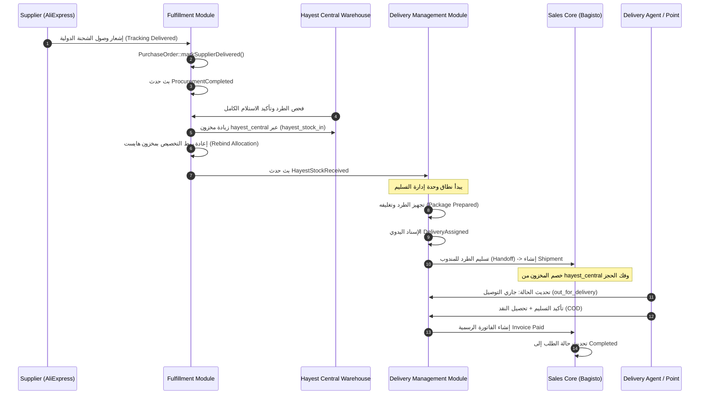

# وثيقة التصميم التنفيذية: وحدة إدارة التسليم (Delivery Management Module)

**النسخة:** 1.0.2  
**التاريخ:** 2026-08-16  
**المنصة:** هايست (Hayest) — Bagisto 2.4.x  
**الحالة:** مسودة تصميم تنفيذية معتمدة للتطوير  

---

## جدول المحتويات

1. [الملخص التنفيذي](#1-الملخص-التنفيذي)
2. [الحدود المعمارية للوحدات ومصفوفة المسؤوليات](#2-الحدود-المعمارية-للوحدات-ومصفوفة-المسؤوليات)
3. [نموذج المنتجات والمصادر والأكواد المعيارية](#3-نموذج-المنتجات-والمصادر-والأكواد-المعيارية)
4. [نموذج طلب الشراء والتوريد وانتقال التخصيص](#4-نموذج-طلب-الشراء-والتوريد-وانتقال-التخصيص)
5. [نموذج مخزون الدروبشوبينغ ومخزون هايست ودفتر الحركات](#5-نموذج-مخزون-الدروبشوبينغ-ومخزون-هايست-ودفتر-الحركات)
6. [دورة الشحنة والتسليم والجهات الفاعلة وحماية الـ Handoff](#6-دورة-الشحنة-والتسليم-والجهات-الفاعلة-وحماية-الـ-handoff)
7. [المحافظة وطريقة التسليم والدفع وتخزين البيانات](#7-المحافظة-وطريقة-التسليم-والدفع-وتخزين-البيانات)
8. [الفوترة والتحصيل والتسويات النقدية وحسم العملات](#8-الفوترة-والتحصيل-والتسويات-النقدية-وحسم-العملات)
9. [الصلاحيات والأمان ونطاقات الاستعلام وحسابات النقاط](#9-الصلاحيات-والأمان-ونطاقات-الاستعلام-وحسابات-النقاط)
10. [واجهات المستخدم وتجربة التشغيل](#10-واجهات-المستخدم-وتجربة-التشغيل)
11. [الأحداث والوظائف الخلفية والتزامن](#11-الأحداث-والوظائف-الخلفية-والتزامن)
12. [خطة الاختبارات الشاملة وسيناريوهات الفشل](#12-خطة-الاختبارات-الشاملة-وسيناريوهات-الفشل)
13. [خطة التنفيذ والنشر وإدارة الكوارث والرجوع](#13-خطة-التنفيذ-والنشر-وإدارة-الكوارث-والرجوع)
14. [الافتراضات والمخاطر ومصفوفة الفرز البرمجي](#14-الافتراضات-والمخاطر-ومصفوفة-الفرز-البرمجي)

---

## 1. الملخص التنفيذي

### 1.1 هدف الوحدة ونطاقها
وحدة **إدارة التسليم (Delivery Management)** هي الوحدة المسؤولة تشغيلياً ولوجستياً عن مرحلة ما بعد توفر المنتجات في مركز التوزيع الرئيسي لهايست وحتى تسليمها ليد العميل النهائي، أو معالجة تعثر التسليم وإعادة إدخال الطرد إلى المخزون المحلي.

تبدأ مسؤولية هذه الوحدة **حصراً** بعد تأكيد استلام المنتج وإيداعه الفعلي في مخزون هايست عبر حدث `HayestStockReceived`.

### 1.2 الفصل الصارم بين وحدة التوريد ووحدة إدارة التسليم
- **وحدة التوريد والدروبشوبينغ (`Fulfillment / Procurement`):** مسؤولة عن دورة الشراء الخارجية، مزامنة الكتالوج، إصدار وتتبع طلبات الشراء من AliExpress، تأكيد الاستلام الفعلي في المركز (`SourceReceiptConfirmed`)، وزيادة المخزون في مستودع هايست المركزي (`HayestStockReceived`).
- **وحدة إدارة التسليم (`Delivery Management`):** تبدأ من استلام البند الجاهز، تجهيز الطرد (Kitting & Packaging)، الإسناد اليدوي (للمندوب أو نقطة التسليم)، تنفيذ الـ Handoff (مع خصم المخزون وإنشاء شحنة Bagisto)، متابعة خط السير، تحصيل النقد، وتسوية العهدة.

```
┌────────────────────────────────────────────────────────┐
│ 1. نطاق التوريد والدروبشوبينغ (Fulfillment Domain)     │
│ الطلب ──► طلب الشراء ──► الشحن الخارجي ──► الاستلام ──► زيادة مخزون هايست │
└───────────────────────────┬────────────────────────────┘
                            │ حدث: HayestStockReceived
┌───────────────────────────▼────────────────────────────┐
│ 2. نطاق إدارة التسليم (Delivery Management Domain)     │
│ التجهيز ──► الإسناد ──► الـ Handoff ──► التوصيل ──► التحصيل / الإرجاع     │
└────────────────────────────────────────────────────────┘
```

### 1.3 مصادر المنتجات المدعومة
1. **AliExpress (دروبشوبينغ):** يمر بدورة التوريد والشراء الخارجي، ولا يدخل نطاق التسليم إلا بعد وصوله الفعلي وإيداعه في `hayest_central`.
2. **منتجات محلية:** مخزنة مسبقاً في `hayest_central`، تنتقل مباشرة إلى مرحلة التجهيز والإسناد دون إنشاء طلب شراء خارجي.

### 1.4 نطاق الإصدار الأول (v1) والخصائص المؤجلة
- **المشمول في v1:**
  - التوصيل المنزلي لأمانة العاصمة (`SAN`) فقط.
  - نقاط التسليم لكافة المحافظات اليمنية المفعلة.
  - الدفع عند الاستلام (COD) محصور في التوصيل المنزلي بأمانة العاصمة (`SAN`) وممنوع لنقاط التسليم.
  - الإسناد اليدوي عبر مشرف العمليات.
  - واجهة ويب متجاوبة وخفيفة للمندوب تحت المسار `/delivery`.
  - تسوية العهد النقدية اليومية للمناديب بالريال اليمني (`YER`).
  - إرجاع الطرود المتعثرة لمخزون هايست المحلي دون إعادتها للمورد الخارجي.
- **المؤجل للإصدارات اللاحقة:**
  - رسائل SMS، إشعارات WhatsApp، ورموز التحقق OTP.
  - خوارزميات الإسناد التلقائي.
  - فتح التوصيل المنزلي لمحافظات أخرى (معمارية النظام تدعم ذلك برمجياً عبر قواعد البيانات دون تعديل كود).
  - الطلبات المختلطة (سلة تجمع منتج محلي ومنتج AliExpress).

---

## 2. الحدود المعمارية للوحدات ومصفوفة المسؤوليات

### 2.1 مصفوفة المسؤوليات ومصادر الحقيقة (Single Source of Truth)

| النطاق / الوحدة | المسؤولية الحصرية | مصدر الحقيقة (Source of Truth) | المرجع البرمجي المثبت في الكود |
| :--- | :--- | :--- | :--- |
| **AliExpress / Catalog Projection** | استيراد المنتجات، تحديث صور المتغيرات، إسقاط الأسعار، قراءة توفر المورد الخارجي | `aliexpress_product_imports`, `external_variant_projections` | [`AliExpressProductImporter.php`](file:///e:/HIGESTO%20NEW1/higest/higest101/app/Services/AliExpress/AliExpressProductImporter.php), [`CatalogProjectionListener.php`](file:///e:/HIGESTO%20NEW1/higest/higest101/packages/Webkul/Fulfillment/src/Listeners/CatalogProjectionListener.php) |
| **Procurement / Purchase Orders** | دورة حياة طلبات الشراء الخارجية، لقطات التكلفة، تتبع الشحنات الدولية | `purchase_orders`, `purchase_order_items`, `procurement_sessions` | [`PurchaseOrder.php`](file:///e:/HIGESTO%20NEW1/higest/higest101/packages/Webkul/Fulfillment/src/Models/PurchaseOrder.php), [`SupplierProcurementWorkflow.php`](file:///e:/HIGESTO%20NEW1/higest/higest101/packages/Webkul/Fulfillment/src/Services/Application/SupplierProcurementWorkflow.php) |
| **External Availability Projection** | تمثيل كمية التوفر الخارجية القابلة للبيع عبر المتجر الإلكتروني فقط | `product_inventories` (حيث الكود هو `default`) | [`AliExpressStockListener.php:L99-L125`](file:///e:/HIGESTO%20NEW1/higest/higest101/packages/Webkul/Fulfillment/src/Listeners/AliExpressStockListener.php#L99-L125) |
| **Hayest Physical Stock & Receiving** | تأكيد الفحص والاستلام، تسجيل حركة `hayest_stock_in`، إدارة رصيد المخزن المركزي الفعلي | `product_inventories` (حيث الكود هو `hayest_central`) و `inventory_movements` | **[تصميم جديد]** امتداد لـ `Fulfillment` و `Inventory` |
| **Order Allocation** | إدارة حجوزات البنود، ربط بنود المبيعات بمصادر التوريد | `order_allocations`, `allocation_logs` | [`OrderAllocation.php`](file:///e:/HIGESTO%20NEW1/higest/higest101/packages/Webkul/Fulfillment/src/Models/OrderAllocation.php), [`ReserveAllocationHandler.php`](file:///e:/HIGESTO%20NEW1/higest/higest101/packages/Webkul/Fulfillment/src/Handlers/ReserveAllocationHandler.php) |
| **Delivery Management** | التجهيز، الإسناد، التسليم للناقل (Handoff)، تتبع رحلة الميل الأخير، وإدارة نقاط التسليم | `delivery_assignments`, `delivery_attempt_logs`, `delivery_points` | **[تصميم جديد]** حزمة `Webkul\DeliveryManagement` |
| **Sales & Shipments** | إدارة كائن الطلب في المتجر، توليد سجلات الشحن والفواتير الرسمية، المرتجعات المالية | `orders`, `order_items`, `shipments`, `invoices`, `refunds` | [`Order.php`](file:///e:/HIGESTO%20NEW1/higest/higest101/packages/Webkul/Sales/src/Models/Order.php), [`ShipmentRepository.php`](file:///e:/HIGESTO%20NEW1/higest/higest101/packages/Webkul/Sales/src/Repositories/ShipmentRepository.php) |
| **Cash Settlements & Treasury** | تسجيل المقبوضات النقدية، مطابقة الفروقات، تسوية عهد المناديب | `delivery_cash_collections`, `delivery_settlements`, `ledger_entries` | **[تصميم جديد]** + [`FinancialSettlementService.php`](file:///e:/HIGESTO%20NEW1/higest/higest101/packages/Webkul/Fulfillment/src/Services/Domain/FinancialSettlementService.php) |

### 2.2 تدفق الأحداث والواجهات البينية



---

## 3. نموذج المنتجات والمصادر والأكواد المعيارية

### 3.1 جدول الأكواد المعيارية وخريطة التوافق (Canonical Codes & Legacy Mapping)

تعتمد المنصة طبقة تحويل موحدة (Canonical Mapping Adapter) تضمن تعامل كافة الخدمات الخلفية مع الأكواد المعيارية حصراً:

| المفهوم (Concept) | الكود المعياري (Canonical Code) | الأكواد السابقة / البديلة في الكود الحالي | الموقع واستخدامه |
| :--- | :--- | :--- | :--- |
| **نوع المصدر (Source Type)** | `aliexpress` | `supplier`, `ae` | يُخزن في `order_allocations.source_code` و `purchase_orders.provider` |
| | `local` | `warehouse` | يُخزن في `order_allocations.allocation_type` |
| **نمط التوريد (Fulfillment Mode)** | `order_triggered` | `dropshipping` | للبضائع التي تُشترى بعد طلب العميل (AliExpress) |
| | `stock_based` | `in_stock`, `local_stock` | للبضائع المتوفرة مسبقاً في مخزون هايست |
| **مصدر المخزون (Inventory Source)** | `default` | `default` | **مصدر افتراضي خارجي** لعرض توفر AliExpress في الواجهة |
| | `hayest_central` | `warehouse_riyadh` (كود اختباري سابق) | **المستودع الفعلي المركزي** في صنعاء لعمليات الشحن الحقيقية |
| **طريقة التسليم (Shipping Method)** | `home_delivery` | `homedelivery_standard` | التوصيل لباب منزل العميل |
| | `delivery_point` | `deliverypoint_pickup` | الاستلام عبر نقطة تسليم وسيطة |

### 3.2 طبقة المواءمة والتحويل الموحدة (Shipping Method Adapter)
كافة الخدمات المعنية (`delivery_governorate_rules`, `PaymentEligibilityChecker`, `DeliveryAssignmentService`, `HandoffExecutionService`) لا تتعامل مع أسماء النواقل المركبة مباشرة، بل تمرر كود الشحن عبر دالة تحويل مركزية:
```
homedelivery_standard   <─── Adapter ───>   home_delivery (Canonical)
deliverypoint_pickup    <─── Adapter ───>   delivery_point (Canonical)
```

### 3.3 لقطة بيانات المصدر (Source Snapshot in Order Item)
يتم التقاط وحفظ بيانات المصدر وقت إنشاء الحجز في `order_allocations.supplier_snapshot` بواسطة [`ReserveAllocationHandler`](file:///e:/HIGESTO%20NEW1/higest/higest101/packages/Webkul/Fulfillment/src/Handlers/ReserveAllocationHandler.php#L116-L131)، متضمنة:
- `supplier_product_id`, `supplier_sku_id`
- `supplier_cost`, `supplier_currency`, `exchange_rate`, `landed_cost`
- `selling_price`, `applied_rule_id`, `snapshot_hash`, `snapshot_version`

### 3.4 قرار حاسم: تأجيل الطلبات المختلطة (Mixed Orders Policy)
> [!IMPORTANT]
> **قرار الإصدار الأول (v1):** يمنع النظام إنشاء سلة تسوق تجمع بين منتج من مصدر `aliexpress` ومنتج من مصدر `local`.
> 
> **المبرر الهندسي والتشغيلي:**
> 1. منتجات AliExpress تتطلب دورة توريد تمتد من 7 إلى 25 يوماً، بينما المنتجات المحلية جاهزة للشحن الفوري خلال 24 ساعة.
> 2. دمج المصدرين في طلب واحد يستوجب إنشاء شحنات متعددة مجزأة (Split Shipments) وتعدد مسارات Handoff وإدارة معقدة للفواتير الجزئية وتجزئة مبالغ COD.
> 3. يتم تطبيق هذا المنع عبر `CartValidator` في واجهة المتجر برفض إضافة منتج محلي لسلة تحتوي منتج AliExpress مع إظهار رسالة تنبيه للمستخدم.

---

## 4. نموذج طلب الشراء والتوريد وانتقال التخصيص

### 4.1 الجداول المعتمدة
- **`purchase_orders`:** يربط طلب الشراء بطلب المبيعات [`PurchaseOrder.php`](file:///e:/HIGESTO%20NEW1/higest/higest101/packages/Webkul/Fulfillment/src/Models/PurchaseOrder.php).
- **`purchase_order_items`:** يربط كل بند في طلب الشراء ببند طلب المبيعات `order_item_id`.
- **`order_allocations`:** يمثل حالة الحجز والتخصيص لكل بند [`OrderAllocation.php`](file:///e:/HIGESTO%20NEW1/higest/higest101/packages/Webkul/Fulfillment/src/Models/OrderAllocation.php).

### 4.2 دورة حياة طلب الشراء وحالاته
تخضع الآلة البرمجية في `PurchaseOrder` للانتقالات الصارمة التالية:
```
pending ──► submitting ──► submitted ──► awaiting_payment ──► supplier_processing ──► shipped ──► delivered
   │             │              │              │                     │                   │
   └──► canceled └──► canceled   └──► canceled   └──► canceled          └──► canceled        └──► canceled
   │
   └──► needs_manual_review (متاحة من أي حالة غير نهائية)
```

### 4.3 مخطط انتقال تخصيص البند وإعادة الربط (Allocation Transition & Rebind Lifecycle)

يوضح المخطط التالي كيفية انتقال سجل التخصيص `order_allocations` دون أي ازدواج في الحجز:

```
[1. تخصيص مبدئي خارجي (Initial Supplier Allocation)]
allocation_type = 'supplier' | source_code = 'aliexpress'
state = 'reserved' | reserved_qty = QTY | fulfilled_qty = 0
       │
       │ حدث وصول الصندوق: SourceReceiptConfirmed
       ▼
[2. إعادة الربط بالمستودع المحلي (Rebind to Hayest Central)]
allocation_type = 'warehouse' | source_code = 'hayest_central'
state = 'reserved' | reserved_qty = QTY | fulfilled_qty = 0
       │
       │ حدث الاستلام والإيداع المخزني: HayestStockReceived (تنفيذ hayest_stock_in)
       ▼
[3. حجز فعلي في مخزون هايست (Physical Reservation in Central Stock)]
الكمية QTY محجوزة في رصيد hayest_central بانتظار التجهيز والإسناد
       │
       │ حدث التسليم للناقل: DeliveryHandoffCompleted (إنشاء Shipment)
       ▼
[4. استيفاء التخصيص وخصم المخزون (Allocation Fulfilled)]
allocation_type = 'warehouse' | source_code = 'hayest_central'
state = 'fulfilled' | fulfilled_qty = QTY | reserved_qty = 0
(تم خصم product_inventories لمستودع hayest_central وفك حجز ordered_inventories لمرة واحدة)
```

**قواعد منع الحجز المزدوج رياضياً وبرمجياً:**
- التخصيص المبدئي يمنع بيع الكمية من الإسقاط الخارجي عبر معادلة `sellableStock = max(0, supplierStock - reservations - buffer)`.
- عند وصول الشحنة، يتم **تحديث نفس سجل `order_allocations` ذرياً** بتعديل `allocation_type` إلى `warehouse` و `source_code` إلى `hayest_central` باستخدام القفل التفاؤلي `version` ([OptimisticLocking trait](file:///e:/HIGESTO%20NEW1/higest/higest101/packages/Webkul/Fulfillment/src/Models/OrderAllocation.php#L17)).
- لا يتم إنشاء سجل تخصيص جديد، بل يُعاد توجيه الحجز ذاته من الحصة الخارجية إلى المخزون الفيزيائي المحلي، مما يمنع احتساب الكمية مرتين.

### 4.4 حسم الاستلام الجزئي في الإصدار الأول (Full Receipt Only Policy)
> [!IMPORTANT]
> **القرار التشغيلي الحاسم لـ v1:** يعتمد النظام **الاستلام الكامل فقط (Full Receipt Only)**:
> 1. عند استلام وفحص الطرد من المورد الخارجي:
>    - إذا وصلت كامل الكمية سليمة 100% -> يتم تنفيذ حركة `hayest_stock_in`، بث حدث `HayestStockReceived`، ونقل الطلب لمرحلة التجهيز.
>    - إذا ظهر أي **نقص في الكمية، تلف، أو عيب مصنعي** -> **يُمنع الطلب فوراً وبشكل قاطع من الانتقال إلى مسار التجهيز والتسليم**.
> 2. يتم نقل حالة طلب الشراء وجلسة التوريد إلى `needs_manual_review` / `ops_review`، وتوجيه تنبيه عاجل لفريق العمليات للتدخل (طلب تعويض من AliExpress، إعادة طلب البند الناقص، أو التواصل مع العميل للإلغاء والتعويض).

---

## 5. نموذج مخزون الدروبشوبينغ ومخزون هايست ودفتر الحركات

### 5.1 البحث الديناميكي عن المخازن ومنع الـ IDs الثابتة
> [!CAUTION]
> يُحظر تماماً الاعتماد على معرفات أرقام ثابتة (`id = 1` أو `id = 2`) في كود النظام.
> يتم البحث عن مصادر المخزون برمجياً باستخدام الكود المعياري الفريد:
> - كود التوفر الخارجي: `'default'`
> - كود المستودع المركزي الفعلي: `'hayest_central'`
> 
> يتم جلب المعرف برمجياً عبر Lookup ديناميكي:
> `$sourceId = InventorySource::where('code', 'hayest_central')->value('id');`
> ويتم إنشاء مصدر `hayest_central` عبر Seeder بشكل Idempotent (`firstOrCreate`).

### 5.2 التمييز بين مصادر المخزون
1. **المصدر `default`:** يُعبر عن **التوفر الافتراضي للمورد الخارجي**. يُحظر برمجياً إصدار أي شحنة عميل (`Shipment`) من هذا المصدر لمنتجات AliExpress.
2. **المستودع المركزي `hayest_central`:** يُعبر عن **المخزون الفعلي الفيزيائي** المتواجد في صنعاء، وهو المصدر الوحيد الذي تُخصم منه شحنات العملاء لمنتجات AliExpress (بعد استلامها) والمنتجات المحلية.

### 5.3 دفتر الحركات المخزنية الموحد `inventory_movements` [تصميم جديد]

| الحقل | النوع | الوصف |
| :--- | :--- | :--- |
| `id` | BigInt PK | المعرف الفريد للحركة |
| `movement_type` | Enum / String | نوع الحركة المخزنية المعيارية |
| `product_id` | BigInt FK | معرف المنتج الأساسي |
| `sku` | String | رمز التخزين التعريفي |
| `quantity` | Integer | الكمية (موجبة للإيداع، سالبة للصرف) |
| `source_inventory_source_id` | Nullable BigInt FK | مصدر المخزون المغادر |
| `target_inventory_source_id` | Nullable BigInt FK | مصدر المخزون المستقبل |
| `order_id` | Nullable BigInt FK | رقم طلب العميل المرتبط |
| `order_item_id` | Nullable BigInt FK | رقم بند الطلب المرتبط |
| `purchase_order_id` | Nullable BigInt FK | رقم طلب الشراء المرتبط |
| `shipment_id` | Nullable BigInt FK | رقم شحنة Bagisto المولدة |
| `delivery_assignment_id` | Nullable BigInt FK | رقم مهمة التسليم |
| `actor_id` | **Nullable** BigInt FK | معرف المستخدم المنفذ (`admins.id`) — يكون `null` عندما يكون المنفذ نظاماً |
| `actor_type` | String | `admin`, `system`, `delivery_agent` |
| `reference_event` | Nullable String | اسم الحدث المحفز (مثل: `ProcurementCompleted`, `HayestStockReceived`) |
| `job_class` | Nullable String | اسم فئة الـ Job الخلفي في حال التنفيذ التلقائي |
| `idempotency_key` | Unique String | مفتاح فريد لمنع تكرار القيد |
| `notes` | Nullable Text | تفاصيل الحركة والسبب |
| `created_at` | Timestamp | وقت تسجيل الحركة |

### 5.4 جدول الحركات المعيارية وأثرها على الأرصدة

| نوع الحركة المعيارية | طبيعة الحركة | الأثر على `product_inventories` | المصدر المستهدف |
| :--- | :--- | :--- | :--- |
| `source_receipt` | **حدث تدقيق ووصول** (Audit Trace) | **لا يوجد أي تغيير في الكميات** | توثيق وصول صندوق المورد |
| `hayest_stock_in` | **إيداع مخزني فعلي** (Physical Inbound) | **زيادة (+)** في الكمية الفعلية | `hayest_central` |
| `reservation` | **حجز منطقي** (Allocation) | لا تغيير في الرصيد الفيزيائي (تحديث `ordered_inventories`) | — |
| `package_prepared` | **تجهيز وتغليف** (Staging/Kitting) | لا تغيير في الرصيد الفيزيائي | نقل منطقي لموقع التجهيز |
| `handoff_to_delivery_party` | **تسليم للناقل وخروج شحنة** | **خصم (-)** عبر إنشاء سجل `Shipment` | `hayest_central` |
| `delivery_failure_return` | **إرجاع طرد متعثر للمخزن** | **زيادة (+)** كبضاعة مملوكة لهايست محلياً | `hayest_central` |
| `damage_or_loss` | **إتلاف أو فقدان** | **خصم (-)** من الرصيد الفعلي | `hayest_central` |
| `adjustment` | **تسوية جردية معتمدة** | تعديل موجب أو سالب حسب الجرد | `hayest_central` |

---

## 6. دورة الشحنة والتسليم والجهات الفاعلة وحماية الـ Handoff

### 6.1 الجداول الجديدة لوحدة إدارة التسليم [تصميم جديد]

#### 1. جدول نقاط التسليم `delivery_points`
- `id`, `code` (Unique: `DP-SAN-01`), `name`, `name_ar`
- `state_code` (FK -> `country_states.code`), `city`, `address`, `latitude`, `longitude`
- `contact_name`, `contact_phone`, `working_hours` (JSON), `is_active` (Boolean)

#### 2. جدول مهام وإسناد التسليم `delivery_assignments`
- `id`, `order_id` (FK -> `orders.id`), `shipment_id` (Nullable FK -> `shipments.id`)
- `delivery_type` (`home_delivery`, `delivery_point`)
- `delivery_boy_id` (Nullable FK -> `admins.id`)
- `delivery_point_id` (Nullable FK -> `delivery_points.id`)
- `status` (حالة مهمة التسليم)
- `assigned_by` (FK -> `admins.id`), `assigned_at`
- `picked_up_at`, `out_for_delivery_at`, `delivered_at`, `failed_at`, `returned_at`
- `attempt_count` (Default 0), `max_attempts` (Default 2), `failure_reason`
- `customer_address_snapshot` (JSON), `delivery_point_snapshot` (JSON)
- `idempotency_key` (Unique String)

#### 3. جدول محاولات التسليم `delivery_attempt_logs`
- `id`, `delivery_assignment_id`, `attempt_number`, `status` (`success`, `failed`, `rescheduled`)
- `failure_reason`, `attempted_at`, `attempted_by` (`admins.id`), `latitude`, `longitude`, `notes`

#### 4. جدول التحصيلات النقدية `delivery_cash_collections`
- `id`, `delivery_assignment_id`, `order_id`, `delivery_boy_id`
- `amount` (Decimal 12,4), `currency` (String 3, Default: `YER`)
- `exchange_rate` (Decimal 12,6), `base_currency` (String 3, Default: `YER`), `amount_in_base_currency` (Decimal 12,4), `rate_snapshot_at` (Timestamp)
- `collected_at`, `idempotency_key` (Unique)

#### 5. جدول تسوية العهد النقدية `delivery_settlements`
- `id`, `delivery_boy_id`, `settlement_date`
- `expected_amount`, `actual_amount`, `difference`, `currency` (Default: `YER`)
- `status` (`pending`, `settled`, `discrepancy`), `settled_by` (`admins.id`), `settled_at`, `notes`

### 6.2 الجهات الفاعلة المحددة في دورة نقطة التسليم (Clear Human Actors)
1. **تأكيد الـ Handoff وإرسال الطرد لنقطة التسليم:** يتم تأكيده بواسطة **مشرف الحركة في المستودع المركزي (Central Warehouse Dispatcher)** عبر واجهة المشرف.
2. **تأكيد وصول الطرد واستلامه في نقطة التسليم:** يتم تأكيده بواسطة **مسؤول نقطة التسليم (Delivery Point Agent)** عبر حسابه الإداري المخصص.
3. **تأكيد تسليم الطرد للعميل النهائي:** يتم تأكيده حصراً بواسطة **مسؤول نقطة التسليم (Delivery Point Agent)** بعد التحقق من هوية العميل ورقم الطلب.

### 6.3 مخطط حالات التسليم والانتقالات المعتمدة

```
[جاهز للإسناد]
ready_for_assignment
       │ (إسناد يدوي بواسطة مشرف العمليات: delivery.dispatch.manage)
       ▼
   assigned
       │ (استلام المندوب/الناقل Handoff -> توليد Shipment وخصم المخزون)
       ▼
   picked_up
       │
       ├───────────────────────────────────────────────┐
       │ (مسار التوصيل المنزلي)                         │ (مسار نقطة التسليم)
       ▼                                               ▼
out_for_delivery                              arrived_at_point (تأكيد مسؤول النقطة)
       │                                               │
       ├───────────────────────────────┐               │
       ▼ (تسليم ناجح)                   ▼ (تعثر)       ▼ (استلام العميل)
   delivered                     delivery_failed   delivered
                                       │
                         ┌─────────────┴─────────────┐
                         ▼ (إعادة جدولة)             ▼ (فشل نهائي واعتماد المشرف)
                  retry_scheduled             returned_to_hayest
                         │                           │
                         └─► assigned                └─► [حركة delivery_failure_return وإيداع بمخزون هايست]
```

### 6.4 شروط وضوابط خدمة التسليم للناقل (`HandoffExecutionService`)
تُطبق خدمة التنفيذ `HandoffExecutionService` الشروط الإلزامية التالية داخل معاملة قاعدة بيانات واحدة (`DB::transaction`):
1. **Lookup ديناميكي للمستودع:** البحث عن مصدر المخزون باستخدام الكود المعياري `'hayest_central'`.
2. **التحقق من الرصيد الفيزيائي المتاح:** فحص `product_inventories` للبند في `hayest_central` والتأكد من كفاية الكمية.
3. **حظر المصدر الخارجي (Strict Source Guard):** في حال كان المصدر هو `'default'` أو أي مصدر افتراضي خارجي، يتم **إلقاء استثناء فوري وإلغاء العملية** لمنع الشحن الوهمي.
4. **تمرير المصدر الصحيح لـ Bagisto:** تمرير المعرف الديناميكي الناتج `$source->id` إلى `ShipmentRepository::create()`.
5. **تسجيل قيد الحركة:** تقييد حركة `handoff_to_delivery_party` في جدول `inventory_movements` بنفس المعاملة.
6. **إثبات الخصم لمرة واحدة:** الخصم يحدث هنا فقط؛ وعند التسليم النهائي للعميل (`delivered`) لا يتم استدعاء أي دالة تخصم المخزون مرة ثانية.

---

## 7. المحافظة وطريقة التسليم والدفع وتخزين البيانات

### 7.1 هيكل جدول قواعد المحافظات `delivery_governorate_rules` [تصميم جديد]
- `id`, `state_code` (يطابق رموز [`YemenGovernoratesSeeder.php`](file:///e:/HIGESTO%20NEW1/higest/higest101/database/seeders/YemenGovernoratesSeeder.php) مثل `SAN`, `AD`, `TA`, `IB`, `HD`)
- `delivery_type` (`home_delivery`, `delivery_point` — بالكود المعياري)
- `is_enabled` (Boolean)
- `allowed_payment_methods` (JSON: `["cashondelivery", "moneytransfer"]`)
- `delivery_fee` (Decimal 10,2), `min_order_amount` (Decimal 10,2)
- Unique Key: `(state_code, delivery_type)`

### 7.2 مصفوفة التهيئة الابتدائية
- `SAN` + `home_delivery`: مفعل (`is_enabled = true`)، الدفع: `["cashondelivery", "moneytransfer"]`.
- `SAN` + `delivery_point`: مفعل (`is_enabled = true`)، الدفع: `["moneytransfer"]` (COD ممنوع).
- كافة المحافظات الأخرى + `delivery_point`: مفعل في حال وجود نقطة نشطة، الدفع: `["moneytransfer"]` (COD ممنوع).
- كافة المحافظات الأخرى + `home_delivery`: معطل حالياً (`is_enabled = false`).

### 7.3 تخزين الحقول عبر مراحل الطلب (Cart -> Order -> Assignment)

| المرحلة | الحقل المخزن | مكان ونوع التخزين في قاعدة البيانات |
| :--- | :--- | :--- |
| **سلة التسوق (Cart)** | طريقة ونوع التسليم | `cart_addresses.additional` (حقل JSON يحتوي: `delivery_type`, `delivery_point_id`, `delivery_point_snapshot`) |
| **طلب المبيعات (Order)** | طريقة التسليم المعتمدة | `orders.shipping_method` (نص معتمد: `homedelivery_standard` أو `deliverypoint_pickup`) |
| | لقطة عنوان ونقطة التسليم | `order_addresses.additional` (JSON مجمد وقت الطلب يمنع تأثر الطلب بتعديل بيانات النقطة لاحقاً) |
| **مهمة التسليم (Assignment)** | بيانات ومراجع التنفيذ | `delivery_assignments.delivery_type`, `delivery_assignments.delivery_point_id`, ولقطات JSON في `customer_address_snapshot` و `delivery_point_snapshot` |

### 7.4 الحماية الصارمة على مستوى الخادم (Triple-Layer Backend Validation)
> [!WARNING]
> دالة [`CashOnDelivery::isAvailable()`](file:///e:/HIGESTO%20NEW1/higest/higest101/packages/Webkul/Payment/src/Payment/CashOnDelivery.php#L28-L35) الحالية في الكود لا تطبق أي قيود جغرافية.
> سيتم إنشاء خدمة فحص الأهلية `PaymentEligibilityChecker` [تصميم جديد] وتطبيقها إلزامياً في ثلاث نقاط على الخادم:
1. **نقطة جلب طرق الدفع (`GET /api/checkout/onepage/payment-methods`):** استبعاد `cashondelivery` تلقائياً إذا لم يكن الطلب `home_delivery` في محافظة مسموحة.
2. **نقطة حفظ طريقة الدفع (`POST /api/checkout/onepage/payment-methods`):** رفض الحفظ برمز 422 إذا تم تمرير COD لنقطة تسليم.
3. **نقطة اعتماد وإنشاء الطلب (`POST /api/checkout/onepage/orders` في [`OnepageController::storeOrder`](file:///e:/HIGESTO%20NEW1/higest/higest101/packages/Webkul/Shop/src/Http/Controllers/API/OnepageController.php)):** إعادة فحص الكارت قبل الحفظ الفعلي؛ وإذا وُجد تلاعب بالـ Payload يتم إيقاف المعاملة فوراً وإرجاع رمز خطأ 400.

---

## 8. الفوترة والتحصيل والتسويات النقدية وحسم العملات

### 8.1 حسم العملات في الإصدار الأول (Currency Resolution)
> [!IMPORTANT]
> **القرار المعتمد لـ v1:** يُعتمد **الريال اليمني (`YER`) حصراً كعملة التحصيل والتسوية الميدانية الرسمية** لطلبات الدفع عند الاستلام، وذلك لمنع خلافات أسعار الصرف الميدانية بين المندوب والعميل وتفادي مخاطر تقلب العملة على الخزينة.
> 
> **المعمارية الداعمة للعملات المتعددة (SAR / USD Fallback):**
> لدعم التوسع المستقبلي دون تعديل هيكل الجداول، يتضمن جدول `delivery_cash_collections` وجدول `delivery_settlements` الحقول التالية:
> - `currency`: العملة المحصلة فعلياً (Default: `YER`).
> - `exchange_rate`: سعر الصرف المجمد وقت التحصيل.
> - `base_currency`: العملة الأساسية للنظام (`YER`).
> - `amount_in_base_currency`: المبلغ المقابل بالريال اليمني.
> - `rate_snapshot_at`: وقت وتاريخ تجميد سعر الصرف.

### 8.2 دورة طلبات الدفع المسبق (Prepaid Orders)
1. إنشاء الطلب والدفع الفوري (إلكتروني أو حوالة معتمدة).
2. توليد فاتورة مدفوعة `Invoice` (`state = 'paid'`).
3. الرصيد: `grand_total_invoiced = grand_total`، و `total_due = 0`.
4. تجهيز الطرد -> Handoff (توليد `Shipment`) -> تسليم للعميل دون تحصيل نقد.

### 8.3 دورة طلبات الدفع عند الاستلام (COD Orders)
1. إنشاء الطلب واختيار `cashondelivery`.
2. **لا يتم توليد أي فاتورة إطلاقاً عند إنشاء الطلب**.
3. الرصيد المالي: `grand_total_invoiced = 0`، و `total_due = grand_total`.
4. قبول المشرف للطلب -> التوريد -> استلام المستودع.
5. تجهيز الطرد -> تسليمه للمندوب (Handoff) وتوليد سجل `Shipment` (يتحول الطلب إلى `processing`).
6. المندوب يسلم العميل ويستلم المبلغ نقداً بالريال اليمني.
7. المندوب يضغط "تم التسليم" -> تسجيل القيد في `delivery_cash_collections`.
8. توليد فاتورة Bagisto رسمية بحالة `paid` آلياً فور استلام النقد.
9. الرصيد المالي: `grand_total_invoiced = grand_total`، و `total_due = 0`.
10. انتقال حالة الطلب تلقائياً إلى `completed`.

---

## 9. الصلاحيات والأمان ونطاقات الاستعلام وحسابات النقاط

### 9.1 استبدال Global Scope بـ Query Scopes و Policies صريحة
1. **في نموذج `DeliveryAssignment`:**
   - توفير Scope محدد: `scopeForAgent(Builder $query, int $adminId)`.
   - توفير Scope للمشرفين: `scopeForSupervisor(Builder $query)`.
2. **في طبقة السياسات `DeliveryAssignmentPolicy`:**
   - فحص صلاحية المشرف `delivery.dispatch.manage` للسماح بالوصول الكامل.
   - فحص ملكية السجل للمندوب: `$assignment->delivery_boy_id === $admin->id`.
3. **في وحدات التحكم الخاصة بالمندوب (`/delivery/*`):**
   - استدعاء نطاق المندوب صراحة: `DeliveryAssignment::forAgent(auth('admin')->id())->findOrFail($id)`.

### 9.2 نموذج حساب وصلاحيات مسؤول نقطة التسليم
- **حساب مسؤول النقطة:** مستخدم مسجل في جدول `admins` تابع لـ Guard `admin`.
- **الدور الوظيفي:** دور مخصص `delivery_point_agent`.
- **الصلاحيات الممنوحة:** `delivery.points.operate` (تأكيد وصول الطرود للنقطة، والبحث برقم الطلب لتسليم العميل).
- **نطاق الوصول (Data Scoping):** يتم تقييد استعلامات مسؤول النقطة برقم النقطة المرتبط بحسابه (`admins.delivery_point_id`) لمنع استعراض طرود فروع أخرى.
- **ملاحظة تشغيلية:** التفاصيل الدقيقة لتصميم شاشة نقطة التسليم التفاعلية تُعد قراراً تشغيلياً يتم اعتماده قبل بناء واجهة نقاط التسليم.

### 9.3 شجرة الصلاحيات المضافة لملف `acl.php` [تصميم جديد]
- `delivery` (القائمة الرئيسية لإدارة التسليم)
  - `delivery.dashboard.view` (عرض لوحة القيادة والمؤشرات)
  - `delivery.dispatch.manage` (إسناد الطلبات وإعادة الجدولة للمشرفين)
  - `delivery.agent.view_assigned` (عرض الطلبات الخاصة بالمندوب المسجل فقط)
  - `delivery.agent.update_status` (تحديث مسار التسليم: استلام، توصيل، تعثر)
  - `delivery.points.operate` (تشغيل نقطة التسليم: استلام الطرود وتسليمها للعملاء)
  - `delivery.returns.approve` (صلاحية اعتماد إرجاع الطرد لمخزون هايست)
  - `delivery.points.manage` (إدارة فروع وعناوين نقاط التسليم)
  - `delivery.settlements.manage` (تسوية ومطابقة العهد النقدية للمحاسب)
- `inventory` (إدارة المستودع والاستلام)
  - `inventory.receipts.manage` (فحص وتأكيد الاستلام الفعلي `hayest_stock_in`)
  - `inventory.movements.view` (سجل حركات المخزون والتدقيق)

---

## 10. واجهات المستخدم وتجربة التشغيل

### 10.1 واجهة الإدارة والتشغيل (`/admin/delivery/*`)
- **لوحة متابعة التسليم والتوزيع:** شاشة لمشرف العمليات تعرض الطلبات الجاهزة للإسناد، مع إمكانية الفرز حسب المحافظة والحي واختيار المندوب أو النقطة بضغطة زر.
- **إدارة نقاط التسليم:** شاشة DataGrid لإضافة، تعديل، وتعطيل نقاط التسليم مع خريطة جغرافية وتحديد سعة الاستيعاب.
- **شاشة اعتماد المرتجعات:** شاشة للمشرف لمراجعة الطرود المتعثرة واعتماد إرجاعها إلى الرفوف مع تحديد سبب التعثر الموثق من المندوب.
- **شاشة التسويات النقدية اليومية:** للمحاسب لمراجعة إجمالي المبالغ المحصلة من كل مندوب، ومقارنتها بالنقد الفعلي المسلم وتوثيق أي فروقات مالية.

### 10.2 واجهة المندوب المتجاوبة (`/delivery`)
- مسار مخصص وخفيف للهواتف الذكية (Mobile-First Web View) محمي بـ Guard `admin`.
- تعرض فقط قائمة الطلبات المسندة للمندوب الحالي (تبويبات: قيد الانتظار، جاري التوصيل، مكتملة، متعثرة).
- بطاقة الطلب تتضمن: اسم العميل، رقم الهاتف للاتصال المباشر، العنوان التفصيلي، المبلغ المطلوب تحصيله بالريال اليمني، وزرين واضحين: **[تم التسليم واستلام النقد]** و **[تعذر التسليم مع ذكر السبب]**.

---

## 11. الأحداث والوظائف الخلفية والتزامن

### 11.1 سجل الأحداث المعيارية المتبادلة

| الحدث المعماري | المصدر | المستمع الأساسي | الوظيفة الناتجة |
| :--- | :--- | :--- | :--- |
| `ProcurementCompleted` | `Fulfillment` | `SourceReceiptListener` | إشعار وصول الشحنة من المورد الخارجي |
| `SourceReceiptConfirmed` | `Warehouse Inbound` | `StockInHandler` | توثيق الفحص الأولي |
| `HayestStockReceived` | `Fulfillment / Inventory` | `ReadyForDispatchListener` | قيد إيداع المخزون ونقل الطلب لمرحلة التجهيز |
| `DeliveryAssigned` | `Delivery Management` | `DeliveryNotificationHandler` | إشعار المندوب بالمهمة المسندة |
| `DeliveryHandoffCompleted` | `Delivery Management` | `ShipmentCreationHandler` | إنشاء شحنة Bagisto وخصم المخزون |
| `DeliveryCompleted` | `Delivery Management` | `InvoiceAndOrderCloseHandler` | توليد فاتورة COD وإغلاق الطلب |
| `DeliveryFailed` | `Delivery Management` | `DeliveryFailureHandler` | تسجيل المحاولة وفتح مسار المراجعة |
| `DeliveryReturnApproved` | `Operations Supervisor` | `RestockLocalInventoryHandler` | قيد حركة `delivery_failure_return` |
| `CashCollected` | `Delivery Management` | `TreasuryLedgerHandler` | تقييد المقبوضات النقدية في حساب العهدة |

### 11.2 حدود المعاملات البنكية ومفاتيح عدم التكرار (Transaction Boundaries & Idempotency)
- كل عملية تغيير حالة مالية أو مخزنية تُنفذ داخل `DB::transaction` مغلقة.
- استخدام `idempotency_key` فريد (UUID v4) لكل حركة تسليم، تحصيل، أو إرجاع لمنع تكرار القيد في حال إعادة إرسال الطلب من شبكة ضعيفة.

---

## 12. خطة الاختبارات الشاملة وسيناريوهات الفشل

### 12.1 اختبارات الوحدات والتكامل الإلزامية
1. **اختبار دورة COD المتكاملة:**
   - إنشاء طلب COD -> التحقق من عدم وجود فاتورة.
   - تنفيذ Handoff -> التحقق من إنشاء `Shipment` وخصم المخزون من `hayest_central` وعدم توليد فاتورة.
   - تأكيد التسليم والتحصيل -> التحقق من تسجيل النقد وتوليد `Invoice` مدفوعة وانتقال الطلب إلى `completed`.
2. **اختبارات أمان التحقق الجغرافي:**
   - قبول COD في `SAN` + `home_delivery`.
   - رفض COD في `SAN` + `delivery_point`.
   - رفض COD في المحافظات الأخرى (`AD`, `TA`, `IB`).
   - محاولة حقن طلب COD عبر الـ API المباشر وتأكيد رفض الخادم برمز 400.
3. **اختبارات المخزون وانتقال التخصيص:**
   - التحقق من انتقال التخصيص من `supplier` إلى `warehouse` (`hayest_central`) دون مضاعفة الحجز.
   - التحقق من أن مزامنة AliExpress لا تعدل أو تصفر رصيد مستودع `hayest_central`.
   - التحقق من حظر الاستلام الجزئي ودخول الطلب في `needs_manual_review` عند النقص.
   - التحقق من أن فشل التسليم يعيد المنتج لمخزون `hayest_central` كمنتج محلي.
4. **اختبارات عزل بيانات المناديب والنقاط:**
   - تأكيد عدم قدرة المندوب على استعراض أو تعديل مهمة تخص مندوباً آخر (إرجاع 403).
   - تأكيد عدم قدرة مسؤول نقطة على استعراض طرود نقطة أخرى.
5. **اختبارات التعافي من الفشل الجزئي (Partial Failure Recovery):**
   - محاكاة انقطاع الاتصال بعد تسجيل النقد وقبل توليد الفاتورة -> التأكد من قدرة الـ Job الخلفي على استكمال إصدار الفاتورة بالاعتماد على مفتاح `idempotency_key` دون مضاعفة النقد أو خصم المخزون مرة ثانية.

---

## 13. خطة التنفيذ والنشر وإدارة الكوارث والرجوع

### 13.1 مراحل التنفيذ التراكمية
- **المرحلة 1:** إنشاء الجداول، النماذج، والـ Repositories ونظام قواعد المحافظات.
- **المرحلة 2:** ربط حدث الاستلام من التوريد وزيادة مخزون `hayest_central` وإعادة ربط التخصيص.
- **المرحلة 3:** محرك التحقق من طرق الدفع `PaymentEligibilityChecker` وحماية الـ Endpoints.
- **المرحلة 4:** خدمات الإسناد، الـ Handoff، توليد الشحنات، وحالات التسليم الميداني.
- **المرحلة 5:** واجهة الإدارة المركزية وإدارة نقاط التسليم والاعتمادات.
- **المرحلة 6:** واجهة المندوب المتجاوبة `/delivery` وتطبيق الـ Policies.
- **المرحلة 7:** التحصيل النقدي والتسويات المحاسبية اليومية.
- **المرحلة 8:** اختبارات الـ Staging والمحاكاة الميدانية الكاملة.

### 13.2 خطة الرجوع وإدارة الطوارئ (Rollback & Disaster Recovery)
1. **النسخ الاحتياطي ونقاط الاستعادة:**
   - أخذ Snapshot كامل لقاعدة البيانات وقفل جداول الحركات قبل تشغيل الـ Migrations.
2. **مفتاح الإيقاف الفوري (Feature Flag / Kill-Switch):**
   - وجود متغير بيئي `DELIVERY_MODULE_ENABLED=true/false`.
   - في حال تعطيله، يتم تحويل مسارات الدفع والشحن تلقائياً إلى الوضع القياسي الآمن للمتجر دون تعطيل عمليات الشراء القائمة.
3. **أداة المصالحة الجردية والمالية (Ledger Reconciliation Command):**
   - توفير أمر Artisan: `php artisan delivery:reconcile` لفحص أي تفاوت بين سجلات `delivery_cash_collections`، فواتير `invoices`، وحركات `inventory_movements` وإصدار تقرير فوري بالفروقات.

---

## 14. الافتراضات والمخاطر ومصفوفة الفرز البرمجي

### 14.1 قائمة الافتراضات المتبقية (Remaining Assumptions)
1. **A1:** حسابات المناديب ومسؤولي النقاط تُنشأ كحسابات مدراء نظام (`Admin`) تابعة لـ Guard `admin` بأدوار وصلاحيات مخصصة.
2. **A2:** العملة الحصرية لتحصيل مبالغ COD في v1 هي الريال اليمني (`YER`).
3. **A3:** لا يوجد تكامل مع رسائل WhatsApp أو SMS في الإصدار الأول، والاعتماد كلياً على التحديث المباشر من واجهة المندوب والمتجر.
4. **A4:** الاستلام من المورد الخارجي في v1 هو استلام كامل فقط، وأي نقص يخضع للمراجعة اليدوية للمشرفين.

### 14.2 مصفوفة فرز الكود: الموجود فعلياً مقابل التصميم الجديد

| المكون المعماري | الحالة الفعلية في المستودع | مصدر الدليل البرمجي |
| :--- | :--- | :--- |
| جداول `purchase_orders` و `purchase_order_items` و `order_allocations` | **موجود فعلياً ومثبت** | [`PurchaseOrder.php`](file:///e:/HIGESTO%20NEW1/higest/higest101/packages/Webkul/Fulfillment/src/Models/PurchaseOrder.php), [`OrderAllocation.php`](file:///e:/HIGESTO%20NEW1/higest/higest101/packages/Webkul/Fulfillment/src/Models/OrderAllocation.php) |
| حدث `ProcurementCompleted` في Outbox | **موجود فعلياً ومثبت** | [`SyncSupplierOrderStatusHandler.php:L129`](file:///e:/HIGESTO%20NEW1/higest/higest101/packages/Webkul/Fulfillment/src/Handlers/Procurement/SyncSupplierOrderStatusHandler.php#L129) |
| آلية حساب توفر المورد الخارجي في `default` | **موجود فعلياً ومثبت** | [`AliExpressStockListener.php:L109`](file:///e:/HIGESTO%20NEW1/higest/higest101/packages/Webkul/Fulfillment/src/Listeners/AliExpressStockListener.php#L109) |
| توليد سجل `Shipment` وخصم المخزون | **موجود فعلياً ومثبت** | [`ShipmentRepository.php`](file:///e:/HIGESTO%20NEW1/higest/higest101/packages/Webkul/Sales/src/Repositories/ShipmentRepository.php) |
| أكواد المحافظات اليمنية في `country_states` | **موجود فعلياً ومثبت** | [`YemenGovernoratesSeeder.php`](file:///e:/HIGESTO%20NEW1/higest/higest101/database/seeders/YemenGovernoratesSeeder.php) |
| فجوة عدم وجود قيود جغرافية في `CashOnDelivery` | **فجوة مثبتة في الكود** | [`CashOnDelivery.php:L28-L35`](file:///e:/HIGESTO%20NEW1/higest/higest101/packages/Webkul/Payment/src/Payment/CashOnDelivery.php#L28-L35) |
| جدول `inventory_movements` وحركة `hayest_stock_in` | **[تصميم جديد بالكامل]** | سيتم إنشاؤه ضمن حزمة التوريد والمخزون |
| جداول التسليم: `delivery_points`, `assignments`, `logs`, `collections`, `settlements` | **[تصميم جديد بالكامل]** | سيتم إنشاؤها ضمن حزمة `Webkul\DeliveryManagement` |
| جدول قواعد المحافظات `delivery_governorate_rules` وخدمة `PaymentEligibilityChecker` | **[تصميم جديد بالكامل]** | سيتم إنشاؤها لضبط وحماية بوابات الدفع |
| خدمة `HandoffExecutionService` بضوابط حظر المصدر الخارجي | **[تصميم جديد بالكامل]** | سيتم إنشاؤها لتنفيذ تسليم الناقل الآمن |
| واجهة المندوب `/delivery` والـ Policies و Scopes الخاصة بها | **[تصميم جديد بالكامل]** | واجهة ويب متجاوبة خفيفة |

---
*نهاية وثيقة التصميم التنفيذية — النسخة 1.0.2 المعتمدة للتطوير*
