# وثيقة تصميم نموذج قراءة دورة حياة الطلب (Order Lifecycle Read Model Design v1.0)

---

## 1. الغرض والأهداف الفنية

تحدد هذه الوثيقة البنية المعمارية والتشغيلية لتنفيذ **نموذج قراءة دورة حياة الطلب (Order Lifecycle Read Model)** في نظام هايست.
الهدف الرئيسي هو تقديم رؤية دقيقة، موحدة، وحقيقية 100% عن حركة المبيعات والتوريد والمخزون والتسليم عبر **11 محطة تشغيلية رسمية** دون تغيير أو تعارض مع حالة الطلب الأساسية في Bagisto (`orders.status`).

---

## 2. جدول المحطات الـ11 الرسمي وشروط الانتقال

| # | رمز المرحلة (`stage_code`) | الاسم بالعربية | شرط الدخول (Enter Condition) | شرط الخروج (Exit Condition) | المالك التشغيلي | أثر المخزون والتسليم | مصدر الحقيقة (SSOT) |
| --- | --- | --- | --- | --- | --- | --- | --- |
| **1** | `new` | طلب جديد | إنشاء طلب جديد ولم يكتمل التحقق الأولي. | اكتمال الدفع أو تأكيد أهلية COD. | خدمة المبيعات (Sales) | محجوز افتراضياً | `orders.status = 'pending'` |
| **2** | `payment_pending` | بانتظار الدفع | طلب يتطلب إجراء دفع إلكتروني أو تأكيد مالكي. | وصول إشعار الدفع الناجح أو الإلغاء. | بوابة الدفع / المحاسبة | لا يوجد رصيد محلي مخصص | `orders.status = 'pending_payment'` أو `invoices.state = 'pending'` |
| **3** | `confirmed` | تم التأكيد | دفع مؤكد أو COD مؤهل صريح. | صدور قرار الشراء أو التخصيص المحلي. | مدير العمليات / المبيعات | جاهز لقرار التنفيذ | `orders.status = 'processing'` أو `'confirmed'` مع دفع مقبول |
| **4** | `sourcing_required` | يحتاج توريداً | بند مستورد غير مخصص محلياً وبدون أمر شراء. | إنشاء أمر شراء PO مكرس. | مدير التوريد / Dropship | غير متوفر محلياً | `order_items.additional` (AliExpress) وعدم كفاية `hayest_dropship_ye` |
| **5** | `po_created` | أمر شراء منشأ | إنشاء أمر شراء PO ولم يشحن المورد بعد. | صدور رقم التتبع وشحن المورد. | مسئول الشراء | كمية في الطريق للمورد | `purchase_orders.state` IN (`draft`, `created`, `pending`, `submitted`, `needs_manual_review`) |
| **6** | `supplier_shipped` | شحن من المصدر | تأكيد شحن المورد نحو مركز الرياض. | تسجيل محضر الاستلام في الرياض. | المورد / علي إكسبرس | شحنة دولية نشطة | `purchase_orders.state = 'shipped'` وتوفر `tracking_number` |
| **7** | `sa_received` | استلام السعودية | اكتمال محضر استلام الرياض بفحص سليم. | إصدار مانيفست النقل لليمن. | مستودع الرياض | رصيد مرحلي في `hayest_dropship_sa` | `inbound_receipt_manifests.status = 'completed'` (المستودع SA ID 4) |
| **8** | `ye_in_transit` | نقل إلى اليمن | صدور مانيفست نقل نشط (الرياض -> صنعاء). | محضر استلام يمني موثق. | شركة النقل البري | كمية عابرة للحدود | `inventory_transfer_manifests.status = 'in_transit'` |
| **9** | `ye_received` | استلام اليمن | وصول وتفريغ المانيفست في صنعاء. | تخصيص الكمية لمهمة التسليم. | مستودع صنعاء | رصيد مؤكد في `hayest_dropship_ye` (للمستورد) | `inventory_transfer_manifests.status = 'completed'` والحركة المخزنية |
| **10** | `handed_off` | جاهز لـ Handoff | تخصيص الرصيد المحلي وتسليمه للمندوب/الفرع. | بدء أو نجاح مهمة التوصيل. | مندوب / نقطة تسليم | تخصيص رصيد مؤكد للتسليم | `delivery_assignments.status` IN (`assigned`, `picked_up`, `out_for_delivery`) |
| **11** | `delivered` | تم التسليم | تأكيد التسليم النهائي والتحصيل المالي. | إغلاق الملف التشغيلي. | المندوب / المحاسبة | كمية مسلمة ومحصلة | `delivery_assignments.status = 'delivered'` وإغلاق الطلب |

---

## 3. قواعد الدفع الإلكتروني مقابل الدفع عند الاستلام (COD)

1. **الدفع الإلكتروني (Online Payment)**:
   - يظل الطلب في حالة `payment_pending` حتى تصل إشارة النجاح عبر البوابة وصدور فاتورة `paid`.
   - فور صدور الفاتورة، ينتقل الطلب فوراً إلى مرحلة `confirmed`.
2. **الدفع عند الاستلام (COD)**:
   - فور التحقق من أهلية حساب العميل والعنوان، ينتقل طلب الـ COD مباشرة إلى مرحلة `confirmed`.
   - **يُمنع منعاً باتاً احتجاز طلب الـ COD المؤهل في مرحلة `payment_pending`.**

---

## 4. قواعد المنشأ والمصادر المخزنية الصحيحة (Internal vs Imported)

تلتزم جميع عمليات الاستلام والتصنيف بالمصادر المخزنية الرسمية التالية:

```
┌─────────────────────────────────────────────────────────────────────────────┐
│                            جدول مصادر المخزون المعتمدة                       │
├──────────────────────┬──────────────────────────────────────┬───────────────┤
│ نوع المنتج           │ المصدر اليمني المعتمد لافتتاح الرصيد │ معرف المصدر   │
├──────────────────────┼──────────────────────────────────────┼───────────────┤
│ منتج داخلي           │ hayest_internal_ye                    │ ID 7          │
│ منتج مستورد (AliExp) │ hayest_dropship_ye                   │ ID 6          │
│ تالف / مرجع / حجر    │ hayest_quarantine_ye                 │ ID 8          │
│ توفر خارجي (Legacy)  │ default / aliexpress_source          │ ID 1 / ID 3   │
└──────────────────────┴──────────────────────────────────────┴───────────────┘
```

> [!CAUTION]
> **تصحيح إجباري في النموذج الفني:**
> - المنتج المستورد من علي إكسبرس عند استلامه وتفريغه في صنعاء يفتح رصيداً **حصراً** في **`hayest_dropship_ye` (ID 6)**.
> - **يُمنع منعاً باتاً إدخال أو تسجيل رصيد أي منتج مستورد في `hayest_internal_ye` (ID 7).**
> - الرصيد في `default` (ID 1) أو `aliexpress_source` (ID 3) هو توفر خارجي فقط، ويُحظر استخدامه كإثبات رصيد مملوك أو مصدر لـ Handoff.

---

## 5. قاعدة الطلب المختلط (Mixed Orders & Bottleneck Stage)

الطلب الذي يحتوي على بنود متعددة (مثال: بند محلي جاهز وبند مستورد يحتاج توريداً) يُعالج وفق قاعدة **عنق الزجاجة (Bottleneck Stage)**:

$$\text{current\_stage}(\text{order}) = \min_{i \in \text{Items}} (\text{readiness\_rank}(\text{item}_i))$$

### مصفوفة رتب الجاهزية (`readiness_rank`):
1. `new` (رتبة 1)
2. `payment_pending` (رتبة 2)
3. `sourcing_required` (رتبة 3)
4. `po_created` (رتبة 4)
5. `supplier_shipped` (رتبة 5)
6. `sa_received` (رتبة 6)
7. `ye_in_transit` (رتبة 7)
8. `ye_received` (رتبة 8)
9. `confirmed` (رتبة 9)
10. `handed_off` (رتبة 10)
11. `delivered` (رتبة 11)

### النتيجة التشغيلية:
- إذا كان البند A في `handed_off` (رتبة 10) والبند B في `po_created` (رتبة 4)، يُحسب الطلب كاملاً في العداد الإجمالي في محطة **`po_created`** (عنق الزجاجة الأبطأ غير النهائي).
- تظل تفاصيل كل بند متوفرة داخل النافذة التفصيلية للطلب.

---

## 6. سياسة الاستثناءات (الإلغاء، الفشل، الإرجاع، الحجر)

- **الإلغاء (`canceled`)**: يُسجل البند/الطلب في حالة استثناء جانبية (`is_exception = true`, `exception_reason = 'canceled'`) ويُستبعد من العدادات النشطة للمسار الإحدى عشري.
- **تالف أو ناقص عند استلام السعودية/اليمن**: يُسجل البند المتضرر فوراً في مستودع الحجر الصحي (`hayest_quarantine_sa` / `hayest_quarantine_ye`) ولا ينتقل إلى سكة النقل أو Handoff.
- **فشل التوصيل أو الإرجاع**: تُحظر إعادة البند المرجع إلى المصدر الافتراضي `default` وتُسجل الحركة نحو `hayest_quarantine_ye`.

---

## 7. مخطط الانتقالات ومنع القفز غير الصحيح

```mermaid
graph TD
    subgraph "المسار الداخلي (Internal Item Flow)"
        I1[1. new] --> I2[2. payment_pending / 3. confirmed]
        I2 -->|رصيد متوفر في hayest_internal_ye| I10[10. handed_off]
        I10 --> I11[11. delivered]
    end

    subgraph "المسار المستورد (Imported Item Flow)"
        M1[1. new] --> M2[2. payment_pending / 3. confirmed]
        M2 -->|بدون رصيد محلي| M4[4. sourcing_required]
        M4 -->|إنشاء PO| M5[5. po_created]
        M5 -->|شحن المورد| M6[6. supplier_shipped]
        M6 -->|استلام الرياض| M7[7. sa_received]
        M7 -->|مانيفست النقل| M8[8. ye_in_transit]
        M8 -->|استلام صنعاء| M9[9. ye_received في hayest_dropship_ye]
        M9 -->|تخصيص تسليم| M10[10. handed_off]
        M10 --> M11[11. delivered]
    end

    style M9 fill:#dcfce7,stroke:#15803d,stroke-width:2px
    style I10 fill:#dbeafe,stroke:#1d4ed8,stroke-width:2px
```



---

## 8. الأحداث والمستمعون (Domain Events Subscriber Mapping)

تعتمد خدمة إعادة البناء وحساب المراحل على الإشارات الصادرة من الأحداث التالية دون إجراء أي تعديل على قاعدة البيانات الميدانية:

1. `sales.order.create.after` -> إعادة حساب الطلب إلى `new` / `confirmed`.
2. `sales.invoice.save.after` -> إعادة حساب الطلب إلى `confirmed`.
3. `fulfillment.purchase_order.create.after` / `update.after` -> إعادة حساب البنود إلى `po_created` / `supplier_shipped`.
4. `inventory.inbound_receipt.completed` -> إعادة حساب البنود إلى `sa_received`.
5. `inventory.transfer_manifest.in_transit` -> إعادة حساب البنود إلى `ye_in_transit`.
6. `inventory.transfer_manifest.completed` -> إعادة حساب البنود إلى `ye_received` (في `hayest_dropship_ye`).
7. `delivery.assignment.created` / `updated` -> إعادة حساب البنود إلى `handed_off` / `delivered`.

---
**اعتُمد هذا التصميم الفني كمرجع إجباري ومسبق لتطوير migrations وخدمات دورة حياة الطلب.**
