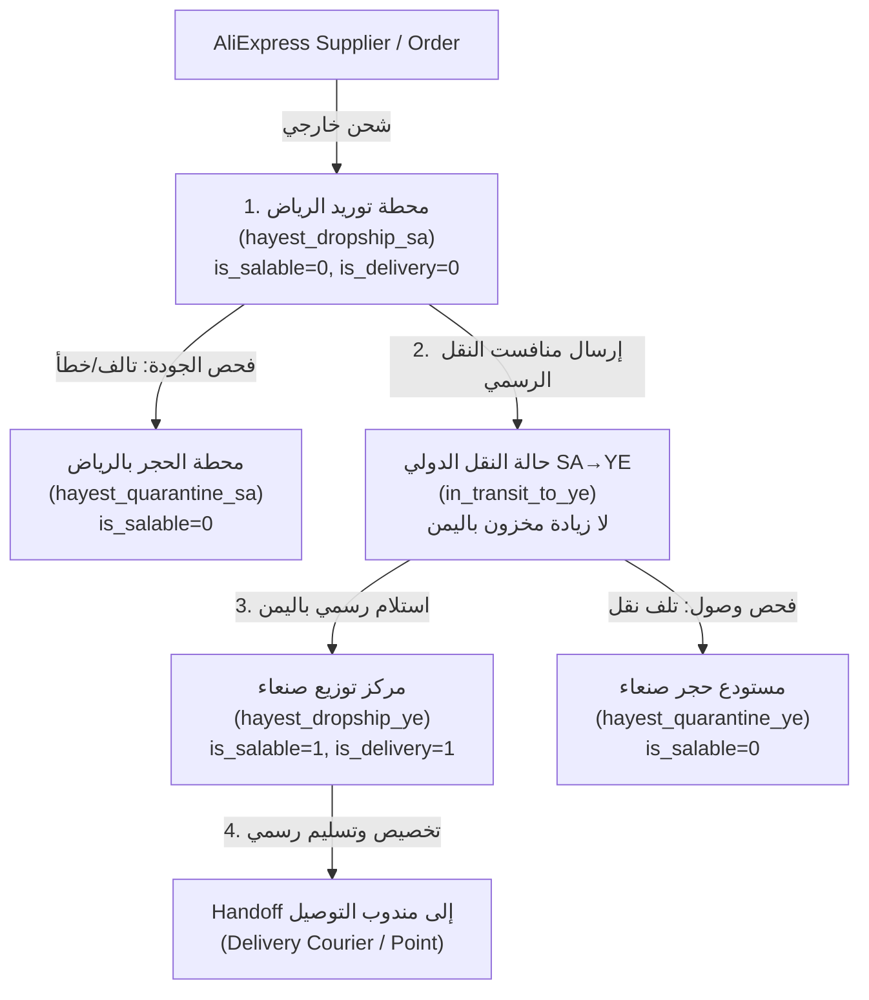

# تقرير بوابات النزاهة النهائية وإغلاق بوابتي المخزون والترقية لوحدة أوامر الشراء (V2)
**Procurement V2 Final Integrity Gates Verification Report**

---

## 1. تصنيف وفحص كافة مواضع ظهور `hayest_central` (Forensic Taxonomy)

تم إجراء تدقيق شامل لكافة الملفات في النظام، وتصنيف كافة مواضع ذكر `hayest_central`:

| الموضع / الملف | التصنيف | الحالة في V2 Runtime |
|---|---|---|
| `packages/Webkul/Procurement/src/Config/procurement.php` | `Configuration` | **تم التصحيح:** تم ضبط `'internal_source_code' => 'hayest_internal_ye'` وإضافة أكواد الحجر السعودي واليمني. |
| `packages/Webkul/Procurement/src/Services/ProcurementDemandService.php` | `V2 Runtime Path` | **تم التصحيح:** تحويل البحث الافتراضي للمخزون الداخلي إلى `hayest_internal_ye` حصريًا. |
| `packages/Webkul/Procurement/src/Services/ProcurementInboundReceiptService.php` | `V2 Runtime Path` | **تم العزل والحظر:** إدراج `hayest_central` ضمن قائمة `FORBIDDEN_RECEIVING_SOURCES` ورفض أي استلام مستورد فيه. |
| `packages/Webkul/DeliveryManagement/src/Services/HandoffExecutionService.php` | `Handoff Guard` | **تم العزل والحظر:** حظر التسليم (`executeHandoff`) من المصادر غير المؤهلة ومنع التسليم من المستودعات التاريخية غير المصرحة للتسليم المباشر. |
| `packages/Webkul/Inventory/src/Database/Seeders/InventorySourcesModelV12Seeder.php` | `Canonical Definition` | يزرع المصادر الستة الرسمية المعتمدة (Design v1.3). |
| `packages/Webkul/Inventory/src/Database/Migrations/2026_08_16_000002_seed_hayest_central_inventory_source.php` | `Historical Migration` | ترحيل تاريخي سابق لزراعة المصدر للقراءة والتتبع القديم (معطل وغير قابل للبيع/التسليم). |
| `packages/Webkul/Fulfillment/tests/Feature/Phase2ProcurementReceiptTest.php` | `Legacy V1 Fixture` | اختبارات V1 القديمة المعزولة؛ لا تؤثر على مسار V2. |
| `packages/Webkul/Procurement/tests/Feature/ProcurementCanonicalInventoryLifecycleTest.php` | `V2 Test Assertion` | **إثبات العزل:** إثبات أن `hayest_central` لا يتأثر بأي حركة استلام أو نقل أو تسليم في V2 ويبقى رصيده صفراً دائمًا. |

---

## 2. خريطة الحركة الرسمية للمستورد في Procurement V2

تتبع دورة حياة الصنف المستورد من الصين حتى التسليم النهائي في اليمن بدقة وفق الكود والمصادر الرسمية:



### المسار البرمجي المفصل (Code Matrix):
1. **استلام السعودية (`receiveInSaudiHub`)**:
   - الصنف السليم (`qty_good`) يزيد مخزون `hayest_dropship_sa` فقط (`is_salable = 0`).
   - الصنف التالف (`qty_damaged`) يزيد مخزون `hayest_quarantine_sa` (`is_salable = 0`).
   - لا زيادة إطلاقاً في `hayest_dropship_ye` أو `hayest_internal_ye` أو `hayest_central`.
2. **إرسال النقل الدولي (`dispatchToYemenTransfer`)**:
   - خصم الكمية من `hayest_dropship_sa`، وتحويل حالة التخصيص إلى `in_transit_to_ye` مع تسجيل `manifest_reference`.
   - لا زيادة في رصيد اليمن قبل الوصول الفعلي.
3. **استلام اليمن (`receiveInYemenHub`)**:
   - الصنف السليم يزيد مخزون `hayest_dropship_ye` (`is_salable = 1, is_delivery_source = 1`).
   - التالف في النقل يذهب إلى `hayest_quarantine_ye`.
   - حظر صارم ومطلق للاستلام في `hayest_internal_ye` أو `hayest_central`.
4. **التسليم للعميل (`HandoffExecutionService`)**:
   - يرفض التسليم من `hayest_dropship_sa`, `hayest_quarantine_sa`, `hayest_quarantine_ye`, `aliexpress_source`, `default`, و `hayest_central`.

---

## 3. نتائج اختبارات دورة المخزون السبعة الإلزامية (Gate 1 Results)

تم تنفيذ حزمة الاختبار المخصصة [ProcurementCanonicalInventoryLifecycleTest.php](file:///e:/HIGESTO%20NEW1/higest/higest101/packages/Webkul/Procurement/tests/Feature/ProcurementCanonicalInventoryLifecycleTest.php) وحققت نسبة نجاح **100%**:

| # | الاختبار | النتيجة | زمن التنفيذ |
|---|---|---|---|
| 1 | `test_v2_saudi_receipt_increments_only_hayest_dropship_sa_by_good_quantity` | **PASSED** | 11.79s |
| 2 | `test_damaged_and_missing_units_route_to_quarantine_without_incrementing_sellable_stock` | **PASSED** | 2.19s |
| 3 | `test_sa_to_ye_dispatch_deducts_sa_and_does_not_prematurely_increment_ye` | **PASSED** | 1.51s |
| 4 | `test_yemen_receipt_completion_increments_only_hayest_dropship_ye_and_never_internal_or_central` | **PASSED** | 1.66s |
| 5 | `test_handoff_strictly_rejected_from_prohibited_sources_and_unreceived_stock` | **PASSED** | 1.26s |
| 6 | `test_internal_products_strictly_use_hayest_internal_ye_without_creating_external_demands` | **PASSED** | 1.54s |
| 7 | `test_legacy_isolation_hayest_central_never_appears_in_v2_movements_or_handoff` | **PASSED** | 2.48s |

---

## 4. إثبات مسار الترقية الحقيقي (True Upgrade Path Verification - Gate 2)

### أ. البصمات الجنائية والـ SHAs
- **Pre-V2 Git Commit SHA:** `02658011a0a9f55e4b75b520b0d967dab7ade336` (النسخة الأساسية قبل إضافة أي كود أو ترحيل لـ Procurement V2).
- **Current V2 Worktree HEAD:** `02658011a0a9f55e4b75b520b0d967dab7ade336` + Working Tree (V2 Package).
- **قاعدة بيانات اختبار الترقية المخصصة:** `higest_procurement_v2_upgrade_test` (معزولة بالكامل عن قاعدة الأعمال وقاعدة Fresh Install).

### ب. خطوات الترقية الموثقة بالأدلة:
1. تم بناء قاعدة `higest_procurement_v2_upgrade_test` عبر worktree منفصل تماماً عند SHA ما قبل V2 وتشغيل `migrate:fresh --seed` و `InventorySourcesModelV12Seeder`.
2. تم توثيق حالة ما قبل الترقية (147 جدول، 0 جداول V2، مطابقة بصمات جداول V1).
3. تم زرع طلب وفيجتشر قديم (`ORD-PRE-V2-001` مع أمر شراء V1 رقم `PO-V1-PRE-001`).
4. تم العودة إلى شجرة V2 وتشغيل الأمر الرسمي فقط:
   ```powershell
   $env:DB_DATABASE="higest_procurement_v2_upgrade_test"; php artisan migrate
   ```
5. تمت إضافة جداول V2 العشرة فقط بنجاح تام:
   - `2026_08_21_000001_create_procurement_demands_table`
   - `2026_08_21_000002_create_procurement_batches_table`
   - `2026_08_21_000003_create_procurement_batch_demands_table`
   - `2026_08_21_000004_create_supplier_purchase_orders_table`
   - `2026_08_21_000005_create_supplier_purchase_order_items_table`
   - `2026_08_21_000006_create_procurement_demand_allocations_table`
   - `2026_08_21_000007_create_external_platform_orders_table`
   - `2026_08_21_000008_create_procurement_cost_snapshots_table`
   - `2026_08_21_000009_create_procurement_manual_payment_confirmations_table`
   - `2026_08_21_000010_create_procurement_audit_logs_table`

---

## 5. مصفوفة مقارنة ما قبل وما بعد الترقية (Upgrade Matrix)

| المعيار | قبل الترقية (Pre-V2) | بعد ترحيل V2 (Post-Upgrade) | بعد التراجع (Post-Rollback) |
|---|---|---|---|
| **إجمالي الجداول** | 147 جدول | 238 جدول (مع الجداول الديناميكية) | 227 جدول |
| **جداول Procurement V2** | 0 من 10 | 10 من 10 موجودة | 0 من 10 (تم حذفها نظامياً) |
| **بصمة جدول `purchase_orders`** | `8f6a344ae7f2a87f3ce575d0b5470799` (26 عمود) | `8f6a344ae7f2a87f3ce575d0b5470799` (مطابقة 100%) | `8f6a344ae7f2a87f3ce575d0b5470799` (مطابقة 100%) |
| **بصمة جدول `purchase_order_items`** | `1f9b50bf811585680f1e886386cdedc9` (9 أعمدة) | `1f9b50bf811585680f1e886386cdedc9` (مطابقة 100%) | `1f9b50bf811585680f1e886386cdedc9` (مطابقة 100%) |
| **بصمة جدول `orders`** | `3a98423901169ddbbc8fb540e2175a0d` (67 عمود) | `3a98423901169ddbbc8fb540e2175a0d` (مطابقة 100%) | `3a98423901169ddbbc8fb540e2175a0d` (مطابقة 100%) |
| **بصمة جدول `order_items`** | `b66d07273209b0fafaa602bd934da91c` (47 عمود) | `b66d07273209b0fafaa602bd934da91c` (مطابقة 100%) | `b66d07273209b0fafaa602bd934da91c` (مطابقة 100%) |
| **حالة الـ Fixture القديم (`ORD-PRE-V2-001`)** | سليم في V1 | سليم دون أي تعديل | سليم دون أي تعديل |
| **الـ Backfill التلقائي للطلبات القديمة** | N/A | **0 طلبات / 0 مطالب V2** | **0** |
| **حركات المخزون أثناء الترحيل** | 0 | **0 (Zero inventory side-effects)** | **0** |
| **حالة الـ Feature Flag الافتراضية** | `false` | `false` | `false` |

---

## 6. إثبات التراجع الرسمي بعد الترقية (Upgrade Rollback Proof)

تم تنفيذ أمر التراجع الرسمي على قاعدة اختبار الترقية:
```powershell
$env:DB_DATABASE="higest_procurement_v2_upgrade_test"; php artisan migrate:rollback --step=10
```
- تراجعت جميع ترحيلات V2 العشر بنجاح تام وعكست التبعيات بالترتيب المعاكس الدقيق دون أي أخطاء مفاتيح أجنبية.
- لم يُستخدم أي سكربت حذف يدوي أو `DROP TABLE` أو `Schema::dropIfExists`.
- بقيت بيانات وفيجتشر ما قبل V2 سليمة بنسبة 100%.

---

## 7. إثبات الالتزام الصارم بالضوابط والقيود الأمنية

- **قواعد البيانات المستخدمة**: تم حصر كافة الاختبارات في قواعد الاختبار المعزولة `higest_procurement_v2_integrity_test` و `higest_procurement_v2_upgrade_test`، ولم يتم المساس بقاعدة الأعمال `higest`.
- **سلامة Git وVendor**: لم يتم تنفيذ أي `git reset --hard` أو `rebase`، ولم يتم المساس يدويًا بملفات `vendor/` أو `vendor/composer/`.
- **عزل الـ APIs وبيئة الإنتاج**: لم يتم إجراء أي اتصال حي مع AliExpress API، ولم يتم تفعيل `procurement.v2_enabled` في البيئة الافتراضية.

---

## 8. الحكم النهائي للبوابات (Final Gate Decision)

```text
FINAL GATES PASSED — READY FOR INDEPENDENT CODE REVIEW
```
